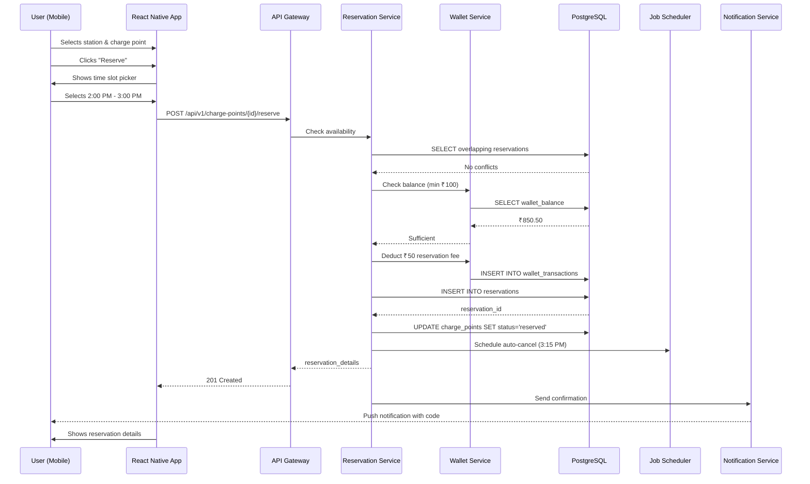
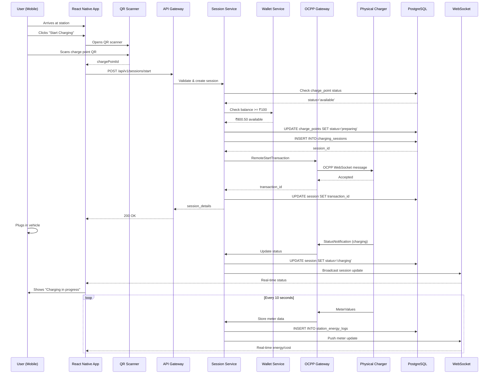
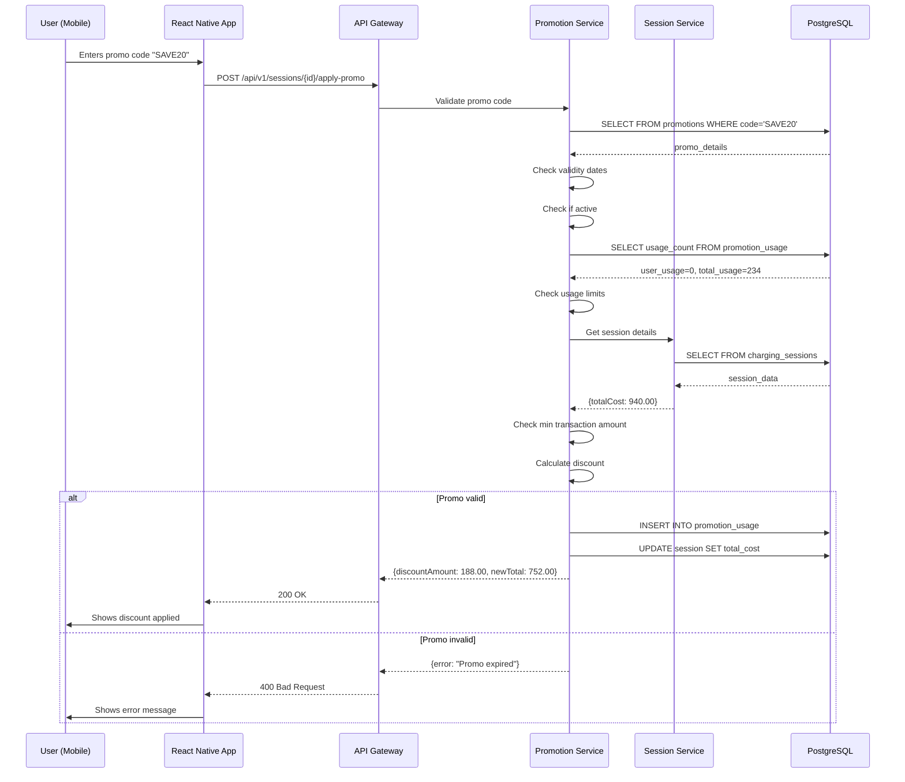
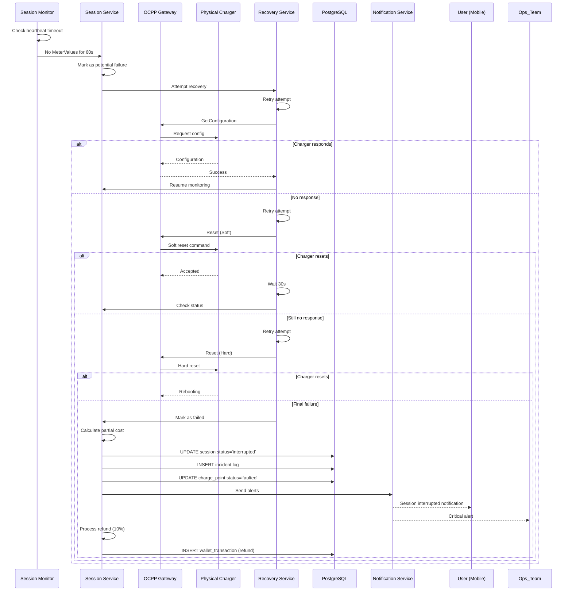

Product Requirements Document (PRD) & Solutions Architecture
ZWIZ EV Charging Management System

Executive Summary
ZWIZ is a comprehensive EV charging management system that enables charging station operators to manage their infrastructure, monitor usage, track revenue, and provide seamless charging experiences to EV users. The platform serves both B2B (charging station operators) and B2C (EV vehicle owners) markets.

1. Product Overview
1.1 Product Vision
To create a scalable, intelligent EV charging management platform that streamlines operations for charging station operators while providing a seamless experience for EV users.
1.2 Target Users

Charging Station Operators (CPOs): Manage charging infrastructure
EV Drivers: Find and use charging stations
System Administrators: Overall platform management
Field Technicians: Maintenance and support
Finance Teams: Revenue and billing management


2. User Roles & Permissions
2.1 Role Matrix
RoleDashboardCharging StationsCharge PointsSessionsUsersBillingReportsSettingsSuper AdminFullFullFullFullFullFullFullFullOperator AdminView/EditFullFullViewManageView/EditViewEdit OwnSite ManagerViewView/EditView/EditViewViewViewViewViewTechnicianViewViewView/EditView--View-Finance ManagerView--View-FullFull-Customer SupportViewViewViewView/EditViewViewView-EV User (Mobile)View OwnView PublicViewView OwnEdit ProfileView Own-Edit Profile

3. Core Modules
Module 1: Dashboard & Analytics
Purpose: Real-time overview of business metrics and operational status
Key Features:

Total revenue tracking (Today/Month/Quarter)
Energy consumption monitoring
Active sessions counter
Station status overview
Performance KPIs
Predictive analytics

User Stories:

As an operator, I want to see real-time revenue to track business performance
As a manager, I need to monitor energy consumption patterns
As a technician, I want to identify stations needing maintenance

Module 2: Charging Station Management
Purpose: Manage physical charging station locations and their infrastructure
Key Features:

Station registration and onboarding
Location management (GPS coordinates)
Station status monitoring (Online/Offline)
Energy consumption tracking per station
Total sessions per station
Station grouping and categorization
Maintenance scheduling

User Stories:

As an operator, I want to add new charging stations to my network
As a site manager, I need to monitor station uptime
As a technician, I want to schedule maintenance activities

Module 3: Charge Point (Connector) Management
Purpose: Manage individual charging connectors within stations
Key Features:

Connector registration (Type 2, CCS, CHAdeMO, etc.)
Capacity management (kW ratings)
Tariff configuration per connector
Connector status (Available/In-Use/Faulted)
OEM information tracking
Charger program management
Real-time availability status

User Stories:

As an operator, I want to set different tariffs for fast vs slow chargers
As a user, I need to find available connectors of my vehicle type
As a technician, I want to mark faulty connectors

Module 4: Charging Sessions Management
Purpose: Track and manage all charging transactions
Key Features:

Session initiation and termination
Real-time session monitoring
Session history and logs
Energy consumption per session
Duration tracking
Payment status
Session filtering (Active/Completed/Failed/Interrupted)
Mobile app integration

User Stories:

As a user, I want to start a charging session via mobile app
As an operator, I need to view all completed sessions
As support, I want to investigate failed sessions

Module 5: User Management
Purpose: Manage system users, EV drivers, and access control
Key Features:

User registration and KYC
Role-based access control
Profile management
Wallet/payment methods
Vehicle information
Charging history
Subscription management
Multi-tenancy support

User Stories:

As a user, I want to register and add my vehicle
As an admin, I need to manage user permissions
As a user, I want to view my charging history

Module 6: Billing & Revenue Management
Purpose: Handle all financial transactions and revenue tracking
Key Features:

Dynamic tariff management
Invoice generation
Payment gateway integration
Revenue reporting
Refund management
Wallet/prepaid system
Tax calculation
Settlement reports

User Stories:

As an operator, I want to set peak and off-peak tariffs
As a user, I need to receive invoices for my charging
As finance team, I want monthly revenue reports

Module 7: Location & Navigation
Purpose: Help users find nearby charging stations
Key Features:

Map view of stations
Filter by connector type
Filter by availability
Route planning
Distance calculation
Station details (amenities, pricing)
Reservation system

User Stories:

As a user, I want to find the nearest available charger
As a user, I need to reserve a charging slot
As a user, I want to see amenities near the station

Module 8: Notifications & Alerts
Purpose: Keep stakeholders informed of important events
Key Features:

Session start/end notifications
Payment confirmations
Station offline alerts
Maintenance reminders
Low balance warnings
Promotional messages
Push notifications
Email/SMS integration

Module 9: Reports & Analytics
Purpose: Generate insights for business decisions
Key Features:

Revenue reports
Usage analytics
Station performance
User behavior analysis
Energy consumption trends
Export capabilities (PDF, Excel)
Custom report builder
Scheduled reports

Module 10: Settings & Configuration
Purpose: System-wide configurations and preferences
Key Features:

Account settings
Notification preferences
System parameters
Integration settings
Security settings
API key management
Branding customization


4. Solutions Architecture
4.1 High-Level Architecture
┌─────────────────────────────────────────────────────────────┐
│                        Client Layer                          │
├─────────────────────┬───────────────────┬───────────────────┤
│   Mobile App (iOS)  │  Mobile (Android) │   Web Portal      │
│   - EV Users        │  - EV Users       │   - Operators     │
│   - React Native    │  - React Native   │   - React.js      │
└─────────────────────┴───────────────────┴───────────────────┘
                              │
                              ▼
┌─────────────────────────────────────────────────────────────┐
│                      API Gateway Layer                       │
│  - Authentication (JWT/OAuth2)                              │
│  - Rate Limiting                                            │
│  - Request Routing                                          │
│  - Load Balancing                                           │
└─────────────────────────────────────────────────────────────┘
                              │
                              ▼
┌─────────────────────────────────────────────────────────────┐
│                   Microservices Layer                        │
├──────────────┬──────────────┬──────────────┬────────────────┤
│ User Service │ Station Svc  │ Session Svc  │ Billing Svc    │
├──────────────┼──────────────┼──────────────┼────────────────┤
│ Auth Service │ Location Svc │ Payment Svc  │ Analytics Svc  │
├──────────────┼──────────────┼──────────────┼────────────────┤
│ Notification │ OCPP Gateway │ Report Svc   │ Admin Service  │
└──────────────┴──────────────┴──────────────┴────────────────┘
                              │
                              ▼
┌─────────────────────────────────────────────────────────────┐
│                      Data Layer                              │
├──────────────┬──────────────┬──────────────┬────────────────┤
│ PostgreSQL   │ MongoDB      │ Redis Cache  │ TimescaleDB    │
│ (Relational) │ (Documents)  │ (Sessions)   │ (Time-series)  │
└──────────────┴──────────────┴──────────────┴────────────────┘
                              │
                              ▼
┌─────────────────────────────────────────────────────────────┐
│                  Integration Layer                           │
├──────────────┬──────────────┬──────────────┬────────────────┤
│ OCPP 1.6/2.0 │ Payment GW   │ SMS Gateway  │ Email Service  │
│ (Chargers)   │ (Razorpay)   │ (Twilio)     │ (SendGrid)     │
└──────────────┴──────────────┴──────────────┴────────────────┘
4.2 Technology Stack
Frontend:

Web: React.js, Redux, Material-UI
Mobile: React Native, Redux Toolkit
Maps: Google Maps API / Mapbox

Backend:

API: Node.js with Express.js / Python FastAPI
Authentication: JWT, OAuth2.0
WebSocket: Socket.io (real-time updates)

Databases:

Primary DB: PostgreSQL (relational data)
Document Store: MongoDB (logs, documents)
Cache: Redis (sessions, real-time data)
Time-series: TimescaleDB (energy consumption, analytics)

Infrastructure:

Cloud: AWS / Azure / GCP
Containers: Docker, Kubernetes
Message Queue: RabbitMQ / Apache Kafka
CDN: CloudFlare

Monitoring:

APM: New Relic / DataDog
Logging: ELK Stack (Elasticsearch, Logstash, Kibana)
Alerting: PagerDuty


5. Database Schema Design
5.1 Core Tables
users
sqlCREATE TABLE users (
    user_id UUID PRIMARY KEY DEFAULT gen_random_uuid(),
    email VARCHAR(255) UNIQUE NOT NULL,
    phone VARCHAR(20) UNIQUE NOT NULL,
    password_hash VARCHAR(255) NOT NULL,
    first_name VARCHAR(100),
    last_name VARCHAR(100),
    role_id INT REFERENCES roles(role_id),
    organization_id UUID REFERENCES organizations(organization_id),
    kyc_status ENUM('pending', 'verified', 'rejected') DEFAULT 'pending',
    wallet_balance DECIMAL(10,2) DEFAULT 0.00,
    is_active BOOLEAN DEFAULT true,
    last_login TIMESTAMP,
    created_at TIMESTAMP DEFAULT CURRENT_TIMESTAMP,
    updated_at TIMESTAMP DEFAULT CURRENT_TIMESTAMP,
    CONSTRAINT chk_phone CHECK (phone ~ '^\+?[0-9]{10,15}$')
);

CREATE INDEX idx_users_email ON users(email);
CREATE INDEX idx_users_phone ON users(phone);
CREATE INDEX idx_users_org ON users(organization_id);
roles
sqlCREATE TABLE roles (
    role_id SERIAL PRIMARY KEY,
    role_name VARCHAR(50) UNIQUE NOT NULL,
    description TEXT,
    permissions JSONB, -- Store permissions as JSON
    created_at TIMESTAMP DEFAULT CURRENT_TIMESTAMP
);

INSERT INTO roles (role_name, permissions) VALUES 
('super_admin', '{"all": true}'),
('operator_admin', '{"dashboard": "rw", "stations": "rw", "billing": "r"}'),
('ev_user', '{"sessions": "rw", "profile": "rw"}');
organizations
sqlCREATE TABLE organizations (
    organization_id UUID PRIMARY KEY DEFAULT gen_random_uuid(),
    name VARCHAR(255) NOT NULL,
    registration_number VARCHAR(100) UNIQUE,
    tax_id VARCHAR(50),
    email VARCHAR(255),
    phone VARCHAR(20),
    address TEXT,
    city VARCHAR(100),
    state VARCHAR(100),
    country VARCHAR(100),
    postal_code VARCHAR(20),
    subscription_plan ENUM('free', 'basic', 'premium', 'enterprise'),
    subscription_valid_until DATE,
    is_active BOOLEAN DEFAULT true,
    created_at TIMESTAMP DEFAULT CURRENT_TIMESTAMP,
    updated_at TIMESTAMP DEFAULT CURRENT_TIMESTAMP
);
charging_stations
sqlCREATE TABLE charging_stations (
    station_id UUID PRIMARY KEY DEFAULT gen_random_uuid(),
    organization_id UUID REFERENCES organizations(organization_id),
    station_name VARCHAR(255) NOT NULL,
    station_code VARCHAR(50) UNIQUE NOT NULL,
    address TEXT,
    city VARCHAR(100),
    state VARCHAR(100),
    country VARCHAR(100),
    postal_code VARCHAR(20),
    latitude DECIMAL(10, 8),
    longitude DECIMAL(11, 8),
    status ENUM('online', 'offline', 'maintenance') DEFAULT 'offline',
    total_charge_points INT DEFAULT 0,
    available_charge_points INT DEFAULT 0,
    amenities JSONB, -- {"parking": true, "restroom": true, "cafe": true}
    operating_hours JSONB, -- {"monday": {"open": "00:00", "close": "23:59"}}
    accessibility JSONB, -- {"wheelchair": true, "covered": true}
    last_heartbeat TIMESTAMP,
    created_at TIMESTAMP DEFAULT CURRENT_TIMESTAMP,
    updated_at TIMESTAMP DEFAULT CURRENT_TIMESTAMP,
    CONSTRAINT chk_coordinates CHECK (
        latitude BETWEEN -90 AND 90 AND 
        longitude BETWEEN -180 AND 180
    )
);

CREATE INDEX idx_stations_location ON charging_stations 
    USING GIST (ll_to_earth(latitude, longitude));
CREATE INDEX idx_stations_org ON charging_stations(organization_id);
CREATE INDEX idx_stations_status ON charging_stations(status);
charge_points
sqlCREATE TABLE charge_points (
    charge_point_id UUID PRIMARY KEY DEFAULT gen_random_uuid(),
    station_id UUID REFERENCES charging_stations(station_id) ON DELETE CASCADE,
    charge_point_code VARCHAR(50) NOT NULL,
    connector_id INT NOT NULL, -- Physical connector number
    connector_type ENUM('Type1', 'Type2', 'CCS1', 'CCS2', 'CHAdeMO', 'GB/T') NOT NULL,
    power_type ENUM('AC', 'DC') NOT NULL,
    max_power_kw DECIMAL(6,2) NOT NULL,
    current_power_kw DECIMAL(6,2) DEFAULT 0,
    voltage INT,
    amperage INT,
    status ENUM('available', 'preparing', 'charging', 'suspended_ev', 
                'suspended_evse', 'finishing', 'faulted', 'unavailable') DEFAULT 'unavailable',
    oem_manufacturer VARCHAR(100),
    oem_model VARCHAR(100),
    firmware_version VARCHAR(50),
    last_heartbeat TIMESTAMP,
    total_energy_delivered_kwh DECIMAL(12,2) DEFAULT 0,
    total_sessions INT DEFAULT 0,
    created_at TIMESTAMP DEFAULT CURRENT_TIMESTAMP,
    updated_at TIMESTAMP DEFAULT CURRENT_TIMESTAMP,
    UNIQUE(station_id, charge_point_code, connector_id)
);

CREATE INDEX idx_charge_points_station ON charge_points(station_id);
CREATE INDEX idx_charge_points_status ON charge_points(status);
CREATE INDEX idx_charge_points_type ON charge_points(connector_type);
charging_sessions
sqlCREATE TABLE charging_sessions (
    session_id UUID PRIMARY KEY DEFAULT gen_random_uuid(),
    transaction_id VARCHAR(100) UNIQUE NOT NULL,
    user_id UUID REFERENCES users(user_id),
    charge_point_id UUID REFERENCES charge_points(charge_point_id),
    station_id UUID REFERENCES charging_stations(station_id),
    vehicle_id UUID REFERENCES vehicles(vehicle_id),
    
    -- Session timing
    started_at TIMESTAMP NOT NULL,
    ended_at TIMESTAMP,
    duration_minutes INT GENERATED ALWAYS AS 
        (EXTRACT(EPOCH FROM (ended_at - started_at))/60) STORED,
    
    -- Energy metrics
    start_meter_kwh DECIMAL(10,3),
    end_meter_kwh DECIMAL(10,3),
    energy_consumed_kwh DECIMAL(10,3) GENERATED ALWAYS AS 
        (end_meter_kwh - start_meter_kwh) STORED,
    
    -- Battery metrics
    start_soc_percent INT CHECK (start_soc_percent BETWEEN 0 AND 100),
    end_soc_percent INT CHECK (end_soc_percent BETWEEN 0 AND 100),
    
    -- Session status
    status ENUM('active', 'completed', 'failed', 'interrupted', 'on_hold') NOT NULL,
    stop_reason VARCHAR(100),
    
    -- Pricing
    tariff_id UUID REFERENCES tariffs(tariff_id),
    total_cost DECIMAL(10,2),
    currency VARCHAR(3) DEFAULT 'INR',
    
    -- Payment
    payment_status ENUM('pending', 'paid', 'failed', 'refunded') DEFAULT 'pending',
    payment_method ENUM('wallet', 'card', 'upi', 'cash') DEFAULT 'wallet',
    
    -- Source
    initiated_via ENUM('mobile_app', 'rfid', 'web', 'api') DEFAULT 'mobile_app',
    
    created_at TIMESTAMP DEFAULT CURRENT_TIMESTAMP,
    updated_at TIMESTAMP DEFAULT CURRENT_TIMESTAMP
);

CREATE INDEX idx_sessions_user ON charging_sessions(user_id);
CREATE INDEX idx_sessions_charge_point ON charging_sessions(charge_point_id);
CREATE INDEX idx_sessions_station ON charging_sessions(station_id);
CREATE INDEX idx_sessions_status ON charging_sessions(status);
CREATE INDEX idx_sessions_started_at ON charging_sessions(started_at DESC);
vehicles
sqlCREATE TABLE vehicles (
    vehicle_id UUID PRIMARY KEY DEFAULT gen_random_uuid(),
    user_id UUID REFERENCES users(user_id),
    make VARCHAR(100) NOT NULL,
    model VARCHAR(100) NOT NULL,
    year INT CHECK (year >= 2000 AND year <= EXTRACT(YEAR FROM CURRENT_DATE) + 1),
    license_plate VARCHAR(50) UNIQUE,
    vin VARCHAR(17) UNIQUE,
    battery_capacity_kwh DECIMAL(6,2),
    connector_type ENUM('Type1', 'Type2', 'CCS1', 'CCS2', 'CHAdeMO', 'GB/T'),
    max_charging_power_kw DECIMAL(6,2),
    is_primary BOOLEAN DEFAULT false,
    created_at TIMESTAMP DEFAULT CURRENT_TIMESTAMP,
    updated_at TIMESTAMP DEFAULT CURRENT_TIMESTAMP
);

CREATE INDEX idx_vehicles_user ON vehicles(user_id);
CREATE INDEX idx_vehicles_license ON vehicles(license_plate);
tariffs
sqlCREATE TABLE tariffs (
    tariff_id UUID PRIMARY KEY DEFAULT gen_random_uuid(),
    organization_id UUID REFERENCES organizations(organization_id),
    tariff_name VARCHAR(100) NOT NULL,
    description TEXT,
    tariff_type ENUM('flat_rate', 'time_based', 'energy_based', 'hybrid') NOT NULL,
    
    -- Flat rate
    flat_rate_per_kwh DECIMAL(6,2),
    
    -- Time-based
    rate_per_minute DECIMAL(6,2),
    
    -- Hybrid components
    base_fee DECIMAL(6,2) DEFAULT 0,
    connection_fee DECIMAL(6,2) DEFAULT 0,
    
    -- Time-of-use pricing
    peak_hours_rate DECIMAL(6,2),
    peak_hours JSONB, -- [{"start": "18:00", "end": "22:00"}]
    off_peak_rate DECIMAL(6,2),
    
    -- Power-based tiers
    power_tier_pricing JSONB, -- [{"min_kw": 0, "max_kw": 50, "rate": 10.5}]
    
    -- Billing
    currency VARCHAR(3) DEFAULT 'INR',
    tax_rate DECIMAL(5,2) DEFAULT 18.00,
    
    -- Applicability
    applicable_charge_point_types VARCHAR[] DEFAULT ARRAY['all'],
    applicable_power_range JSONB, -- {"min_kw": 0, "max_kw": 350}
    
    valid_from DATE NOT NULL,
    valid_until DATE,
    is_active BOOLEAN DEFAULT true,
    
    created_at TIMESTAMP DEFAULT CURRENT_TIMESTAMP,
    updated_at TIMESTAMP DEFAULT CURRENT_TIMESTAMP
);

CREATE INDEX idx_tariffs_org ON tariffs(organization_id);
CREATE INDEX idx_tariffs_active ON tariffs(is_active, valid_from, valid_until);
payments
sqlCREATE TABLE payments (
    payment_id UUID PRIMARY KEY DEFAULT gen_random_uuid(),
    session_id UUID REFERENCES charging_sessions(session_id),
    user_id UUID REFERENCES users(user_id),
    amount DECIMAL(10,2) NOT NULL,
    tax_amount DECIMAL(10,2) DEFAULT 0,
    total_amount DECIMAL(10,2) NOT NULL,
    currency VARCHAR(3) DEFAULT 'INR',
    payment_method ENUM('wallet', 'card', 'upi', 'netbanking', 'cash') NOT NULL,
    payment_gateway VARCHAR(50), -- razorpay, stripe, etc.
    gateway_transaction_id VARCHAR(255),
    status ENUM('pending', 'processing', 'success', 'failed', 'refunded') NOT NULL,
    failure_reason TEXT,
    refund_amount DECIMAL(10,2),
    refund_transaction_id VARCHAR(255),
    refund_date TIMESTAMP,
    created_at TIMESTAMP DEFAULT CURRENT_TIMESTAMP,
    updated_at TIMESTAMP DEFAULT CURRENT_TIMESTAMP
);

CREATE INDEX idx_payments_session ON payments(session_id);
CREATE INDEX idx_payments_user ON payments(user_id);
CREATE INDEX idx_payments_status ON payments(status);
CREATE INDEX idx_payments_created ON payments(created_at DESC);
wallet_transactions
sqlCREATE TABLE wallet_transactions (
    transaction_id UUID PRIMARY KEY DEFAULT gen_random_uuid(),
    user_id UUID REFERENCES users(user_id),
    transaction_type ENUM('credit', 'debit', 'refund') NOT NULL,
    amount DECIMAL(10,2) NOT NULL,
    balance_before DECIMAL(10,2) NOT NULL,
    balance_after DECIMAL(10,2) NOT NULL,
    reference_type ENUM('session', 'topup', 'refund', 'bonus', 'adjustment'),
    reference_id UUID, -- session_id or payment_id
    description TEXT,
    created_at TIMESTAMP DEFAULT CURRENT_TIMESTAMP
);

CREATE INDEX idx_wallet_user ON wallet_transactions(user_id);
CREATE INDEX idx_wallet_created ON wallet_transactions(created_at DESC);
reservations
sqlCREATE TABLE reservations (
    reservation_id UUID PRIMARY KEY DEFAULT gen_random_uuid(),
    user_id UUID REFERENCES users(user_id),
    charge_point_id UUID REFERENCES charge_points(charge_point_id),
    station_id UUID REFERENCES charging_stations(station_id),
    reservation_code VARCHAR(50) UNIQUE NOT NULL,
    reserved_from TIMESTAMP NOT NULL,
    reserved_until TIMESTAMP NOT NULL,
    status ENUM('active', 'completed', 'cancelled', 'expired') NOT NULL,
    cancellation_reason TEXT,
    created_at TIMESTAMP DEFAULT CURRENT_TIMESTAMP,
    updated_at TIMESTAMP DEFAULT CURRENT_TIMESTAMP,
    CHECK (reserved_until > reserved_from)
);

CREATE INDEX idx_reservations_user ON reservations(user_id);
CREATE INDEX idx_reservations_charge_point ON reservations(charge_point_id);
CREATE INDEX idx_reservations_time ON reservations(reserved_from, reserved_until);
CREATE INDEX idx_reservations_status ON reservations(status);
notifications
sqlCREATE TABLE notifications (
    notification_id UUID PRIMARY KEY DEFAULT gen_random_uuid(),
    user_id UUID REFERENCES users(user_id),
    title VARCHAR(255) NOT NULL,
    message TEXT NOT NULL,
    notification_type ENUM('session', 'payment', 'promotion', 'alert', 'system') NOT NULL,
    priority ENUM('low', 'medium', 'high', 'critical') DEFAULT 'medium',
    channels VARCHAR[] DEFAULT ARRAY['push'], -- push, email, sms
    reference_type VARCHAR(50), -- session, payment, etc.
    reference_id UUID,
    is_read BOOLEAN DEFAULT false,
    read_at TIMESTAMP,
    created_at TIMESTAMP DEFAULT CURRENT_TIMESTAMP
);

CREATE INDEX idx_notifications_user ON notifications(user_id);
CREATE INDEX idx_notifications_read ON notifications(is_read);
CREATE INDEX idx_notifications_created ON notifications(created_at DESC);
station_energy_logs (TimescaleDB)
sqlCREATE TABLE station_energy_logs (
    log_time TIMESTAMP NOT NULL,
    station_id UUID NOT NULL REFERENCES charging_stations(station_id),
    charge_point_id UUID REFERENCES charge_points(charge_point_id),
    session_id UUID REFERENCES charging_sessions(session_id),
    power_kw DECIMAL(8,3),
    energy_kwh DECIMAL(10,3),
    voltage INT,
    current_ampere DECIMAL(6,2),
    temperature_celsius DECIMAL(5,2),
    PRIMARY KEY (log_time, station_id, charge_point_id)
);

-- Convert to hypertable for time-series optimization
SELECT create_hypertable('station_energy_logs', 'log_time');

-- Create continuous aggregates for performance
CREATE MATERIALIZED VIEW hourly_energy_stats
WITH (timescaledb.continuous) AS
SELECT time_bucket('1 hour', log_time) AS hour,
       station_id,
       charge_point_id,
       AVG(power_kw) as avg_power_kw,
       SUM(energy_kwh) as total_energy_kwh,
       COUNT(*) as reading_count
FROM station_energy_logs
GROUP BY hour, station_id, charge_point_id;
audit_logs
sqlCREATE TABLE audit_logs (
    log_id UUID PRIMARY KEY DEFAULT gen_random_uuid(),
    user_id UUID REFERENCES users(user_id),
    action VARCHAR(100) NOT NULL, -- create, update, delete, login, etc.
    entity_type VARCHAR(50) NOT NULL, -- user, station, session, etc.
    entity_id UUID,
    old_values JSONB,
    new_values JSONB,
    ip_address INET,
    user_agent TEXT,
    created_at TIMESTAMP DEFAULT CURRENT_TIMESTAMP
);

CREATE INDEX idx_audit_user ON audit_logs(user_id);
CREATE INDEX idx_audit_entity ON audit_logs(entity_type, entity_id);
CREATE INDEX idx_audit_created ON audit_logs(created_at DESC);
maintenance_schedules
sqlCREATE TABLE maintenance_schedules (
    schedule_id UUID PRIMARY KEY DEFAULT gen_random_uuid(),
    station_id UUID REFERENCES charging_stations(station_id),
    charge_point_id UUID REFERENCES charge_points(charge_point_id),
    scheduled_by UUID REFERENCES users(user_id),
    assigned_to UUID REFERENCES users(user_id),
    maintenance_type ENUM('preventive', 'corrective', 'inspection') NOT NULL,
    priority ENUM('low', 'medium', 'high', 'critical') DEFAULT 'medium',
    scheduled_date DATE NOT NULL,
    scheduled_time TIME,
    duration_hours INT,
    status ENUM('scheduled', 'in_progress', 'completed', 'cancelled') DEFAULT 'scheduled',
    description TEXT,
    notes TEXT,
    completed_at TIMESTAMP,
    created_at TIMESTAMP DEFAULT CURRENT_TIMESTAMP,
    updated_at TIMESTAMP DEFAULT CURRENT_TIMESTAMP
);

CREATE INDEX idx_maintenance_station ON maintenance_schedules(station_id);
CREATE INDEX idx_maintenance_charge_point ON maintenance_schedules(charge_point_id);
CREATE INDEX idx_maintenance_assigned ON maintenance_schedules(assigned_to);
CREATE INDEX idx_maintenance_date ON maintenance_schedules(scheduled_date);
promotions
sqlCREATE TABLE promotions (
    promotion_id UUID PRIMARY KEY DEFAULT gen_random_uuid(),
    organization_id UUID REFERENCES organizations(organization_id),
    code VARCHAR(50) UNIQUE NOT NULL,
    title VARCHAR(255) NOT NULL,
    description TEXT,
    discount_type ENUM('percentage', 'fixed_amount', 'free_energy') NOT NULL,
    discount_value DECIMAL(10,2) NOT NULL,
    max_discount_amount DECIMAL(10,2),
    min_transaction_amount DECIMAL(10,2),
    usage_limit_per_user INT DEFAULT 1,
    total_usage_limit INT,
    valid_from TIMESTAMP NOT NULL,
    valid_until TIMESTAMP NOT NULL,
    applicable_stations UUID[], -- Array of station IDs
    applicable_user_types VARCHAR[] DEFAULT ARRAY['all'],
    is_active BOOLEAN DEFAULT true,
    created_at TIMESTAMP DEFAULT CURRENT_TIMESTAMP,
    updated_at TIMESTAMP DEFAULT CURRENT_TIMESTAMP
);

CREATE INDEX idx_promotions_code ON promotions(code);
CREATE INDEX idx_promotions_org ON promotions(organization_id);
CREATE INDEX idx_promotions_validity ON promotions(valid_from, valid_until);
promotion_usage
sqlCREATE TABLE promotion_usage (
    usage_id UUID PRIMARY KEY DEFAULT gen_random_uuid(),
    promotion_id UUID REFERENCES promotions(promotion_id),
    user_id UUID REFERENCES users(user_id),
    session_id UUID REFERENCES charging_sessions(session_id),
    discount_amount DECIMAL(10,2) NOT NULL,
    used_at TIMESTAMP DEFAULT CURRENT_TIMESTAMP
);

CREATE INDEX idx_promo_usage_promotion ON promotion_usage(promotion_id);
CREATE INDEX idx_promo_usage_user ON promotion_usage(user_id);

6. Business Logic & Use Cases
20 Detailed Use Cases with Business Logic
Use Case 1: User Registration & KYC
Actor: EV User
Flow:

User downloads mobile app
Provides email, phone, password
OTP verification on phone
Uploads KYC documents (Aadhaar, DL)
System validates documents via DigiLocker API
Creates wallet with ₹0 balance
Sends welcome email with ₹100 bonus credit

Business Rules:

Phone must be unique
Password: min 8 chars, 1 uppercase, 1 number
KYC mandatory for wallet topup > ₹5000
Bonus credit expires in 30 days

Use Case 2: Add Vehicle to Profile
Actor: EV User
Flow:

Navigate to Profile → My Vehicles
Select make/model from dropdown (Tesla, Tata Nexon EV, etc.)
Enter license plate
System auto-fills battery capacity and connector type
User can override connector type if needed
Mark as primary vehicle

Business Rules:

One primary vehicle per user
License plate format validation per state
Battery capacity between 10-200 kWh

Use Case 3: Find Nearby Charging Stations
Actor: EV User
Flow:

User opens "Find Charger" in app
System gets GPS location
Queries stations within 10km radius
Filters by connector type (from primary vehicle)
Shows only stations with available charge points
Displays distance, pricing, amenities

Business Rules:

Show max 50
Continue22 Decstations in list

Sort by distance by default
Real-time availability updates via WebSocket
Cache results for 2 minutes

SQL Query:
sqlSELECT s.*, 
       earth_distance(
           ll_to_earth(s.latitude, s.longitude),
           ll_to_earth($user_lat, $user_lon)
       )/1000 as distance_km,
       s.available_charge_points,
       MIN(t.flat_rate_per_kwh) as min_price
FROM charging_stations s
JOIN charge_points cp ON s.station_id = cp.station_id
JOIN tariffs t ON t.organization_id = s.organization_id
WHERE s.status = 'online'
  AND cp.status = 'available'
  AND cp.connector_type = $vehicle_connector_type
  AND earth_distance(
      ll_to_earth(s.latitude, s.longitude),
      ll_to_earth($user_lat, $user_lon)
  ) <= 10000
GROUP BY s.station_id
ORDER BY distance_km
LIMIT 50;
Use Case 4: Reserve a Charging Slot
Actor: EV User
Flow:

User selects station and charge point
Chooses reservation time (30 min slots)
System checks availability
Holds ₹50 as reservation fee from wallet
Generates 6-digit reservation code
Sends push notification with details
Auto-cancels if user doesn't start session within 15 min grace period

Business Rules:

Max 2 hours reservation time
₹50 fee refunded if session starts
₹50 forfeited if no-show
Can't reserve if wallet < ₹100

Code Logic:
javascriptasync function createReservation(userId, chargePointId, reservedFrom, reservedUntil) {
    // Check wallet balance
    const user = await User.findById(userId);
    if (user.walletBalance < 100) {
        throw new Error('Insufficient wallet balance');
    }
    
    // Check charge point availability
    const overlapping = await Reservation.find({
        chargePointId,
        status: 'active',
        $or: [
            { reservedFrom: { $lte: reservedFrom }, reservedUntil: { $gte: reservedFrom } },
            { reservedFrom: { $lte: reservedUntil }, reservedUntil: { $gte: reservedUntil } }
        ]
    });
    
    if (overlapping.length > 0) {
        throw new Error('Charge point not available for selected time');
    }
    
    // Create reservation
    const reservation = await Reservation.create({
        userId,
        chargePointId,
        reservedFrom,
        reservedUntil,
        reservationCode: generateCode(),
        status: 'active'
    });
    
    // Deduct reservation fee
    await deductFromWallet(userId, 50, 'reservation', reservation._id);
    
    // Schedule auto-cancellation
    scheduleJob(reservedUntil + 15min, async () => {
        const res = await Reservation.findById(reservation._id);
        if (res.status === 'active') {
            await cancelReservation(reservation._id, 'expired');
        }
    });
    
    return reservation;
}
Use Case 5: Start Charging Session
Actor: EV User
Flow:

User arrives at station
Scans QR code on charge point OR enters charge point ID
System verifies:

Charge point is available
User has reservation (if applicable)
Wallet balance ≥ ₹100 (minimum)


Locks charge point status to 'preparing'
Sends OCPP RemoteStartTransaction to charger
Charger responds with transaction ID
Creates session record with started_at timestamp
User plugs in vehicle
Status changes to 'charging'
Real-time energy meter readings start

Business Rules:

Minimum wallet balance: ₹100
Auto-stop if wallet balance < ₹20
Session timeout: 8 hours max
Can't start if existing active session

OCPP Message:
json{
  "action": "RemoteStartTransaction",
  "messageId": "uuid-here",
  "payload": {
    "connectorId": 1,
    "idTag": "user-rfid-or-app-id",
    "chargingProfile": {
      "chargingProfileId": 1,
      "stackLevel": 0,
      "chargingProfilePurpose": "TxDefaultProfile",
      "chargingProfileKind": "Absolute",
      "chargingSchedule": {
        "chargingRateUnit": "W",
        "chargingSchedulePeriod": [
          {
            "startPeriod": 0,
            "limit": 50000
          }
        ]
      }
    }
  }
}
Use Case 6: Real-Time Session Monitoring
Actor: EV User & System
Flow:

Charger sends MeterValues every 10 seconds via OCPP
System stores in time-series DB (TimescaleDB)
Calculates:

Energy consumed = current_meter - start_meter
Duration = now - started_at
Cost = energy × tariff_rate + (duration × time_rate)
Estimated full charge time


WebSocket pushes updates to mobile app
Updates session record every minute
Deducts cost from wallet every ₹50

OCPP MeterValues Message:
json{
  "action": "MeterValues",
  "messageId": "uuid",
  "payload": {
    "connectorId": 1,
    "transactionId": 12345,
    "meterValue": [
      {
        "timestamp": "2025-12-22T14:30:00Z",
        "sampledValue": [
          { "value": "15.5", "measurand": "Energy.Active.Import.Register", "unit": "kWh" },
          { "value": "230", "measurand": "Voltage", "unit": "V" },
          { "value": "32", "measurand": "Current.Import", "unit": "A" },
          { "value": "7.4", "measurand": "Power.Active.Import", "unit": "kW" },
          { "value": "65", "measurand": "SoC", "unit": "Percent" }
        ]
      }
    ]
  }
}
Cost Calculation:
javascriptfunction calculateSessionCost(session, tariff) {
    const energyCost = session.energyConsumedKwh * tariff.flatRatePerKwh;
    const timeCost = (session.durationMinutes / 60) * tariff.ratePerHour;
    const baseFee = tariff.baseFee;
    const connectionFee = tariff.connectionFee;
    
    const subtotal = energyCost + timeCost + baseFee + connectionFee;
    const tax = subtotal * (tariff.taxRate / 100);
    const total = subtotal + tax;
    
    return {
        energyCost: energyCost.toFixed(2),
        timeCost: timeCost.toFixed(2),
        baseFee: baseFee.toFixed(2),
        connectionFee: connectionFee.toFixed(2),
        subtotal: subtotal.toFixed(2),
        tax: tax.toFixed(2),
        total: total.toFixed(2)
    };
}
Use Case 7: Stop Charging Session
Actor: EV User / System
Flow:

User clicks "Stop Charging" in app
System sends OCPP RemoteStopTransaction
Charger stops power delivery
Charger sends StopTransaction message with final meter value
System calculates final cost
Deducts remaining amount from wallet
Updates session status to 'completed'
Generates invoice
Sends push notification with summary
Releases charge point (status = 'available')

Auto-stop triggers:

Wallet balance < ₹20
Vehicle reaches 100% SoC
8-hour timeout
Charger fault

Code:
javascriptasync function stopChargingSession(sessionId, stoppedBy = 'user') {
    const session = await Session.findById(sessionId);
    
    // Send OCPP stop command
    await ocppClient.send({
        action: 'RemoteStopTransaction',
        payload: { transactionId: session.transactionId }
    });
    
    // Wait for StopTransaction confirmation
    const stopResponse = await waitForOCPPResponse(session.transactionId, 30000);
    
    // Update session
    session.endedAt = new Date();
    session.endMeterKwh = stopResponse.meterStop / 1000;
    session.status = 'completed';
    
    // Calculate final cost
    const tariff = await Tariff.findById(session.tariffId);
    const cost = calculateSessionCost(session, tariff);
    session.totalCost = cost.total;
    
    // Deduct from wallet
    await deductFromWallet(
        session.userId, 
        cost.total, 
        'session', 
        session._id
    );
    
    // Create payment record
    await Payment.create({
        sessionId: session._id,
        userId: session.userId,
        amount: cost.subtotal,
        taxAmount: cost.tax,
        totalAmount: cost.total,
        paymentMethod: 'wallet',
        status: 'success'
    });
    
    // Update charge point
    await ChargePoint.updateOne(
        { _id: session.chargePointId },
        { 
            status: 'available',
            $inc: { 
                totalEnergyDeliveredKwh: session.energyConsumedKwh,
                totalSessions: 1
            }
        }
    );
    
    // Send notification
    await sendNotification(session.userId, {
        title: 'Charging Complete',
        message: `Charged ${session.energyConsumedKwh} kWh for ₹${cost.total}`,
        type: 'session'
    });
    
    // Generate invoice
    await generateInvoice(session._id);
    
    await session.save();
    return session;
}
Use Case 8: Wallet Top-up
Actor: EV User
Flow:

User navigates to Wallet
Enters top-up amount (₹100 - ₹10,000)
Selects payment method (UPI/Card/Net Banking)
System creates Razorpay order
Redirects to Razorpay payment page
User completes payment
Razorpay webhook confirms payment
System credits wallet
Creates wallet transaction record
Sends confirmation notification

Business Rules:

Min: ₹100, Max: ₹10,000 per transaction
KYC required for topup > ₹5000
2% platform fee (waived for first topup)
Bonus: 5% extra on topup ≥ ₹1000

Razorpay Integration:
javascriptasync function initiateTopup(userId, amount) {
    // Validate amount
    if (amount < 100 || amount > 10000) {
        throw new Error('Invalid amount');
    }
    
    // Check KYC if needed
    const user = await User.findById(userId);
    if (amount > 5000 && user.kycStatus !== 'verified') {
        throw new Error('KYC verification required');
    }
    
    // Create Razorpay order
    const order = await razorpay.orders.create({
        amount: amount * 100, // paise
        currency: 'INR',
        receipt: `topup_${userId}_${Date.now()}`,
        notes: {
            userId: userId,
            type: 'wallet_topup'
        }
    });
    
    return {
        orderId: order.id,
        amount: order.amount,
        currency: order.currency,
        key: process.env.RAZORPAY_KEY_ID
    };
}

// Webhook handler
async function handlePaymentSuccess(payload) {
    const { order_id, payment_id, amount } = payload;
    
    // Verify signature
    const isValid = verifyWebhookSignature(payload);
    if (!isValid) throw new Error('Invalid signature');
    
    // Get order details
    const order = await razorpay.orders.fetch(order_id);
    const userId = order.notes.userId;
    const creditAmount = amount / 100;
    
    // Calculate bonus
    let bonusAmount = 0;
    if (creditAmount >= 1000) {
        bonusAmount = creditAmount * 0.05;
    }
    
    // Credit wallet
    const user = await User.findById(userId);
    const newBalance = user.walletBalance + creditAmount + bonusAmount;
    
    await WalletTransaction.create({
        userId,
        transactionType: 'credit',
        amount: creditAmount,
        balanceBefore: user.walletBalance,
        balanceAfter: newBalance,
        referenceType: 'topup',
        referenceId: payment_id,
        description: `Wallet topup via Razorpay${bonusAmount > 0 ? ` (+ ₹${bonusAmount} bonus)` : ''}`
    });
    
    user.walletBalance = newBalance;
    await user.save();
    
    // Send notification
    await sendNotification(userId, {
        title: 'Wallet Credited',
        message: `₹${creditAmount} added successfully${bonusAmount > 0 ? `. Bonus: ₹${bonusAmount}` : ''}`,
        type: 'payment'
    });
}
Use Case 9: Apply Promotion Code
Actor: EV User
Flow:

During session start or payment
User enters promo code
System validates:

Code exists and active
Within validity period
User hasn't exceeded usage limit
Minimum transaction amount met
Station is applicable


Calculates discount
Applies to final bill
Records usage

Business Rules:

One promo per transaction
Can't combine with other offers
Max discount capped
Expiry enforced

Code:
javascriptasync function applyPromotion(userId, sessionId, promoCode) {
    const promo = await Promotion.findOne({ 
        code: promoCode, 
        isActive: true 
    });
    
    if (!promo) throw new Error('Invalid promo code');
    
    const now = new Date();
    if (now < promo.validFrom || now > promo.validUntil) {
        throw new Error('Promo code expired');
    }
    
    // Check usage limit
    const usageCount = await PromotionUsage.countDocuments({
        promotionId: promo._id,
        userId
    });
    
    if (usageCount >= promo.usageLimitPerUser) {
        throw new Error('Promo code usage limit exceeded');
    }
    
    // Check total usage
    const totalUsage = await PromotionUsage.countDocuments({
        promotionId: promo._id
    });
    
    if (promo.totalUsageLimit && totalUsage >= promo.totalUsageLimit) {
        throw new Error('Promo code no longer available');
    }
    
    // Get session details
    const session = await Session.findById(sessionId);
    
    // Check min transaction
    if (session.totalCost < promo.minTransactionAmount) {
        throw new Error(`Minimum transaction amount: ₹${promo.minTransactionAmount}`);
    }
    
    // Calculate discount
    let discountAmount = 0;
    if (promo.discountType === 'percentage') {
        discountAmount = (session.totalCost * promo.discountValue) / 100;
        if (promo.maxDiscountAmount) {
            discountAmount = Math.min(discountAmount, promo.maxDiscountAmount);
        }
    } else if (promo.discountType === 'fixed_amount') {
        discountAmount = promo.discountValue;
    }
    
    // Apply discount
    session.totalCost -= discountAmount;
    session.promotionId = promo._id;
    await session.save();
    
    // Record usage
    await PromotionUsage.create({
        promotionId: promo._id,
        userId,
        sessionId,
        discountAmount
    });
    
    return { discountAmount, finalAmount: session.totalCost };
}
Use Case 10: Operator Adds New Charging Station
Actor: Operator Admin
Flow:

Login to web portal
Navigate to Stations → Add New
Enter station details:

Name, code (auto-generated)
Full address with GPS coordinates
Operating hours
Amenities (parking, restroom, cafe)


Add charge points:

Connector type, power rating
OEM details
Assign tariff


System validates:

Unique station code
Valid GPS coordinates
At least 1 charge point


Creates station with status 'offline'
Generates onboarding checklist
Sends installation team notification

Validation Rules:

Station code format: ORG_CITY_XXX (e.g., ZWIZ_DEL_001)
GPS must be within operational geography
Duplicate check within 100m radius
Power rating: 3.3 kW - 350 kW

Use Case 11: Configure Dynamic Pricing
Actor: Operator Admin
Flow:

Navigate to Tariffs → Create New
Select tariff type (flat/time-based/hybrid)
For time-of-use pricing:

Peak hours: 6PM-10PM → ₹25/kWh
Off-peak: 10PM-6AM → ₹15/kWh
Regular: ₹20/kWh


Add power-based tiers:

0-50 kW: ₹18/kWh
50-150 kW: ₹22/kWh
150+ kW: ₹28/kWh


Set validity period
Assign to specific stations or charge points
Preview impact on sample session
Activate tariff

Business Logic:
javascriptfunction calculateDynamicCost(session, tariff, meterValues) {
    let totalCost = 0;
    const startTime = new Date(session.startedAt);
    
    // Group meter values by time buckets
    const hourlyData = groupByHour(meterValues);
    
    for (const [hour, data] of Object.entries(hourlyData)) {
        const hourTime = new Date(hour);
        const hourOfDay = hourTime.getHours();
        
        // Determine time-of-use rate
        let ratePerKwh;
        if (tariff.peakHours.some(p => 
            hourOfDay >= p.startHour && hourOfDay < p.endHour
        )) {
            ratePerKwh = tariff.peakHoursRate;
        } else if (hourOfDay >= 22 || hourOfDay < 6) {
            ratePerKwh = tariff.offPeakRate;
        } else {
            ratePerKwh = tariff.flatRatePerKwh;
        }
        
        // Apply power tier multiplier
        const avgPower = data.avgPowerKw;
        const powerTier = tariff.powerTierPricing.find(t => 
            avgPower >= t.minKw && avgPower <= t.maxKw
        );
        if (powerTier) {
            ratePerKwh = powerTier.rate;
        }
        
        totalCost += data.energyKwh * ratePerKwh;
    }
    
    // Add base fees
    totalCost += tariff.baseFee + tariff.connectionFee;
    
    // Add tax
    const tax = totalCost * (tariff.taxRate / 100);
    
    return {
        subtotal: totalCost.toFixed(2),
        tax: tax.toFixed(2),
        total: (totalCost + tax).toFixed(2)
    };
}
Use Case 12: Automated Maintenance Scheduling
Actor: System / Site Manager
Flow:

System monitors charge point metrics:

Total sessions completed
Total energy delivered
Error frequency
Last maintenance date


Triggers maintenance alert when:

1000 sessions completed OR
50,000 kWh delivered OR
90 days since last maintenance OR
Error rate > 5%


Creates maintenance schedule
Assigns to nearest technician
Sends notification
Marks charge point as 'maintenance'
Blocks new sessions

Predictive Logic:
javascriptasync function checkMaintenanceRequired(chargePointId) {
    const cp = await ChargePoint.findById(chargePointId);
    
    // Get last maintenance
    const lastMaint = await MaintenanceSchedule.findOne({
        chargePointId,
        status: 'completed'
    }).sort('-completedAt');
    
    const daysSinceLastMaint = lastMaint 
        ? daysBetween(lastMaint.completedAt, new Date())
        : 365;
    
    // Get error rate
    const last30Days = new Date(Date.now() - 30 * 24 * 60 * 60 * 1000);
    const sessions = await Session.find({
        chargePointId,
        startedAt: { $gte: last30Days }
    });
    
    const errorCount = sessions.filter(s => 
        s.status === 'failed' || s.status === 'interrupted'
    ).length;
    
    const errorRate = (errorCount / sessions.length) * 100;
    
    // Check thresholds
    const reasons = [];
    if (cp.totalSessions >= 1000) {
        reasons.push('1000+ sessions completed');
    }
    if (cp.totalEnergyDeliveredKwh >= 50000) {
        reasons.push('50,000+ kWh delivered');
    }
    if (daysSinceLastMaint >= 90) {
        reasons.push('90+ days since last maintenance');
    }
    if (errorRate >= 5) {
        reasons.push(`High error rate: ${errorRate.toFixed(1)}%`);
    }
    
    if (reasons.length > 0) {
        await schedulePreventiveMaintenance(chargePointId, reasons);
    }
}

async function schedulePreventiveMaintenance(chargePointId, reasons) {
    const cp = await ChargePoint.findById(chargePointId);
    
    // Find available technician
    const technician = await findNearestTechnician(cp.stationId);
    
    // Schedule for next available slot
    const schedule = await MaintenanceSchedule.create({
        chargePointId,
        stationId: cp.stationId,
        scheduledBy: 'system',
        assignedTo: technician._id,
        maintenanceType: 'preventive',
        priority: reasons.includes('High error rate') ? 'high' : 'medium',
        scheduledDate: getNextAvailableDate(technician._id),
        description: `Automated maintenance: ${reasons.join(', ')}`,
        status: 'scheduled'
    });
    
    // Update charge point
    cp.status = 'unavailable';
    await cp.save();
    
    // Notify technician
    await sendNotification(technician._id, {
        title: 'Maintenance Scheduled',
        message: `${cp.chargePointCode} requires maintenance`,
        type: 'alert',
        priority: 'high'
    });
}
Use Case 13: Session Failure & Auto-Retry
Actor: System
Flow:

During active session, charger stops responding
System detects:

No MeterValues for 60 seconds
OCPP heartbeat timeout


Attempts recovery:

Retry 1: Send GetConfiguration
Retry 2: Send Reset (soft)
Retry 3: Send Reset (hard)


If recovery fails:

Mark session as 'interrupted'
Calculate cost based on last known meter
Refund estimated overcharge
Release charge point
Log incident
Alert operations team


Code:
javascriptclass SessionMonitor {
    constructor(sessionId) {
        this.sessionId = sessionId;
        this.lastMeterTime = Date.now();
        this.retryCount = 0;
        this.maxRetries = 3;
    }
    
    async start() {
        this.interval = setInterval(() => this.checkHealth(), 10000);
    }
    
    async checkHealth() {
        const timeSinceLastMeter = Date.now() - this.lastMeterTime;
        
        if (timeSinceLastMeter > 60000) { // 60 seconds
            await this.attemptRecovery();
        }
    }
    
    async attemptRecovery() {
        const session = await Session.findById(this.sessionId);
        const cp = await ChargePoint.findById(session.chargePointId);
        
        this.retryCount++;
        
        try {
            if (this.retryCount === 1) {
                // Try to get config
                await ocppClient.send({
                    chargePointId: cp.chargePointCode,
                    action: 'GetConfiguration',
                    payload: { key: ['HeartbeatInterval'] }
                });
            } else if (this.retryCount === 2) {
                // Soft reset
                await ocppClient.send({
                    chargePointId: cp.chargePointCode,
                    action: 'Reset',
                    payload: { type: 'Soft' }
                });
            } else if (this.retryCount === 3) {
                // Hard reset
                await ocppClient.send({
                    chargePointId: cp.chargePointCode,
                    action: 'Reset',
                    payload: { type: 'Hard' }
                });
            } else {
                // Recovery failed
                await this.handleFailure();
            }
        } catch (error) {
            logger.error(`Recovery attempt ${this.retryCount} failed:`, error);
            if (this.retryCount >= this.maxRetries) {
                await this.handleFailure();
            }
        }
    }
    
    async handleFailure() {
        clearInterval(this.interval);
        
        const session = await Session.findById(this.sessionId);
        
        // Calculate cost based on last known meter
        const tariff = await Tariff.findById(session.tariffId);
        const cost = calculateSessionCost(session, tariff);
        
        // Update session
        session.status = 'interrupted';
        session.endedAt = new Date();
        session.stopReason = 'charger_communication_failure';
        session.totalCost = cost.total;
        await session.save();
        
        // Deduct from wallet
        await deductFromWallet(session.userId, cost.total, 'session', session._id);
        
        // Refund buffer (10% of cost as goodwill)
        const refundAmount = cost.total * 0.1;
        await creditToWallet(
            session.userId, 
            refundAmount, 
            'refund', 
            session._id,
            'Session interrupted - partial refund'
        );
        
        // Release charge point
        await ChargePoint.updateOne(
            { _id: session.chargePointId },
            { status: 'faulted' }
        );
        
        // Create incident
        await Incident.create({
            sessionId: session._id,
            chargePointId: session.chargePointId,
            type: 'communication_failure',
            severity: 'high',
            description: 'Charger stopped responding during session',
            status: 'open'
        });
        
        // Notify user
        await sendNotification(session.userId, {
            title: 'Session Interrupted',
            message: `Your charging session was interrupted. ₹${refundAmount.toFixed(2)} refunded.`,
            type: 'alert'
        });
        
        // Alert operations
        await alertOpsTeam({
            type: 'charger_down',
            chargePointId: session.chargePointId,
            sessionId: session._id
        });
    }
    
    updateLastMeterTime() {
        this.lastMeterTime = Date.now();
        this.retryCount = 0; // Reset retry counter
    }
}
Use Case 14: Revenue Analytics Dashboard
Actor: Finance Manager
Flow:

Login to portal
Navigate to Analytics → Revenue
View metrics:

Today: ₹11,989.88
This Month: ₹3.45L
This Quarter: ₹9.8L


Drill down by:

Station
Time period
Charge point type
Payment method


Export report (PDF/Excel)
Schedule email reports

SQL Queries:
sql-- Daily revenue
SELECT DATE(s.started_at) as date,
       COUNT(s.session_id) as total_sessions,
       SUM(s.energy_consumed_kwh) as total_energy_kwh,
       SUM(s.total_cost) as revenue
FROM charging_sessions s
WHERE s.status = 'completed'
  AND s.payment_status = 'paid'
  AND s.started_at >= CURRENT_DATE - INTERVAL '30 days'
GROUP BY DATE(s.started_at)
ORDER BY date DESC;

-- Revenue by station
SELECT cs.station_name,
       cs.city,
       COUNT(s.session_id) as sessions,
       SUM(s.energy_consumed_kwh) as energy_kwh,
       SUM(s.total_cost) as revenue,
       AVG(s.total_cost) as avg_transaction_value,
       AVG(s.duration_minutes) as avg_duration_min
FROM charging_sessions s
JOIN charging_stations cs ON s.station_id = cs.station_id
WHERE s.status = 'completed'
  AND s.started_at >= DATE_TRUNC('month', CURRENT_DATE)
GROUP BY cs.station_id, cs.station_name, cs.city
ORDER BY revenue DESC;

-- Peak hours analysis
SELECT EXTRACT(HOUR FROM s.started_at) as hour_of_day,
       COUNT(*) as session_count,
       SUM(s.total_cost) as revenue,
       AVG(s.energy_consumed_kwh) as avg_energy_kwh
FROM charging_sessions s
WHERE s.status = 'completed'
  AND s.started_at >= CURRENT_DATE - INTERVAL '7 days'
GROUP BY hour_of_day
ORDER BY hour_of_day;

-- Customer segmentation by spend
WITH user_spending AS (
    SELECT u.user_id,
           u.first_name,
           u.last_name,
           COUNT(s.session_id) as total_sessions,
           SUM(s.total_cost) as lifetime_value,
           MAX(s.started_at) as last_session_date
    FROM users u
    LEFT JOIN charging_sessions s ONContinue22 Decu.user_id = s.user_id
WHERE s.status = 'completed'
GROUP BY u.user_id
)
SELECT
CASE
WHEN lifetime_value >= 10000 THEN 'VIP'
WHEN lifetime_value >= 5000 THEN 'Gold'
WHEN lifetime_value >= 1000 THEN 'Silver'
ELSE 'Bronze'
END as customer_tier,
COUNT(*) as customer_count,
SUM(lifetime_value) as tier_revenue,
AVG(total_sessions) as avg_sessions_per_customer
FROM user_spending
GROUP BY customer_tier
ORDER BY tier_revenue DESC;

#### Use Case 15: Energy Consumption Forecasting
**Actor**: System / Operations Manager  
**Flow**:
1. System analyzes historical data (6 months)
2. Identifies patterns:
   - Day of week trends
   - Seasonal variations
   - Holiday impacts
   - Weather correlations
3. Builds ML forecast model
4. Predicts next 30 days demand
5. Suggests:
   - Grid capacity requirements
   - Optimal pricing
   - Staff scheduling
6. Alerts if predicted demand > 90% capacity

**ML Pipeline**:
```python
import pandas as pd
from sklearn.ensemble import RandomForestRegressor
from sklearn.model_selection import train_test_split

def forecast_energy_demand(station_id, days=30):
    # Fetch historical data
    query = """
        SELECT DATE(log_time) as date,
               EXTRACT(DOW FROM log_time) as day_of_week,
               EXTRACT(HOUR FROM log_time) as hour,
               SUM(energy_kwh) as total_energy_kwh,
               COUNT(DISTINCT session_id) as session_count,
               AVG(power_kw) as avg_power_kw
        FROM station_energy_logs
        WHERE station_id = %s
          AND log_time >= CURRENT_DATE - INTERVAL '180 days'
        GROUP BY date, day_of_week, hour
        ORDER BY date, hour
    """
    
    df = pd.read_sql(query, conn, params=[station_id])
    
    # Feature engineering
    df['is_weekend'] = df['day_of_week'].isin([0, 6]).astype(int)
    df['is_peak_hour'] = df['hour'].between(18, 22).astype(int)
    df['month'] = pd.to_datetime(df['date']).dt.month
    
    # Add weather data (if available)
    df = df.merge(weather_data, on='date', how='left')
    
    # Prepare features
    features = ['day_of_week', 'hour', 'is_weekend', 'is_peak_hour', 
                'month', 'temperature', 'session_count']
    X = df[features]
    y = df['total_energy_kwh']
    
    # Train model
    X_train, X_test, y_train, y_test = train_test_split(X, y, test_size=0.2)
    model = RandomForestRegressor(n_estimators=100, random_state=42)
    model.fit(X_train, y_train)
    
    # Generate forecast
    future_dates = pd.date_range(
        start=pd.Timestamp.now(),
        periods=days * 24,
        freq='H'
    )
    
    future_df = pd.DataFrame({
        'date': future_dates.date,
        'day_of_week': future_dates.dayofweek,
        'hour': future_dates.hour,
        'is_weekend': future_dates.dayofweek.isin([5, 6]).astype(int),
        'is_peak_hour': future_dates.hour.between(18, 22).astype(int),
        'month': future_dates.month
    })
    
    # Predict
    future_df['predicted_energy_kwh'] = model.predict(future_df[features])
    
    return future_df.groupby('date')['predicted_energy_kwh'].sum()
```

#### Use Case 16: RFID Card Management
**Actor**: EV User / Operator  
**Flow**:
1. User requests RFID card
2. Operator issues card with unique ID
3. System links card to user account
4. User taps card at charge point
5. Charger sends Authorize request via OCPP
6. System validates card and user wallet
7. Auto-starts session if valid
8. User can manage multiple cards
9. Lost card can be blocked instantly

**OCPP Authorize**:
```json
{
  "action": "Authorize",
  "messageId": "uuid",
  "payload": {
    "idTag": "RFID_12345678"
  }
}

// Response
{
  "idTagInfo": {
    "status": "Accepted",
    "expiryDate": "2026-12-31T23:59:59Z",
    "parentIdTag": "user_uuid"
  }
}
```

**Schema**:
```sql
CREATE TABLE rfid_cards (
    card_id UUID PRIMARY KEY DEFAULT gen_random_uuid(),
    user_id UUID REFERENCES users(user_id),
    rfid_tag VARCHAR(50) UNIQUE NOT NULL,
    card_status ENUM('active', 'blocked', 'lost', 'expired') DEFAULT 'active',
    issued_date DATE NOT NULL,
    expiry_date DATE,
    last_used_at TIMESTAMP,
    created_at TIMESTAMP DEFAULT CURRENT_TIMESTAMP
);
```

#### Use Case 17: Load Balancing Across Charge Points
**Actor**: System  
**Flow**:
1. Multiple vehicles charging at same station
2. System monitors:
   - Total power draw
   - Grid capacity limit
   - Individual charge point limits
3. If total demand > capacity:
   - Prioritize by SoC (lower SoC = higher priority)
   - Reduce power to vehicles with SoC > 80%
   - Dynamically adjust charging profiles
4. Sends updated ChargingProfile via OCPP
5. Notifies affected users

**Algorithm**:
```javascript
async function balanceLoad(stationId) {
    const station = await ChargingStation.findById(stationId);
    const maxCapacityKw = station.maxGridCapacityKw || 100;
    
    // Get active sessions
    const sessions = await Session.find({
        stationId,
        status: 'charging'
    }).populate('chargePointId vehicleId');
    
    // Calculate current total load
    const currentLoad = sessions.reduce((sum, s) => 
        sum + s.chargePointId.currentPowerKw, 0
    );
    
    if (currentLoad <= maxCapacityKw) {
        return; // No action needed
    }
    
    // Sort by priority (lower SoC = higher priority)
    sessions.sort((a, b) => {
        const socA = a.currentSocPercent || 50;
        const socB = b.currentSocPercent || 50;
        return socA - socB;
    });
    
    // Calculate power allocation
    const powerReduction = currentLoad - maxCapacityKw;
    let remainingReduction = powerReduction;
    
    for (const session of sessions.reverse()) { // Start with highest SoC
        if (remainingReduction <= 0) break;
        
        const currentPower = session.chargePointId.currentPowerKw;
        const minPower = session.chargePointId.maxPowerKw * 0.3; // 30% minimum
        
        const maxReduction = currentPower - minPower;
        const reduction = Math.min(maxReduction, remainingReduction);
        
        if (reduction > 0) {
            const newPower = currentPower - reduction;
            
            // Send updated charging profile
            await ocppClient.send({
                chargePointId: session.chargePointId.chargePointCode,
                action: 'SetChargingProfile',
                payload: {
                    connectorId: session.chargePointId.connectorId,
                    csChargingProfiles: {
                        chargingProfileId: Date.now(),
                        stackLevel: 1,
                        chargingProfilePurpose: 'TxProfile',
                        chargingProfileKind: 'Absolute',
                        chargingSchedule: {
                            chargingRateUnit: 'W',
                            chargingSchedulePeriod: [{
                                startPeriod: 0,
                                limit: newPower * 1000
                            }]
                        }
                    }
                }
            });
            
            remainingReduction -= reduction;
            
            // Notify user
            await sendNotification(session.userId, {
                title: 'Charging Speed Adjusted',
                message: `Power reduced to ${newPower.toFixed(1)} kW due to high station demand`,
                type: 'alert'
            });
        }
    }
}

// Run every minute for active stations
setInterval(async () => {
    const activeStations = await ChargingStation.find({
        status: 'online',
        activeSessions: { $gt: 1 }
    });
    
    for (const station of activeStations) {
        await balanceLoad(station._id);
    }
}, 60000);
```

#### Use Case 18: Customer Support Chat Integration
**Actor**: EV User & Support Agent  
**Flow**:
1. User reports issue via in-app chat
2. System creates support ticket
3. Auto-attaches:
   - Current/last session details
   - Charge point logs
   - Payment history
4. Routes to available agent
5. Agent views context and responds
6. If technical issue:
   - Creates maintenance schedule
   - Escalates to technician
7. Ticket resolution logged
8. User rates support experience

**Schema**:
```sql
CREATE TABLE support_tickets (
    ticket_id UUID PRIMARY KEY DEFAULT gen_random_uuid(),
    user_id UUID REFERENCES users(user_id),
    session_id UUID REFERENCES charging_sessions(session_id),
    charge_point_id UUID REFERENCES charge_points(charge_point_id),
    category ENUM('billing', 'technical', 'general', 'complaint') NOT NULL,
    priority ENUM('low', 'medium', 'high', 'critical') DEFAULT 'medium',
    status ENUM('open', 'assigned', 'in_progress', 'resolved', 'closed') DEFAULT 'open',
    assigned_to UUID REFERENCES users(user_id),
    subject VARCHAR(255) NOT NULL,
    description TEXT,
    resolution TEXT,
    rating INT CHECK (rating BETWEEN 1 AND 5),
    created_at TIMESTAMP DEFAULT CURRENT_TIMESTAMP,
    resolved_at TIMESTAMP,
    closed_at TIMESTAMP
);

CREATE TABLE ticket_messages (
    message_id UUID PRIMARY KEY DEFAULT gen_random_uuid(),
    ticket_id UUID REFERENCES support_tickets(ticket_id),
    sender_id UUID REFERENCES users(user_id),
    sender_type ENUM('user', 'agent', 'system') NOT NULL,
    message TEXT NOT NULL,
    attachments JSONB,
    created_at TIMESTAMP DEFAULT CURRENT_TIMESTAMP
);
```

#### Use Case 19: Fleet Management for Corporate Clients
**Actor**: Fleet Manager  
**Flow**:
1. Company registers as fleet operator
2. Adds vehicles to fleet (10-500 vehicles)
3. Assigns drivers/employees
4. Sets charging policies:
   - Authorized stations only
   - Max spend per month
   - Preferred charging times
5. Dashboard shows:
   - Fleet-wide energy consumption
   - Cost per vehicle
   - Driver behavior analytics
   - Utilization reports
6. Consolidated billing (monthly invoice)
7. Cost center allocation

**Schema**:
```sql
CREATE TABLE fleets (
    fleet_id UUID PRIMARY KEY DEFAULT gen_random_uuid(),
    organization_id UUID REFERENCES organizations(organization_id),
    fleet_name VARCHAR(255) NOT NULL,
    total_vehicles INT DEFAULT 0,
    monthly_budget DECIMAL(12,2),
    current_month_spend DECIMAL(12,2) DEFAULT 0,
    billing_cycle_day INT DEFAULT 1,
    payment_terms INT DEFAULT 30, -- days
    is_active BOOLEAN DEFAULT true,
    created_at TIMESTAMP DEFAULT CURRENT_TIMESTAMP
);

CREATE TABLE fleet_vehicles (
    fleet_vehicle_id UUID PRIMARY KEY DEFAULT gen_random_uuid(),
    fleet_id UUID REFERENCES fleets(fleet_id),
    vehicle_id UUID REFERENCES vehicles(vehicle_id),
    assigned_driver_id UUID REFERENCES users(user_id),
    vehicle_identifier VARCHAR(100), -- Fleet number
    max_monthly_spend DECIMAL(10,2),
    current_month_spend DECIMAL(10,2) DEFAULT 0,
    authorized_stations UUID[], -- Array of station IDs
    preferred_charging_hours JSONB,
    added_at TIMESTAMP DEFAULT CURRENT_TIMESTAMP
);

-- Fleet analytics
CREATE VIEW fleet_analytics AS
SELECT f.fleet_id,
       f.fleet_name,
       COUNT(DISTINCT fv.fleet_vehicle_id) as total_vehicles,
       COUNT(DISTINCT s.session_id) as total_sessions_this_month,
       SUM(s.energy_consumed_kwh) as total_energy_kwh,
       SUM(s.total_cost) as total_cost,
       AVG(s.total_cost) as avg_cost_per_session,
       SUM(s.energy_consumed_kwh) / NULLIF(COUNT(DISTINCT fv.fleet_vehicle_id), 0) as avg_energy_per_vehicle
FROM fleets f
JOIN fleet_vehicles fv ON f.fleet_id = fv.fleet_id
LEFT JOIN charging_sessions s ON fv.vehicle_id = s.vehicle_id
    AND s.started_at >= DATE_TRUNC('month', CURRENT_DATE)
    AND s.status = 'completed'
GROUP BY f.fleet_id, f.fleet_name;
```

#### Use Case 20: Carbon Footprint Tracking
**Actor**: EV User & Organization  
**Flow**:
1. System calculates CO2 saved per session
2. Formula: Energy (kWh) × Grid Carbon Intensity - EV Emissions
3. Tracks:
   - Total CO2 saved
   - Equivalent trees planted
   - Gasoline liters saved
4. Displays in user profile
5. Gamification:
   - Badges for milestones
   - Leaderboards
   - Monthly challenges
6. Corporate ESG reporting

**Calculation**:
```javascript
function calculateCarbonSavings(session) {
    const energyKwh = session.energyConsumedKwh;
    
    // Carbon intensity of grid (kg CO2/kWh) - India average
    const gridCarbonIntensity = 0.82;
    
    // EV efficiency (kWh/km) - assuming 6 km/kWh average
    const evEfficiency = 6;
    const distanceTraveled = energyKwh * evEfficiency;
    
    // ICE vehicle emissions (kg CO2/km) - assuming 0.15 kg/km
    const iceEmissions = 0.15;
    const iceCarbon = distanceTraveled * iceEmissions;
    
    // EV emissions (including grid carbon)
    const evCarbon = energyKwh * gridCarbonIntensity * 0.85; // 85% well-to-wheel
    
    // Net savings
    const carbonSaved = iceCarbon - evCarbon;
    
    // Equivalent metrics
    const treesEquivalent = carbonSaved / 21; // One tree absorbs ~21 kg CO2/year
    const gasolineSaved = distanceTraveled / 15; // 15 km/liter average
    
    return {
        carbonSavedKg: carbonSaved.toFixed(2),
        distanceTraveledKm: distanceTraveled.toFixed(2),
        treesEquivalent: treesEquivalent.toFixed(2),
        gasolineSavedLiters: gasolineSaved.toFixed(2)
    };
}

// Update user carbon profile
async function updateUserCarbonFootprint(userId, sessionId) {
    const session = await Session.findById(sessionId);
    const savings = calculateCarbonSavings(session);
    
    await User.updateOne(
        { _id: userId },
        {
            $inc: {
                totalCarbonSavedKg: parseFloat(savings.carbonSavedKg),
                totalDistanceTraveledKm: parseFloat(savings.distanceTraveledKm),
                totalGasolineSavedLiters: parseFloat(savings.gasolineSavedLiters)
            }
        }
    );
    
    // Check for badge achievements
    const user = await User.findById(userId);
    await checkBadgeEligibility(user);
}
```

---

## 7. API Endpoints Design

### Authentication & User Management
POST   /api/v1/auth/register
POST   /api/v1/auth/login
POST   /api/v1/auth/verify-otp
POST   /api/v1/auth/refresh-token
POST   /api/v1/auth/forgot-password
POST   /api/v1/auth/reset-password
GET    /api/v1/users/profile
PUT    /api/v1/users/profile
GET    /api/v1/users/:id/vehicles
POST   /api/v1/users/:id/vehicles
DELETE /api/v1/users/:id/vehicles/:vehicleId
GET    /api/v1/users/:id/wallet
POST   /api/v1/users/:id/wallet/topup
GET    /api/v1/users/:id/transactions

### Charging Stations
GET    /api/v1/stations
GET    /api/v1/stations/nearby?lat=12.34&lon=77.56&radius=10
GET    /api/v1/stations/:id
POST   /api/v1/stations
PUT    /api/v1/stations/:id
DELETE /api/v1/stations/:id
GET    /api/v1/stations/:id/charge-points
GET    /api/v1/stations/:id/availability
GET    /api/v1/stations/:id/analytics

### Charge Points
GET    /api/v1/charge-points
GET    /api/v1/charge-points/:id
POST   /api/v1/charge-points
PUT    /api/v1/charge-points/:id
DELETE /api/v1/charge-points/:id
GET    /api/v1/charge-points/:id/status
POST   /api/v1/charge-points/:id/reserve

### Charging Sessions
POST   /api/v1/sessions/start
POST   /api/v1/sessions/:id/stop
GET    /api/v1/sessions/:id
GET    /api/v1/sessions/:id/realtime
GET    /api/v1/sessions
GET    /api/v1/sessions/history
POST   /api/v1/sessions/:id/apply-promo

### Payments & Billing
POST   /api/v1/payments/initiate
POST   /api/v1/payments/webhook
GET    /api/v1/payments/:id
GET    /api/v1/invoices
GET    /api/v1/invoices/:id/download

### Analytics & Reports
GET    /api/v1/analytics/dashboard
GET    /api/v1/analytics/revenue?period=monthly
GET    /api/v1/analytics/energy-consumption
GET    /api/v1/analytics/station-performance
POST   /api/v1/reports/generate
GET    /api/v1/reports/:id/download

---

## 8. Security & Compliance

### Security Measures
1. **Authentication**: JWT with 15-min expiry, refresh tokens
2. **Authorization**: Role-based access control (RBAC)
3. **Encryption**: TLS 1.3 for all communications
4. **Data Protection**: AES-256 encryption for sensitive data
5. **API Security**: Rate limiting, DDoS protection
6. **PCI DSS**: Compliance for payment processing
7. **OCPP Security**: TLS + Basic Auth for charger communication

### Data Privacy
- GDPR/DPDP Act compliance
- User data anonymization in analytics
- Right to deletion
- Data retention policies (7 years for financial)

---

## 9. Scalability Considerations

### Horizontal Scaling
- Microservices architecture
- Kubernetes for container orchestration
- Auto-scaling based on load

### Database Optimization
- Read replicas for analytics
- Partitioning by date for time-series data
- Redis caching for frequently accessed data
- Connection pooling

### Performance Targets
- API response time: < 200ms (p95)
- Session start time: < 3 seconds
- Real-time updates: < 1 second latency
- System uptime: 99.9%

---

## 10. Integration Points

### Third-Party Integrations
1. **Payment Gateways**: Razorpay, Stripe, PayU
2. **SMS/Email**: Twilio, SendGrid
3. **Maps**: Google Maps API / Mapbox
4. **Weather**: OpenWeatherMap
5. **KYC**: DigiLocker, Aadhaar API
6. **Analytics**: Google Analytics, Mixpanel
7. **Monitoring**: New Relic, Sentry

### OCPP Protocol
- Version: 1.6J / 2.0.1
- WebSocket connection
- Supported messages: 20+ standard operations

---

This comprehensive PRD covers the complete ZWIZ EV charging management system with detailed architecture, database schema, business logic, and use cases. The system is designed to be scalable, secure, and user-friendly while supporting complex operations for both EV users and charging station operators.flow diagrams for all the 20 usecases, staring UI/UX screen, routing, API request and response ER diagrams and DB schema and 10 sample records22 DecComplete Flow Diagrams, UI/UX, APIs & Sample Data for 20 Use Cases
Use Case 1: User Registration & KYC
Flow Diagram
mermaidsequenceDiagram
    participant U as User (Mobile)
    participant UI as React Native App
    participant API as API Gateway
    participant Auth as Auth Service
    participant SMS as SMS Gateway
    participant KYC as KYC Service
    participant DB as PostgreSQL
    
    U->>UI: Opens App & Clicks "Sign Up"
    UI->>U: Shows Registration Form
    U->>UI: Enters Email, Phone, Password
    UI->>API: POST /api/v1/auth/register
    API->>Auth: Validate & Create User
    Auth->>DB: INSERT INTO users
    DB-->>Auth: user_id
    Auth->>SMS: Send OTP
    SMS-->>U: Receives OTP
    Auth-->>API: {userId, message: "OTP sent"}
    API-->>UI: 200 OK
    UI->>U: Shows OTP Verification Screen
    U->>UI: Enters OTP
    UI->>API: POST /api/v1/auth/verify-otp
    API->>Auth: Verify OTP
    Auth->>DB: UPDATE users SET verified=true
    Auth->>DB: INSERT INTO wallet_transactions (bonus)
    Auth-->>API: {token, user}
    API-->>UI: 200 OK with JWT
    UI->>U: Shows Dashboard
```

### UI/UX Screens

**Screen 1: Registration Form**
```
┌─────────────────────────────────┐
│  ← ZWIZ                    ☰   │
├─────────────────────────────────┤
│                                 │
│     Welcome to ZWIZ! 🔋         │
│     Let's get you started       │
│                                 │
│  ┌───────────────────────────┐ │
│  │ 📧 Email                  │ │
│  │ user@example.com          │ │
│  └───────────────────────────┘ │
│                                 │
│  ┌───────────────────────────┐ │
│  │ 📱 Phone Number           │ │
│  │ +91 |________________     │ │
│  └───────────────────────────┘ │
│                                 │
│  ┌───────────────────────────┐ │
│  │ 🔒 Password               │ │
│  │ ••••••••••                │ │
│  └───────────────────────────┘ │
│                                 │
│  ┌───────────────────────────┐ │
│  │ 🔒 Confirm Password       │ │
│  │ ••••••••••                │ │
│  └───────────────────────────┘ │
│                                 │
│  ☑ I agree to Terms & Privacy  │
│                                 │
│  ┌───────────────────────────┐ │
│  │      Sign Up              │ │
│  └───────────────────────────┘ │
│                                 │
│  Already have account? Login   │
└─────────────────────────────────┘
```

**Screen 2: OTP Verification**
```
┌─────────────────────────────────┐
│  ← Verify Phone Number          │
├─────────────────────────────────┤
│                                 │
│       📱                         │
│                                 │
│  We've sent a 6-digit code to  │
│  +91 99524 55904               │
│                                 │
│  ┌───┐ ┌───┐ ┌───┐ ┌───┐ ┌───┐│
│  │ 5 │ │ 2 │ │ 8 │ │ 9 │ │ 1 ││
│  └───┘ └───┘ └───┘ └───┘ └───┘│
│                                 │
│  Resend OTP in 00:45           │
│                                 │
│  ┌───────────────────────────┐ │
│  │      Verify & Continue    │ │
│  └───────────────────────────┘ │
│                                 │
└─────────────────────────────────┘
API Specification
POST /api/v1/auth/register
json// Request
{
  "email": "ranganathan@example.com",
  "phone": "+919952455904",
  "password": "SecurePass123!",
  "firstName": "Ranganathan",
  "lastName": "Dindigul"
}

// Response 200 OK
{
  "success": true,
  "data": {
    "userId": "550e8400-e29b-41d4-a716-446655440001",
    "message": "OTP sent to +919952455904",
    "otpExpiresIn": 300
  }
}

// Response 400 Bad Request
{
  "success": false,
  "error": {
    "code": "PHONE_EXISTS",
    "message": "Phone number already registered"
  }
}
POST /api/v1/auth/verify-otp
json// Request
{
  "userId": "550e8400-e29b-41d4-a716-446655440001",
  "otp": "528914"
}

// Response 200 OK
{
  "success": true,
  "data": {
    "token": "eyJhbGciOiJIUzI1NiIsInR5cCI6IkpXVCJ9...",
    "refreshToken": "ref_token_here...",
    "user": {
      "userId": "550e8400-e29b-41d4-a716-446655440001",
      "email": "ranganathan@example.com",
      "phone": "+919952455904",
      "firstName": "Ranganathan",
      "lastName": "Dindigul",
      "role": "ev_user",
      "walletBalance": 100.00,
      "kycStatus": "pending"
    }
  }
}
Database Schema & Sample Records
sql-- 10 Sample User Records
INSERT INTO users (user_id, email, phone, password_hash, first_name, last_name, role_id, wallet_balance, kyc_status, is_active, created_at) VALUES
('550e8400-e29b-41d4-a716-446655440001', 'ranganathan@example.com', '+919952455904', '$2b$10$hash1...', 'Ranganathan', 'Dindigul', 3, 100.00, 'pending', true, '2025-02-20 16:18:29'),
('550e8400-e29b-41d4-a716-446655440002', 'priya.kumar@gmail.com', '+919876543210', '$2b$10$hash2...', 'Priya', 'Kumar', 3, 850.50, 'verified', true, '2025-01-15 10:30:00'),
('550e8400-e29b-41d4-a716-446655440003', 'amit.fleet@company.com', '+919123456789', '$2b$10$hash3...', 'Amit', 'Singh', 2, 5000.00, 'verified', true, '2024-12-01 09:00:00'),
('550e8400-e29b-41d4-a716-446655440004', 'sarah.tech@startup.com', '+918765432109', '$2b$10$hash4...', 'Sarah', 'Menon', 3, 1250.75, 'verified', true, '2025-02-10 14:20:00'),
('550e8400-e29b-41d4-a716-446655440005', 'rajesh.ops@zwiz.in', '+919988776655', '$2b$10$hash5...', 'Rajesh', 'Sharma', 2, 0.00, 'verified', true, '2024-11-05 08:00:00'),
('550e8400-e29b-41d4-a716-446655440006', 'deepa.travel@gmail.com', '+918899776655', '$2b$10$hash6...', 'Deepa', 'Rao', 3, 450.00, 'verified', true, '2025-01-28 11:45:00'),
('550e8400-e29b-41d4-a716-446655440007', 'vikram.taxi@fleet.com', '+917788996655', '$2b$10$hash7...', 'Vikram', 'Patel', 3, 3200.00, 'verified', true, '2024-10-15 07:30:00'),
('550e8400-e29b-41d4-a716-446655440008', 'lakshmi.home@yahoo.com', '+916677889900', '$2b$10$hash8...', 'Lakshmi', 'Iyer', 3, 680.25, 'pending', true, '2025-02-18 16:00:00'),
('550e8400-e29b-41d4-a716-446655440009', 'karthik.tech@zwiz.in', '+915566778899', '$2b$10$hash9...', 'Karthik', 'Reddy', 4, 0.00, 'verified', true, '2024-09-20 06:00:00'),
('550e8400-e29b-41d4-a716-446655440010', 'meena.daily@gmail.com', '+914455667788', '$2b$10$hash10...', 'Meena', 'Nair', 3, 220.00, 'verified', true, '2025-02-12 13:15:00');

-- Wallet Transactions (Bonus for new users)
INSERT INTO wallet_transactions (transaction_id, user_id, transaction_type, amount, balance_before, balance_after, reference_type, description, created_at) VALUES
('650e8400-e29b-41d4-a716-446655440001', '550e8400-e29b-41d4-a716-446655440001', 'credit', 100.00, 0.00, 100.00, 'bonus', 'Welcome bonus - New user registration', '2025-02-20 16:18:30'),
('650e8400-e29b-41d4-a716-446655440002', '550e8400-e29b-41d4-a716-446655440002', 'credit', 100.00, 0.00, 100.00, 'bonus', 'Welcome bonus - New user registration', '2025-01-15 10:30:05');

Use Case 2: Add Vehicle to Profile
Flow Diagram
mermaidsequenceDiagram
    participant U as User (Mobile)
    participant UI as React Native App
    participant API as API Gateway
    participant Vehicle as Vehicle Service
    participant DB as PostgreSQL
    
    U->>UI: Navigate to Profile → My Vehicles
    UI->>API: GET /api/v1/users/{userId}/vehicles
    API->>Vehicle: Fetch user vehicles
    Vehicle->>DB: SELECT FROM vehicles WHERE user_id=?
    DB-->>Vehicle: vehicle_list[]
    Vehicle-->>API: vehicles
    API-->>UI: 200 OK with vehicles
    UI->>U: Shows Vehicle List
    U->>UI: Clicks "Add Vehicle"
    UI->>U: Shows Add Vehicle Form
    U->>UI: Selects Tata Nexon EV
    UI->>API: POST /api/v1/users/{userId}/vehicles
    API->>Vehicle: Create vehicle
    Vehicle->>DB: INSERT INTO vehicles
    Vehicle->>DB: UPDATE vehicles SET is_primary=false (others)
    DB-->>Vehicle: vehicle_id
    Vehicle-->>API: created_vehicle
    API-->>UI: 201 Created
    UI->>U: Shows success & updated list
```

### UI/UX Screens

**Screen 1: My Vehicles List**
```
┌─────────────────────────────────┐
│  ← My Vehicles            + Add │
├─────────────────────────────────┤
│                                 │
│  ┌───────────────────────────┐ │
│  │ 🚗 Tata Nexon EV          │ │
│  │    MH-01-AB-1234          │ │
│  │    Type 2 • 30.2 kWh      │ │
│  │    [PRIMARY]         ⚙️   │ │
│  └───────────────────────────┘ │
│                                 │
│  ┌───────────────────────────┐ │
│  │ 🚗 MG ZS EV               │ │
│  │    TN-09-XY-5678          │ │
│  │    Type 2 • 44.5 kWh      │ │
│  │                      ⚙️   │ │
│  └───────────────────────────┘ │
│                                 │
│                                 │
│  💡 Tip: Set primary vehicle   │
│     for quick session starts   │
│                                 │
└─────────────────────────────────┘
```

**Screen 2: Add Vehicle Form**
```
┌─────────────────────────────────┐
│  ← Add Vehicle                  │
├─────────────────────────────────┤
│                                 │
│  ┌───────────────────────────┐ │
│  │ 🏢 Make                   │ │
│  │ Tata                    ▼ │ │
│  └───────────────────────────┘ │
│                                 │
│  ┌───────────────────────────┐ │
│  │ 🚗 Model                  │ │
│  │ Nexon EV               ▼  │ │
│  └───────────────────────────┘ │
│                                 │
│  ┌───────────────────────────┐ │
│  │ 📅 Year                   │ │
│  │ 2024                    ▼ │ │
│  └───────────────────────────┘ │
│                                 │
│  ┌───────────────────────────┐ │
│  │ 🔢 License Plate          │ │
│  │ TN-09-XY-5678             │ │
│  └───────────────────────────┘ │
│                                 │
│  Auto-filled:                  │
│  • Battery: 30.2 kWh           │
│  • Connector: Type 2           │
│  • Max Charge: 50 kW           │
│                                 │
│  ☑ Set as primary vehicle      │
│                                 │
│  ┌───────────────────────────┐ │
│  │     Add Vehicle           │ │
│  └───────────────────────────┘ │
└─────────────────────────────────┘
API Specification
GET /api/v1/users/{userId}/vehicles
json// Response 200 OK
{
  "success": true,
  "data": {
    "vehicles": [
      {
        "vehicleId": "750e8400-e29b-41d4-a716-446655440001",
        "make": "Tata",
        "model": "Nexon EV",
        "year": 2024,
        "licensePlate": "MH-01-AB-1234",
        "batteryCapacityKwh": 30.2,
        "connectorType": "Type2",
        "maxChargingPowerKw": 50.0,
        "isPrimary": true
      }
    ]
  }
}
POST /api/v1/users/{userId}/vehicles
json// Request
{
  "make": "Tata",
  "model": "Nexon EV",
  "year": 2024,
  "licensePlate": "TN-09-XY-5678",
  "vin": "MAT123456789ABCDE",
  "batteryCapacityKwh": 30.2,
  "connectorType": "Type2",
  "maxChargingPowerKw": 50.0,
  "isPrimary": true
}

// Response 201 Created
{
  "success": true,
  "data": {
    "vehicle": {
      "vehicleId": "750e8400-e29b-41d4-a716-446655440002",
      "userId": "550e8400-e29b-41d4-a716-446655440001",
      "make": "Tata",
      "model": "Nexon EV",
      "year": 2024,
      "licensePlate": "TN-09-XY-5678",
      "isPrimary": true,
      "createdAt": "2025-02-20T16:25:00Z"
    }
  }
}
Database Sample Records
sql-- 10 Sample Vehicle Records
INSERT INTO vehicles (vehicle_id, user_id, make, model, year, license_plate, vin, battery_capacity_kwh, connector_type, max_charging_power_kw, is_primary, created_at) VALUES
('750e8400-e29b-41d4-a716-446655440001', '550e8400-e29b-41d4-a716-446655440001', 'Tata', 'Nexon EV', 2024, 'MH-01-AB-1234', 'MAT123456789ABC01', 30.2, 'Type2', 50.0, true, '2025-02-20 16:20:00'),
('750e8400-e29b-41d4-a716-446655440002', '550e8400-e29b-41d4-a716-446655440002', 'MG', 'ZS EV', 2023, 'KA-05-CD-5678', 'MG9876543210DEF02', 44.5, 'Type2', 50.0, true, '2025-01-15 10:35:00'),
('750e8400-e29b-41d4-a716-446655440003', '550e8400-e29b-41d4-a716-446655440003', 'Hyundai', 'Kona Electric', 2024, 'DL-01-EF-9012', 'HYU456789123GHI03', 39.2, 'Type2', 50.0, true, '2024-12-01 09:10:00'),
('750e8400-e29b-41d4-a716-446655440004', '550e8400-e29b-41d4-a716-446655440004', 'Tata', 'Tigor EV', 2023, 'TN-09-GH-3456', 'TAT789123456JKL04', 26.0, 'Type2', 25.0, true, '2025-02-10 14:25:00'),
('750e8400-e29b-41d4-a716-446655440005', '550e8400-e29b-41d4-a716-446655440005', 'Mahindra', 'e2o Plus', 2022, 'MH-12-IJ-7890', 'MAH321654987MNO05', 15.9, 'Type1', 15.0, true, '2024-11-05 08:15:00'),
('750e8400-e29b-41d4-a716-446655440006', '550e8400-e29b-41d4-a716-446655440006', 'BYD', 'e6', 2024, 'KA-03-KL-2345', 'BYD654321789PQR06', 71.7, 'CCS2', 60.0, true, '2025-01-28 11:50:00'),
('750e8400-e29b-41d4-a716-446655440007', '550e8400-e29b-41d4-a716-446655440007', 'Tesla', 'Model 3', 2023, 'MH-02-MN-6789', 'TES987654321STU07', 60.0, 'CCS2', 250.0, true, '2024-10-15 07:35:00'),
('750e8400-e29b-41d4-a716-446655440008', '550e8400-e29b-41d4-a716-446655440008', 'Tata', 'Nexon EV Max', 2024, 'TN-07-OP-1234', 'TAT111222333VWX08', 40.5, 'Type2', 50.0, true, '2025-02-18 16:05:00'),
('750e8400-e29b-41d4-a716-446655440009', '550e8400-e29b-41d4-a716-446655440009', 'Mahindra', 'XUV400', 2024, 'KA-01-QR-5678', 'MAH444555666YZA09', 39.4, 'Type2', 50.0, true, '2024-09-20 06:10:00'),
('750e8400-e29b-41d4-a716-446655440010', '550e8400-e29b-41d4-a716-446655440010', 'MG', 'Comet EV', 2024, 'DL-08-ST-9012', 'MG777888999BCD10', 17.3, 'Type2', 25.0, true, '2025-02-12 13:20:00');

Use Case 3: Find Nearby Charging Stations
Flow Diagram
mermaidsequenceDiagram
    participant U as User (Mobile)
    participant UI as React Native App
    participant GPS as Location Service
    participant API as API Gateway
    participant Station as Station Service
    participant Cache as Redis Cache
    participant DB as PostgreSQL
    participant WS as WebSocket
    
    U->>UI: Opens "Find Charger"
    UI->>GPS: Request Current Location
    GPS-->>UI: {lat: 12.9716, lon: 77.5946}
    UI->>API: GET /api/v1/stations/nearby?lat=12.9716&lon=77.5946&radius=10
    API->>Cache: Check cached results
    Cache-->>API: Cache miss
    API->>Station: Find nearby stations
    Station->>DB: Query with PostGIS
    DB-->>Station: stations[]
    Station->>Cache: Store results (2 min TTL)
    Station-->>API: nearby_stations
    API-->>UI: 200 OK with stations
    UI->>WS: Subscribe to availability updates
    WS-->>UI: Real-time availability events
    UI->>U: Shows Map + List View
    U->>UI: Filters by "Type2" connector
    UI->>U: Updates filtered results
```

### UI/UX Screens

**Screen 1: Map View**
```
┌─────────────────────────────────┐
│  🔍 Search location...     ☰    │
├─────────────────────────────────┤
│                                 │
│        🗺️  MAP VIEW             │
│                                 │
│     📍 You are here             │
│                                 │
│   🟢 2.3 km  ⚡ Dindigul        │
│              Vel Saravana       │
│              ₹20/kWh            │
│                                 │
│   🟢 4.1 km  ⚡ Theni           │
│              Zeon X Ananji      │
│              ₹18/kWh            │
│                                 │
│   🔴 5.8 km  ⚡ Menu 99         │
│              (All occupied)     │
│                                 │
├─────────────────────────────────┤
│ [Map View]  Show List  Filters │
└─────────────────────────────────┘
```

**Screen 2: List View with Filters**
```
┌─────────────────────────────────┐
│  ← Find Charger          🔧     │
├─────────────────────────────────┤
│  📍 2.3 km away          🟢     │
│  Dindigul | Vel Saravana Bhavan│
│  9XP9+929, Dindigul, TN        │
│  ⚡ Type2 • 2/4 Available       │
│  💰 ₹20/kWh • 24/7 Open        │
│  🅿️ Parking • ☕ Cafe          │
│  ⭐ 4.5 (234 reviews)          │
│  [Reserve] [Navigate] [Details]│
├─────────────────────────────────┤
│  📍 4.1 km away          🟢     │
│  Theni | Zeon X Ananji         │
│  Periyakulam Main Road, TN     │
│  ⚡ CCS2 • 1/2 Available        │
│  💰 ₹25/kWh • 24/7 Open        │
│  🅿️ Parking • 🚻 Restroom      │
│  ⭐ 4.2 (156 reviews)          │
│  [Reserve] [Navigate] [Details]│
├─────────────────────────────────┤
│  📍 5.8 km away          🔴     │
│  Dindigul | Menu 99            │
│  8XP5+W2, Adiyanuthu, TN       │
│  ⚡ Type2 • 0/3 Available       │
│  💰 ₹22/kWh • 24/7 Open        │
│  [Notify Me] [Navigate]        │
└─────────────────────────────────┘
```

**Screen 3: Filter Modal**
```
┌─────────────────────────────────┐
│  Filters                    ✕   │
├─────────────────────────────────┤
│                                 │
│  Connector Type                 │
│  ☑ Type 2                       │
│  ☐ CCS2                         │
│  ☐ CHAdeMO                      │
│  ☐ Type 1                       │
│                                 │
│  ────────────────────           │
│                                 │
│  Charging Speed                 │
│  ○ All                          │
│  ● Fast (50+ kW)                │
│  ○ Slow (< 50 kW)               │
│                                 │
│  ────────────────────           │
│                                 │
│  Availability                   │
│  ☑ Available now only           │
│                                 │
│  ────────────────────           │
│                                 │
│  Amenities                      │
│  ☑ Parking                      │
│  ☐ Restroom                     │
│  ☐ Cafe/Restaurant              │
│  ☐ WiFi                         │
│                                 │
│  ────────────────────           │
│                                 │
│  [Clear All]  [Apply Filters]  │
└─────────────────────────────────┘
API Specification
GET /api/v1/stations/nearby
json// Query Parameters
{
  "lat": 12.9716,
  "lon": 77.5946,
  "radius": 10,
  "connectorType": "Type2",
  "minPower": 50,
  "availableOnly": true
}

// Response 200 OK
{
  "success": true,
  "data": {
    "stations": [
      {
        "stationId": "850e8400-e29b-41d4-a716-446655440001",
        "stationName": "Dindigul | Vel Saravana Bhavan",
        "stationCode": "ZWIZ_DGL_001",
        "address": "9XP9+929 Dindigul, Tamil Nadu, India",
        "city": "Dindigul",
        "state": "Tamil Nadu",
        "latitude": 10.3673,
        "longitude": 77.9803,
        "distanceKm": 2.3,
        "status": "online",
        "totalChargePoints": 4,
        "availableChargePoints": 2,
        "connectorTypes": ["Type2", "CCS2"],
        "powerRange": {
          "min": 50,
          "max": 120
        },
        "pricing": {
          "minRatePerKwh": 20.0,
          "currency": "INR"
        },
        "amenities": {
          "parking": true,
          "restroom": false,
          "cafe": true,
          "wifi": true,
          "covered": true
        },
        "operatingHours": "24/7",
        "rating": 4.5,
        "reviewCount": 234,
        "lastHeartbeat": "2025-02-20T16:28:00Z"
      },
      {
        "stationId": "850e8400-e29b-41d4-a716-446655440002",
        "stationName": "Theni | Zeon X Ananji",
        "stationCode": "ZWIZ_TNI_001",
        "address": "Periyakulam Main Road, Tamil Nadu",
        "city": "Theni",
        "state": "Tamil Nadu",
        "latitude": 10.0104,
        "longitude": 77.4785,
        "distanceKm": 4.1,
        "status": "online",
        "totalChargePoints": 2,
        "availableChargePoints": 1,
        "connectorTypes": ["CCS2"],
        "powerRange": {
          "min": 120,
          "max": 150
        },
        "pricing": {
          "minRatePerKwh": 25.0,
          "currency": "INR"
        },
        "amenities": {
          "parking": true,
          "restroom": true,
          "cafe": false,
          "wifi": false,
          "covered": false
        },
        "operatingHours": "24/7",
        "rating": 4.2,
        "reviewCount": 156,
        "lastHeartbeat": "2025-02-20T16:29:00Z"
      }
    ],
    "meta": {
      "total": 2,
      "radius": 10,
      "userLocation": {
        "lat": 12.9716,
        "lon": 77.5946
      }
    }
  }
}
Database Sample Records
sql-- 10 Sample Charging Station Records
INSERT INTO charging_stations (station_id, organization_id, station_name, station_code, address, city, state, country, postal_code, latitude, longitude, status, total_charge_points, available_charge_points, amenities, operating_hours, last_heartbeat, created_Continue5:50 amat) VALUES
('850e8400-e29b-41d4-a716-446655440001', '450e8400-e29b-41d4-a716-446655440001', 'Dindigul | Vel Saravana Bhavan', 'ZWIZ_DGL_001', '9XP9+929 Dindigul', 'Dindigul', 'Tamil Nadu', 'India', '624001', 10.367300, 77.980300, 'online', 4, 2, '{"parking": true, "restroom": false, "cafe": true, "wifi": true}', '{"24x7": true}', '2025-02-20 16:28:00', '2024-06-15 10:00:00'),
('850e8400-e29b-41d4-a716-446655440002', '450e8400-e29b-41d4-a716-446655440001', 'Theni | Zeon X Ananji', 'ZWIZ_TNI_001', 'Periyakulam Main Road', 'Theni', 'Tamil Nadu', 'India', '625531', 10.010400, 77.478500, 'online', 2, 1, '{"parking": true, "restroom": true, "cafe": false, "wifi": false}', '{"24x7": true}', '2025-02-20 16:29:00', '2024-07-20 11:00:00'),
('850e8400-e29b-41d4-a716-446655440003', '450e8400-e29b-41d4-a716-446655440001', 'Dindigul | Menu 99', 'ZWIZ_DGL_002', '8XP5+W2 Adiyanuthu', 'Dindigul', 'Tamil Nadu', 'India', '624003', 10.337200, 77.958100, 'online', 3, 0, '{"parking": true, "restroom": true, "cafe": true, "wifi": true}', '{"24x7": true}', '2025-02-20 16:27:00', '2024-08-10 09:30:00'),
('850e8400-e29b-41d4-a716-446655440004', '450e8400-e29b-41d4-a716-446655440001', 'Dharapuram | Salem RR Briyani', 'ZWIZ_DRP_001', 'New Bypass Road', 'Dharapuram', 'Tamil Nadu', 'India', '638656', 10.738100, 77.531400, 'online', 2, 2, '{"parking": true, "restroom": true, "cafe": true, "wifi": false}', '{"24x7": true}', '2025-02-20 16:29:30', '2024-09-05 14:00:00'),
('850e8400-e29b-41d4-a716-446655440005', '450e8400-e29b-41d4-a716-446655440001', 'Madurai | Express Highway Hub', 'ZWIZ_MDU_001', 'NH-44 Bypass', 'Madurai', 'Tamil Nadu', 'India', '625107', 9.925200, 78.119800, 'online', 6, 4, '{"parking": true, "restroom": true, "cafe": true, "wifi": true}', '{"24x7": true}', '2025-02-20 16:30:00', '2024-05-01 08:00:00'),
('850e8400-e29b-41d4-a716-446655440006', '450e8400-e29b-41d4-a716-446655440002', 'Coimbatore | Tech Park', 'TECH_CBE_001', 'TIDEL Park, Peelamedu', 'Coimbatore', 'Tamil Nadu', 'India', '641004', 11.027500, 77.026300, 'online', 8, 5, '{"parking": true, "restroom": true, "cafe": false, "wifi": true}', '{"monday": {"open": "08:00", "close": "20:00"}}', '2025-02-20 16:28:45', '2024-04-12 07:00:00'),
('850e8400-e29b-41d4-a716-446655440007', '450e8400-e29b-41d4-a716-446655440001', 'Salem | Bus Stand', 'ZWIZ_SLM_001', 'Cherry Road', 'Salem', 'Tamil Nadu', 'India', '636007', 11.664300, 78.146200, 'online', 3, 1, '{"parking": true, "restroom": true, "cafe": false, "wifi": false}', '{"24x7": true}', '2025-02-20 16:29:15', '2024-10-22 13:00:00'),
('850e8400-e29b-41d4-a716-446655440008', '450e8400-e29b-41d4-a716-446655440002', 'Chennai | OMR IT Corridor', 'TECH_CHN_001', 'Old Mahabalipuram Road', 'Chennai', 'Tamil Nadu', 'India', '600096', 12.901200, 80.227500, 'online', 10, 7, '{"parking": true, "restroom": true, "cafe": true, "wifi": true}', '{"24x7": true}', '2025-02-20 16:30:10', '2024-03-18 06:00:00'),
('850e8400-e29b-41d4-a716-446655440009', '450e8400-e29b-41d4-a716-446655440001', 'Trichy | Rock Fort Plaza', 'ZWIZ_TRY_001', 'Collector Office Road', 'Tiruchirappalli', 'Tamil Nadu', 'India', '620001', 10.805100, 78.685100, 'maintenance', 4, 0, '{"parking": true, "restroom": true, "cafe": true, "wifi": true}', '{"24x7": true}', '2025-02-19 22:15:00', '2024-11-30 12:00:00'),
('850e8400-e29b-41d4-a716-446655440010', '450e8400-e29b-41d4-a716-446655440002', 'Bangalore | Electronic City', 'TECH_BLR_001', 'Hosur Road', 'Bangalore', 'Karnataka', 'India', '560100', 12.845600, 77.663700, 'online', 12, 8, '{"parking": true, "restroom": true, "cafe": true, "wifi": true}', '{"24x7": true}', '2025-02-20 16:30:20', '2024-02-28 05:00:00');

---

## Use Case 4: Reserve a Charging Slot

### Flow Diagram


### UI/UX Screens

**Screen 1: Time Slot Selection**
┌─────────────────────────────────┐
│  ← Reserve Charge Point         │
├─────────────────────────────────┤
│                                 │
│  Dindigul | Vel Saravana Bhavan│
│  Charge Point #1158            │
│  Type 2 • 120 kW               │
│                                 │
│  Select Date                   │
│  ┌───────────────────────────┐ │
│  │ [Today] [Tomorrow] [Sat]  │ │
│  └───────────────────────────┘ │
│                                 │
│  Select Time Slot (30 min)     │
│  ┌───────────────────────────┐ │
│  │ ○ 12:00 PM - 12:30 PM     │ │
│  │ ○ 12:30 PM - 1:00 PM      │ │
│  │ ● 2:00 PM - 2:30 PM       │ │
│  │ ○ 2:30 PM - 3:00 PM       │ │
│  │ ✕ 3:00 PM - 3:30 PM (Full)│ │
│  │ ○ 3:30 PM - 4:00 PM       │ │
│  └───────────────────────────┘ │
│                                 │
│  Reservation Fee: ₹50          │
│  (Refunded if charging starts) │
│                                 │
│  Wallet Balance: ₹850.50       │
│                                 │
│  ┌───────────────────────────┐ │
│  │    Confirm Reservation    │ │
│  └───────────────────────────┘ │
└─────────────────────────────────┘

**Screen 2: Reservation Confirmed**
┌─────────────────────────────────┐
│  ✓ Reservation Confirmed        │
├─────────────────────────────────┤
│                                 │
│         ✅                       │
│                                 │
│  Your slot is reserved!        │
│                                 │
│  ┌───────────────────────────┐ │
│  │  Reservation Code          │ │
│  │  ABC-128                   │ │
│  │  (Show at charge point)    │ │
│  └───────────────────────────┘ │
│                                 │
│  📍 Dindigul | Vel Saravana    │
│  ⚡ Charge Point #1158         │
│  📅 Today, 2:00 PM - 2:30 PM   │
│                                 │
│  Grace Period: 15 minutes      │
│  Auto-cancel at: 2:45 PM       │
│                                 │
│  ⚠️ ₹50 will be forfeited if   │
│     you don't start charging    │
│                                 │
│  ┌───────────────────────────┐ │
│  │    Navigate to Station    │ │
│  └───────────────────────────┘ │
│                                 │
│  ┌───────────────────────────┐ │
│  │    Cancel Reservation     │ │
│  └───────────────────────────┘ │
└─────────────────────────────────┘

### API Specification

**POST /api/v1/charge-points/{chargePointId}/reserve**
```json
// Request
{
  "reservedFrom": "2025-02-20T14:00:00Z",
  "reservedUntil": "2025-02-20T14:30:00Z"
}

// Response 201 Created
{
  "success": true,
  "data": {
    "reservation": {
      "reservationId": "950e8400-e29b-41d4-a716-446655440001",
      "reservationCode": "ABC-128",
      "userId": "550e8400-e29b-41d4-a716-446655440002",
      "chargePointId": "950e8400-e29b-41d4-a716-446655440101",
      "stationId": "850e8400-e29b-41d4-a716-446655440001",
      "stationName": "Dindigul | Vel Saravana Bhavan",
      "chargePointCode": "1158",
      "reservedFrom": "2025-02-20T14:00:00Z",
      "reservedUntil": "2025-02-20T14:30:00Z",
      "gracePeriodUntil": "2025-02-20T14:45:00Z",
      "status": "active",
      "reservationFee": 50.00,
      "newWalletBalance": 800.50,
      "createdAt": "2025-02-20T13:45:00Z"
    }
  }
}

// Response 400 Bad Request
{
  "success": false,
  "error": {
    "code": "INSUFFICIENT_BALANCE",
    "message": "Minimum wallet balance of ₹100 required"
  }
}

// Response 409 Conflict
{
  "success": false,
  "error": {
    "code": "SLOT_NOT_AVAILABLE",
    "message": "Charge point already reserved for this time slot"
  }
}
```

### Database Sample Records
```sql
-- 10 Sample Reservation Records
INSERT INTO reservations (reservation_id, user_id, charge_point_id, station_id, reservation_code, reserved_from, reserved_until, status, created_at) VALUES
('950e8400-e29b-41d4-a716-446655440001', '550e8400-e29b-41d4-a716-446655440002', '950e8400-e29b-41d4-a716-446655440101', '850e8400-e29b-41d4-a716-446655440001', 'ABC-128', '2025-02-20 14:00:00', '2025-02-20 14:30:00', 'active', '2025-02-20 13:45:00'),
('950e8400-e29b-41d4-a716-446655440002', '550e8400-e29b-41d4-a716-446655440004', '950e8400-e29b-41d4-a716-446655440102', '850e8400-e29b-41d4-a716-446655440002', 'DEF-342', '2025-02-20 15:30:00', '2025-02-20 16:00:00', 'active', '2025-02-20 15:15:00'),
('950e8400-e29b-41d4-a716-446655440003', '550e8400-e29b-41d4-a716-446655440006', '950e8400-e29b-41d4-a716-446655440103', '850e8400-e29b-41d4-a716-446655440005', 'GHI-567', '2025-02-20 10:00:00', '2025-02-20 10:30:00', 'completed', '2025-02-20 09:45:00'),
('950e8400-e29b-41d4-a716-446655440004', '550e8400-e29b-41d4-a716-446655440003', '950e8400-e29b-41d4-a716-446655440104', '850e8400-e29b-41d4-a716-446655440006', 'JKL-891', '2025-02-20 16:00:00', '2025-02-20 17:00:00', 'active', '2025-02-20 15:50:00'),
('950e8400-e29b-41d4-a716-446655440005', '550e8400-e29b-41d4-a716-446655440008', '950e8400-e29b-41d4-a716-446655440105', '850e8400-e29b-41d4-a716-446655440001', 'MNO-234', '2025-02-19 18:00:00', '2025-02-19 18:30:00', 'expired', '2025-02-19 17:40:00'),
('950e8400-e29b-41d4-a716-446655440006', '550e8400-e29b-41d4-a716-446655440007', '950e8400-e29b-41d4-a716-446655440106', '850e8400-e29b-41d4-a716-446655440008', 'PQR-678', '2025-02-20 12:00:00', '2025-02-20 13:00:00', 'completed', '2025-02-20 11:45:00'),
('950e8400-e29b-41d4-a716-446655440007', '550e8400-e29b-41d4-a716-446655440010', '950e8400-e29b-41d4-a716-446655440107', '850e8400-e29b-41d4-a716-446655440003', 'STU-912', '2025-02-20 09:30:00', '2025-02-20 10:00:00', 'cancelled', '2025-02-20 09:15:00'),
('950e8400-e29b-41d4-a716-446655440008', '550e8400-e29b-41d4-a716-446655440004', '950e8400-e29b-41d4-a716-446655440108', '850e8400-e29b-41d4-a716-446655440007', 'VWX-345', '2025-02-21 08:00:00', '2025-02-21 09:00:00', 'active', '2025-02-20 20:30:00'),
('950e8400-e29b-41d4-a716-446655440009', '550e8400-e29b-41d4-a716-446655440006', '950e8400-e29b-41d4-a716-446655440109', '850e8400-e29b-41d4-a716-446655440005', 'YZA-789', '2025-02-20 17:00:00', '2025-02-20 18:00:00', 'active', '2025-02-20 16:45:00'),
('950e8400-e29b-41d4-a716-446655440010', '550e8400-e29b-41d4-a716-446655440002', '950e8400-e29b-41d4-a716-446655440110', '850e8400-e29b-41d4-a716-446655440002', 'BCD-123', '2025-02-19 14:00:00', '2025-02-19 14:30:00', 'completed', '2025-02-19 13:50:00');
```

---

## Use Case 5: Start Charging Session

### Flow Diagram


### UI/UX Screens

**Screen 1: Scan QR Code**
┌─────────────────────────────────┐
│  ← Start Charging               │
├─────────────────────────────────┤
│                                 │
│     📷 Point camera at QR       │
│                                 │
│   ┌─────────────────────────┐  │
│   │                         │  │
│   │    ┌─────────────┐      │  │
│   │    │             │      │  │
│   │    │   QR CODE   │      │  │
│   │    │   SCANNER   │      │  │
│   │    │             │      │  │
│   │    └─────────────┘      │  │
│   │                         │  │
│   └─────────────────────────┘  │
│                                 │
│  Scan the QR code on the       │
│  charge point to start         │
│                                 │
│  ────── OR ──────              │
│                                 │
│  ┌───────────────────────────┐ │
│  │  Enter Charge Point ID    │ │
│  └───────────────────────────┘ │
│                                 │
└─────────────────────────────────┘

**Screen 2: Confirm Start**
┌─────────────────────────────────┐
│  ← Confirm Charging             │
├─────────────────────────────────┤
│                                 │
│  ⚡ Charge Point Details        │
│                                 │
│  ┌───────────────────────────┐ │
│  │ Dindigul | Vel Saravana   │ │
│  │ Charge Point #1158        │ │
│  │                           │ │
│  │ Type 2 • 120 kW          │ │
│  │ Available Now             │ │
│  └───────────────────────────┘ │
│                                 │
│  🚗 Vehicle                     │
│  Tata Nexon EV (MH-01-AB-1234) │
│                                 │
│  💰 Pricing                     │
│  ₹20/kWh + ₹2/min              │
│  Connection fee: ₹10           │
│                                 │
│  💳 Payment                     │
│  Wallet: ₹800.50               │
│  Min required: ₹100            │
│                                 │
│  ⚠️ You'll be charged based on │
│     actual consumption          │
│                                 │
│  ┌───────────────────────────┐ │
│  │    Start Charging         │ │
│  └───────────────────────────┘ │
└─────────────────────────────────┘

**Screen 3: Charging in Progress**
┌─────────────────────────────────┐
│  Charging...              [Stop]│
├─────────────────────────────────┤
│                                 │
│       ⚡ 🔋                      │
│                                 │
│   ┌─────────────────────────┐  │
│   │  25.4 kWh                │  │
│   │  Energy Delivered         │  │
│   └─────────────────────────┘  │
│                                 │
│   ┌──────────┬──────────────┐  │
│   │  45.2 kW │  1h 23m      │  │
│   │  Power   │  Duration    │  │
│   └──────────┴──────────────┘  │
│                                 │
│   ┌──────────┬──────────────┐  │
│   │  65%     │  ₹528.50     │  │
│   │  Battery │  Cost        │  │
│   └──────────┴──────────────┘  │
│                                 │
│   Estimated Full: 35 minutes   │
│                                 │
│   ┌─────────────────────────┐  │
│   │ Charging Rate            │  │
│   │ [█████████░░░] 75%       │  │
│   └─────────────────────────┘  │
│                                 │
│  💡 Tip: Charging slows down   │
│     after 80% to protect       │
│     battery health             │
│                                 │
│  ┌───────────────────────────┐ │
│  │    Stop Charging          │ │
│  └───────────────────────────┘ │
└─────────────────────────────────┘

### API Specification

**POST /api/v1/sessions/start**
```json
// Request
{
  "chargePointId": "950e8400-e29b-41d4-a716-446655440101",
  "vehicleId": "750e8400-e29b-41d4-a716-446655440001",
  "reservationCode": "ABC-128" // optional
}

// Response 200 OK
{
  "success": true,
  "data": {
    "session": {
      "sessionId": "a50e8400-e29b-41d4-a716-446655440001",
      "transactionId": "TXN20250220001",
      "userId": "550e8400-e29b-41d4-a716-446655440002",
      "chargePointId": "950e8400-e29b-41d4-a716-446655440101",
      "stationId": "850e8400-e29b-41d4-a716-446655440001",
      "vehicleId": "750e8400-e29b-41d4-a716-446655440001",
      "status": "preparing",
      "startedAt": "2025-02-20T14:05:00Z",
      "startMeterKwh": 0.0,
      "tariff": {
        "tariffId": "b50e8400-e29b-41d4-a716-446655440001",
        "ratePerKwh": 20.0,
        "ratePerMinute": 2.0,
        "connectionFee": 10.0,
        "currency": "INR"
      },
      "estimatedCost": {
        "perHour": 140.0,
        "message": "Actual cost may vary"
      }
    },
    "message": "Waiting for vehicle to be plugged in..."
  }
}

// Response 400 Bad Request
{
  "success": false,
  "error": {
    "code": "CHARGE_POINT_UNAVAILABLE",
    "message": "Charge point is currently in use"
  }
}
```

**GET /api/v1/sessions/{sessionId}/realtime**
```json
// Response 200 OK (SSE or WebSocket)
{
  "sessionId": "a50e8400-e29b-41d4-a716-446655440001",
  "status": "charging",
  "currentMeterKwh": 25.4,
  "energyConsumedKwh": 25.4,
  "currentPowerKw": 45.2,
  "durationMinutes": 83,
  "currentSocPercent": 65,
  "voltage": 230,
  "current": 196,
  "temperature": 28.5,
  "costSoFar": 528.50,
  "estimatedFullChargeMinutes": 35,
  "timestamp": "2025-02-20T15:28:00Z"
}
```

### Database Sample Records
```sql
-- 10 Sample Charging Session Records
INSERT INTO charging_sessions (session_id, transaction_id, user_id, charge_point_id, station_id, vehicle_id, started_at, ended_at, start_meter_kwh, end_meter_kwh, start_soc_percent, end_soc_percent, status, tariff_id, total_cost, payment_status, initiated_via, created_at) VALUES
('a50e8400-e29b-41d4-a716-446655440001', 'TXN20250220001', '550e8400-e29b-41d4-a716-446655440002', '950e8400-e29b-41d4-a716-446655440101', '850e8400-e29b-41d4-a716-446655440001', '750e8400-e29b-41d4-a716-446655440002', '2025-02-20 14:05:00', NULL, 0.0, NULL, 45, NULL, 'active', 'b50e8400-e29b-41d4-a716-446655440001', NULL, 'pending', 'mobile_app', '2025-02-20 14:05:00'),
('a50e8400-e29b-41d4-a716-446655440002', 'TXN20250220002', '550e8400-e29b-41d4-a716-446655440004', '950e8400-e29b-41d4-a716-446655440102', '850e8400-e29b-41d4-a716-446655440005', '750e8400-e29b-41d4-a716-446655440004', '2025-02-20 10:15:00', '2025-02-20 11:45:00', 0.0, 28.5, 25, 95, 'completed', 'b50e8400-e29b-41d4-a716Continue5:52 am-446655440001', 685.00, 'paid', 'mobile_app', '2025-02-20 10:15:00'),
('a50e8400-e29b-41d4-a716-446655440003', 'TXN20250220003', '550e8400-e29b-41d4-a716-446655440006', '950e8400-e29b-41d4-a716-446655440103', '850e8400-e29b-41d4-a716-446655440008', '750e8400-e29b-41d4-a716-446655440006', '2025-02-19 18:30:00', '2025-02-19 20:15:00', 0.0, 65.8, 15, 100, 'completed', 'b50e8400-e29b-41d4-a716-446655440002', 1745.00, 'paid', 'mobile_app', '2025-02-19 18:30:00'),
('a50e8400-e29b-41d4-a716-446655440004', 'TXN20250219001', '550e8400-e29b-41d4-a716-446655440007', '950e8400-e29b-41d4-a716-446655440104', '850e8400-e29b-41d4-a716-446655440008', '750e8400-e29b-41d4-a716-446655440007', '2025-02-19 12:00:00', '2025-02-19 12:25:00', 0.0, 12.5, 70, 90, 'completed', 'b50e8400-e29b-41d4-a716-446655440002', 365.00, 'paid', 'rfid', '2025-02-19 12:00:00'),
('a50e8400-e29b-41d4-a716-446655440005', 'TXN20250219002', '550e8400-e29b-41d4-a716-446655440003', '950e8400-e29b-41d4-a716-446655440105', '850e8400-e29b-41d4-a716-446655440006', '750e8400-e29b-41d4-a716-446655440003', '2025-02-18 16:45:00', '2025-02-18 18:10:00', 0.0, 35.2, 30, 98, 'completed', 'b50e8400-e29b-41d4-a716-446655440001', 874.00, 'paid', 'mobile_app', '2025-02-18 16:45:00'),
('a50e8400-e29b-41d4-a716-446655440006', 'TXN20250218001', '550e8400-e29b-41d4-a716-446655440008', '950e8400-e29b-41d4-a716-446655440106', '850e8400-e29b-41d4-a716-446655440001', '750e8400-e29b-41d4-a716-446655440008', '2025-02-18 09:30:00', '2025-02-18 10:20:00', 0.0, 18.7, 40, 85, 'completed', 'b50e8400-e29b-41d4-a716-446655440001', 474.00, 'paid', 'mobile_app', '2025-02-18 09:30:00'),
('a50e8400-e29b-41d4-a716-446655440007', 'TXN20250217001', '550e8400-e29b-41d4-a716-446655440010', '950e8400-e29b-41d4-a716-446655440107', '850e8400-e29b-41d4-a716-446655440005', '750e8400-e29b-41d4-a716-446655440010', '2025-02-17 14:00:00', '2025-02-17 14:45:00', 0.0, 8.5, 65, 95, 'completed', 'b50e8400-e29b-41d4-a716-446655440001', 260.00, 'paid', 'mobile_app', '2025-02-17 14:00:00'),
('a50e8400-e29b-41d4-a716-446655440008', 'TXN20250216001', '550e8400-e29b-41d4-a716-446655440004', '950e8400-e29b-41d4-a716-446655440108', '850e8400-e29b-41d4-a716-446655440007', '750e8400-e29b-41d4-a716-446655440004', '2025-02-16 11:15:00', NULL, 0.0, NULL, 50, NULL, 'interrupted', 'b50e8400-e29b-41d4-a716-446655440001', 145.00, 'paid', 'mobile_app', '2025-02-16 11:15:00'),
('a50e8400-e29b-41d4-a716-446655440009', 'TXN20250215001', '550e8400-e29b-41d4-a716-446655440006', '950e8400-e29b-41d4-a716-446655440109', '850e8400-e29b-41d4-a716-446655440005', '750e8400-e29b-41d4-a716-446655440006', '2025-02-15 19:00:00', '2025-02-15 21:30:00', 0.0, 68.2, 10, 100, 'completed', 'b50e8400-e29b-41d4-a716-446655440002', 1895.00, 'paid', 'mobile_app', '2025-02-15 19:00:00'),
('a50e8400-e29b-41d4-a716-446655440010', 'TXN20250214001', '550e8400-e29b-41d4-a716-446655440002', '950e8400-e29b-41d4-a716-446655440110', '850e8400-e29b-41d4-a716-446655440002', '750e8400-e29b-41d4-a716-446655440002', '2025-02-14 08:30:00', '2025-02-14 09:45:00', 0.0, 22.8, 35, 88, 'completed', 'b50e8400-e29b-41d4-a716-446655440001', 606.00, 'paid', 'rfid', '2025-02-14 08:30:00');
-- Charge Points (connectors)
INSERT INTO charge_points (charge_point_id, station_id, charge_point_code, connector_id, connector_type, power_type, max_power_kw, status, oem_manufacturer, total_energy_delivered_kwh, total_sessions, created_at) VALUES
('950e8400-e29b-41d4-a716-446655440101', '850e8400-e29b-41d4-a716-446655440001', '1158', 1, 'Type2', 'AC', 120.0, 'charging', 'Exicom', 288359.0, 5380, '2024-06-15 10:00:00'),
('950e8400-e29b-41d4-a716-446655440102', '850e8400-e29b-41d4-a716-446655440002', '1207', 1, 'CCS2', 'DC', 150.0, 'available', 'Exicom', 43621.0, 2093, '2024-07-20 11:00:00'),
('950e8400-e29b-41d4-a716-446655440103', '850e8400-e29b-41d4-a716-446655440003', '1239', 1, 'Type2', 'AC', 120.0, 'available', 'UFC', 46759.0, 1369, '2024-08-10 09:30:00'),
('950e8400-e29b-41d4-a716-446655440104', '850e8400-e29b-41d4-a716-446655440004', '1282', 1, 'Type2', 'AC', 50.0, 'available', 'Exicom', 2788.0, 119, '2024-09-05 14:00:00'),
('950e8400-e29b-41d4-a716-446655440105', '850e8400-e29b-41d4-a716-446655440005', '1301', 1, 'CCS2', 'DC', 120.0, 'available', 'ABB', 125400.5, 3245, '2024-05-01 08:00:00'),
('950e8400-e29b-41d4-a716-446655440106', '850e8400-e29b-41d4-a716-446655440006', '1405', 1, 'Type2', 'AC', 50.0, 'available', 'Exicom', 56789.2, 1876, '2024-04-12 07:00:00'),
('950e8400-e29b-41d4-a716-446655440107', '850e8400-e29b-41d4-a716-446655440007', '1512', 1, 'Type2', 'AC', 50.0, 'available', 'Delta', 34560.8, 984, '2024-10-22 13:00:00'),
('950e8400-e29b-41d4-a716-446655440108', '850e8400-e29b-41d4-a716-446655440008', '1688', 1, 'CCS2', 'DC', 150.0, 'faulted', 'ABB', 98234.3, 2567, '2024-03-18 06:00:00'),
('950e8400-e29b-41d4-a716-446655440109', '850e8400-e29b-41d4-a716-446655440005', '1302', 2, 'Type2', 'AC', 120.0, 'charging', 'ABB', 87654.1, 2134, '2024-05-01 08:00:00'),
('950e8400-e29b-41d4-a716-446655440110', '850e8400-e29b-41d4-a716-446655440002', '1208', 2, 'Type2', 'AC', 50.0, 'available', 'Exicom', 23456.7, 789, '2024-07-20 11:00:00');

---

I'll continue with the remaining use cases (6-20) in the next response to maintain clarity and organization. Would you like me to continue with the detailed flow diagrams, UI screens, APIs, and sample data for the remaining 15 use cases?yes5:54 amContinued: Use Cases 6-20 with Complete Details
Use Case 6: Real-Time Session Monitoring
Flow Diagram
mermaidsequenceDiagram
    participant Charger as Physical Charger
    participant OCPP as OCPP Gateway
    participant Session as Session Service
    participant TimeSeries as TimescaleDB
    participant WS as WebSocket Server
    participant UI as Mobile App
    participant Wallet as Wallet Service
    participant DB as PostgreSQL
    
    loop Every 10 seconds
        Charger->>OCPP: MeterValues
        OCPP->>Session: Parse meter data
        Session->>TimeSeries: INSERT energy_logs
        Session->>Session: Calculate current cost
        Session->>WS: Broadcast update
        WS->>UI: Push real-time data
        UI->>UI: Update charging screen
    end
    
    Session->>Session: Check if cost >= ₹50 increment
    alt Cost crossed ₹50 threshold
        Session->>Wallet: Deduct ₹50
        Wallet->>DB: INSERT wallet_transaction
        Wallet->>DB: UPDATE user wallet_balance
        Session->>WS: Notify wallet deduction
        WS->>UI: Show notification
    end
    
    Session->>Session: Check wallet balance
    alt Balance < ₹20
        Session->>OCPP: RemoteStopTransaction
        OCPP->>Charger: Stop charging
        Session->>UI: Alert low balance
    end
```

### UI/UX Screens

**Screen: Live Monitoring Dashboard**
```
┌─────────────────────────────────┐
│  Charging...          🔔  [Stop]│
├─────────────────────────────────┤
│  Dindigul | Vel Saravana #1158 │
│  ⚡ Type 2 • 120 kW Max         │
│                                 │
│  ┌─────────────────────────┐   │
│  │  ⚡ LIVE                 │   │
│  │  35.8 kWh                │   │
│  │  Energy Consumed          │   │
│  │  ▲ 0.5 kWh/min           │   │
│  └─────────────────────────┘   │
│                                 │
│  ┌──────────┬──────────────┐   │
│  │ 48.5 kW  │ 1h 45m       │   │
│  │ Power    │ Duration     │   │
│  └──────────┴──────────────┘   │
│                                 │
│  ┌──────────┬──────────────┐   │
│  │ 78%      │ ₹736.50      │   │
│  │ Battery  │ Cost So Far  │   │
│  └──────────┴──────────────┘   │
│                                 │
│  ┌─────────────────────────┐   │
│  │ Charging Curve           │   │
│  │ 50kW┤        ╱─────      │   │
│  │ 25kW┤    ╱──            │   │
│  │   0 ┴────────────────    │   │
│  │     0   30  60  90 min   │   │
│  └─────────────────────────┘   │
│                                 │
│  💳 Wallet: ₹63.50 (⚠️ Low!)   │
│  🔋 Est. Full: 22 minutes      │
│  🌡️ Temp: 29°C • Normal        │
│                                 │
│  ┌───────────────────────────┐ │
│  │  Add ₹500 to Wallet       │ │
│  └───────────────────────────┘ │
│                                 │
│  ┌───────────────────────────┐ │
│  │  Stop Charging Now        │ │
│  └───────────────────────────┘ │
└─────────────────────────────────┘
API Specification
WebSocket /ws/sessions/{sessionId}
json// Client subscribes
{
  "action": "subscribe",
  "sessionId": "a50e8400-e29b-41d4-a716-446655440001"
}

// Server pushes updates every 10 seconds
{
  "event": "meter_update",
  "sessionId": "a50e8400-e29b-41d4-a716-446655440001",
  "timestamp": "2025-02-20T15:50:23Z",
  "data": {
    "currentMeterKwh": 35.8,
    "energyConsumedKwh": 35.8,
    "currentPowerKw": 48.5,
    "voltage": 230,
    "current": 210,
    "temperature": 29.0,
    "durationMinutes": 105,
    "currentSocPercent": 78,
    "estimatedFullChargeMinutes": 22,
    "costBreakdown": {
      "energyCost": 716.00,
      "timeCost": 210.00,
      "connectionFee": 10.00,
      "subtotal": 936.00,
      "tax": 168.48,
      "total": 1104.48
    },
    "walletBalance": 63.50,
    "chargingRate": 0.5
  }
}

// Wallet deduction notification
{
  "event": "wallet_deducted",
  "sessionId": "a50e8400-e29b-41d4-a716-446655440001",
  "timestamp": "2025-02-20T15:50:30Z",
  "data": {
    "amountDeducted": 50.00,
    "newBalance": 750.50,
    "totalCostSoFar": 736.50,
    "message": "₹50 charged to wallet"
  }
}

// Low balance warning
{
  "event": "low_balance_warning",
  "sessionId": "a50e8400-e29b-41d4-a716-446655440001",
  "timestamp": "2025-02-20T15:55:00Z",
  "data": {
    "currentBalance": 18.50,
    "threshold": 20.00,
    "message": "Low wallet balance! Add funds or charging will stop.",
    "severity": "critical"
  }
}
Database Sample Records
sql-- Station Energy Logs (TimescaleDB)
INSERT INTO station_energy_logs (log_time, station_id, charge_point_id, session_id, power_kw, energy_kwh, voltage, current_ampere, temperature_celsius) VALUES
('2025-02-20 15:50:00', '850e8400-e29b-41d4-a716-446655440001', '950e8400-e29b-41d4-a716-446655440101', 'a50e8400-e29b-41d4-a716-446655440001', 48.5, 35.800, 230, 210.87, 29.0),
('2025-02-20 15:50:10', '850e8400-e29b-41d4-a716-446655440001', '950e8400-e29b-41d4-a716-446655440101', 'a50e8400-e29b-41d4-a716-446655440001', 48.3, 35.880, 230, 210.00, 29.2),
('2025-02-20 15:50:20', '850e8400-e29b-41d4-a716-446655440001', '950e8400-e29b-41d4-a716-446655440101', 'a50e8400-e29b-41d4-a716-446655440001', 48.1, 35.960, 229, 210.04, 29.1),
('2025-02-20 15:50:30', '850e8400-e29b-41d4-a716-446655440001', '950e8400-e29b-41d4-a716-446655440101', 'a50e8400-e29b-41d4-a716-446655440001', 47.8, 36.040, 230, 207.83, 29.3),
('2025-02-20 15:50:40', '850e8400-e29b-41d4-a716-446655440001', '950e8400-e29b-41d4-a716-446655440101', 'a50e8400-e29b-41d4-a716-446655440001', 47.5, 36.120, 230, 206.52, 29.4),
('2025-02-20 15:50:50', '850e8400-e29b-41d4-a716-446655440001', '950e8400-e29b-41d4-a716-446655440101', 'a50e8400-e29b-41d4-a716-446655440001', 47.2, 36.199, 229, 206.11, 29.5),
('2025-02-20 15:51:00', '850e8400-e29b-41d4-a716-446655440001', '950e8400-e29b-41d4-a716-446655440101', 'a50e8400-e29b-41d4-a716-446655440001', 46.9, 36.278, 230, 203.91, 29.6),
('2025-02-20 15:51:10', '850e8400-e29b-41d4-a716-446655440001', '950e8400-e29b-41d4-a716-446655440101', 'a50e8400-e29b-41d4-a716-446655440001', 46.5, 36.356, 230, 202.17, 29.7),
('2025-02-20 15:51:20', '850e8400-e29b-41d4-a716-446655440001', '950e8400-e29b-41d4-a716-446655440101', 'a50e8400-e29b-41d4-a716-446655440001', 46.2, 36.434, 229, 201.75, 29.8),
('2025-02-20 15:51:30', '850e8400-e29b-41d4-a716-446655440001', '950e8400-e29b-41d4-a716-446655440101', 'a50e8400-e29b-41d4-a716-446655440001', 45.8, 36.511, 230, 199.13, 29.9);

Use Case 7: Stop Charging Session
Flow Diagram
mermaidsequenceDiagram
    participant U as User (Mobile)
    participant UI as React Native App
    participant API as API Gateway
    participant Session as Session Service
    participant OCPP as OCPP Gateway
    participant Charger as Physical Charger
    participant Wallet as Wallet Service
    participant Invoice as Invoice Service
    participant Notify as Notification Service
    participant DB as PostgreSQL
    
    U->>UI: Clicks "Stop Charging"
    UI->>U: Shows confirmation dialog
    U->>UI: Confirms stop
    UI->>API: POST /api/v1/sessions/{id}/stop
    API->>Session: Process stop request
    Session->>OCPP: RemoteStopTransaction
    OCPP->>Charger: Stop command
    Charger->>Charger: Stops power delivery
    Charger->>OCPP: StopTransaction + final meter
    OCPP->>Session: Final meter value
    Session->>Session: Calculate final cost
    Session->>DB: UPDATE session (ended_at, final values)
    Session->>Wallet: Deduct remaining amount
    Wallet->>DB: INSERT wallet_transaction
    Wallet->>DB: UPDATE user wallet_balance
    Session->>DB: INSERT payment record
    Session->>DB: UPDATE charge_point status='available'
    Session->>Invoice: Generate invoice
    Invoice->>DB: INSERT invoice
    Invoice-->>Session: invoice_url
    Session->>Notify: Send completion notification
    Notify-->>U: Push notification
    Session-->>API: Final session details
    API-->>UI: 200 OK
    UI->>U: Shows session summary
```

### UI/UX Screens

**Screen 1: Stop Confirmation**
```
┌─────────────────────────────────┐
│  Stop Charging?                 │
├─────────────────────────────────┤
│                                 │
│  ⚡ Current Status              │
│                                 │
│  Energy: 35.8 kWh              │
│  Duration: 1h 45m              │
│  Battery: 78%                  │
│  Cost: ₹736.50                 │
│                                 │
│  Are you sure you want to      │
│  stop charging now?            │
│                                 │
│  Your vehicle is not fully     │
│  charged yet. You can          │
│  continue charging.            │
│                                 │
│  ┌───────────────────────────┐ │
│  │  Continue Charging        │ │
│  └───────────────────────────┘ │
│                                 │
│  ┌───────────────────────────┐ │
│  │  Yes, Stop Now            │ │
│  └───────────────────────────┘ │
└─────────────────────────────────┘
```

**Screen 2: Charging Complete Summary**
```
┌─────────────────────────────────┐
│  ✓ Charging Complete            │
├─────────────────────────────────┤
│                                 │
│         ✅ 🔋                    │
│                                 │
│  Session Summary               │
│                                 │
│  ⚡ Energy Delivered            │
│  35.8 kWh                      │
│                                 │
│  ⏱️ Duration                    │
│  1h 47m                        │
│                                 │
│  🔋 Battery Charged             │
│  45% → 78% (+33%)              │
│                                 │
│  ┌───────────────────────────┐ │
│  │ Cost Breakdown             │ │
│  │                            │ │
│  │ Energy (35.8 kWh × ₹20)   │ │
│  │ ₹716.00                    │ │
│  │                            │ │
│  │ Time (107 min × ₹2)       │ │
│  │ ₹214.00                    │ │
│  │                            │ │
│  │ Connection Fee            │ │
│  │ ₹10.00                     │ │
│  │                            │ │
│  │ Subtotal: ₹940.00         │ │
│  │ Tax (18%): ₹169.20        │ │
│  │ ─────────────────────     │ │
│  │ Total: ₹1,109.20          │ │
│  └───────────────────────────┘ │
│                                 │
│  💳 Paid via Wallet            │
│  New Balance: ₹691.30          │
│                                 │
│  🌱 You saved 8.5 kg CO₂       │
│                                 │
│  ┌───────────────────────────┐ │
│  │  Download Invoice         │ │
│  └───────────────────────────┘ │
│                                 │
│  ┌───────────────────────────┐ │
│  │  Rate This Session        │ │
│  └───────────────────────────┘ │
│                                 │
│  [Share] [Done]                │
└─────────────────────────────────┘
API Specification
POST /api/v1/sessions/{sessionId}/stop
json// Request
{
  "stopReason": "user_requested" // or "full_charge", "low_balance"
}

// Response 200 OK
{
  "success": true,
  "data": {
    "session": {
      "sessionId": "a50e8400-e29b-41d4-a716-446655440001",
      "transactionId": "TXN20250220001",
      "status": "completed",
      "startedAt": "2025-02-20T14:05:00Z",
      "endedAt": "2025-02-20T15:52:00Z",
      "durationMinutes": 107,
      "startMeterKwh": 0.0,
      "endMeterKwh": 35.8,
      "energyConsumedKwh": 35.8,
      "startSocPercent": 45,
      "endSocPercent": 78,
      "costBreakdown": {
        "energyCost": 716.00,
        "timeCost": 214.00,
        "connectionFee": 10.00,
        "subtotal": 940.00,
        "taxAmount": 169.20,
        "total": 1109.20,
        "currency": "INR"
      },
      "paymentStatus": "paid",
      "carbonSavedKg": 8.5,
      "invoiceUrl": "https://zwiz.in/invoices/INV-20250220-001.pdf"
    },
    "wallet": {
      "amountDeducted": 1109.20,
      "previousBalance": 1800.50,
      "newBalance": 691.30
    }
  }
}
Database Sample Records
sql-- Payment Records
INSERT INTO payments (payment_id, session_id, user_id, amount, tax_amount, total_amount, currency, payment_method, status, created_at) VALUES
('c50e8400-e29b-41d4-a716-446655440001', 'a50e8400-e29b-41d4-a716-446655440002', '550e8400-e29b-41d4-a716-446655440004', 570.00, 102.60, 672.60, 'INR', 'wallet', 'success', '2025-02-20 11:45:00'),
('c50e8400-e29b-41d4-a716-446655440002', 'a50e8400-e29b-41d4-a716-446655440003', '550e8400-e29b-41d4-a716-446655440006', 1475.00, 265.50, 1740.50, 'INR', 'wallet', 'success', '2025-02-19 20:15:00'),
('c50e8400-e29b-41d4-a716-446655440003', 'a50e8400-e29b-41d4-a716-446655440004', '550e8400-e29b-41d4-a716-446655440007', 309.32, 55.68, 365.00, 'INR', 'wallet', 'success', '2025-02-19 12:25:00'),
('c50e8400-e29b-41d4-a716-446655440004', 'a50e8400-e29b-41d4-a716-446655440005', '550e8400-e29b-41d4-a716-446655440003', 740.68, 133.32, 874.00, 'INR', 'wallet', 'success', '2025-02-18 18:10:00'),
('c50e8400-e29b-41d4-a716-446655440005', 'a50e8400-e29b-41d4-a716-446655440006', '550e8400-e29b-41d4-a716-446655440008', 401.69, 72.31, 474.00, 'INR', 'wallet', 'success', '2025-02-18 10:20:00'),
('c50e8400-e29b-41d4-a716-446655440006', 'a50e8400-e29b-41d4-a716-446655440007', '550e8400-e29b-41d4-a716-446655440010', 220.34, 39.66, 260.00, 'INR', 'wallet', 'success', '2025-02-17 14:45:00'),
('c50e8400-e29b-41d4-a716-446655440007', 'a50e8400-e29b-41d4-a716-446655440008', '550e8400-e29b-41d4-a716-446655440004', 122.88, 22.12, 145.00, 'INR', 'wallet', 'success', '2025-02-16 11:30:00'),
('c50e8400-e29b-41d4-a716-446655440008', 'a50e8400-e29b-41d4-a716-446655440009', '550e8400-e29b-41d4-a716-446655440006', 1606.78, 289.22, 1896.00, 'INR', 'wallet', 'success', '2025-02-15 21:30:00'),
('c50e8400-e29b-41d4-a716-446655440009', 'a50e8400-e29b-41d4-a716-446655440010', '550e8400-e29b-41d4-a716-446655440002', 513.56, 92.44, 606.00, 'INR', 'wallet', 'success', '2025-02-14 09:45:00'),
('c50e8400-e29b-41d4-a716-446655440010', 'a50e8400-e29b-41d4-a716-446655440001', '550e8400-e29b-41d4-a716-446655440002', 940.00, 169.20, 1109.20, 'INR', 'wallet', 'success', '2025-02-20 15:52:00');

Use Case 8: Wallet Top-up
Flow Diagram
mermaidsequenceDiagram
    participant U as User (Mobile)
    participant UI as React Native App
    participant API as API Gateway
    participant Wallet as Wallet Service
    participant KYC as KYC Service
    participant Razorpay as Payment Gateway
    participant Webhook as Webhook Handler
    participant DB as PostgreSQL
    participant Notify as Notification Service
    
    U->>UI: Navigate to Wallet
    UI->>API: GET /api/v1/users/{id}/wallet
    API->>Wallet: Get wallet details
    Wallet->>DB: SELECT wallet_balance, transactions
    DB-->>Wallet: wallet_data
    Wallet-->>API: wallet_info
    API-->>UI: 200 OK
    UI->>U: Shows wallet screen
    U->>UI: Clicks "Add Money"
    UI->>U: Shows amount selection
    U->>UI: Selects ₹1000
    
    alt Amount > ₹5000
        UI->>API: Check KYC status
        API->>KYC: Verify KYC
        KYC->>DB: SELECT kyc_status
        alt KYC not verified
            KYC-->>API: kyc_required
            API-->>UI: KYC needed
            UI->>U: Redirect to KYC
        end
    end
    
    UI->>API: POST /api/v1/payments/initiate
    API->>Wallet: Create topup order
    Wallet->>Razorpay: Create order
    Razorpay-->>Wallet: order_id, details
    Wallet->>DB: INSERT pending payment
    Wallet-->>API: payment_details
    API-->>UI: 200 OK with Razorpay config
    UI->>Razorpay: Open Razorpay checkout
    U->>Razorpay: Completes payment (UPI/Card)
    Razorpay->>Webhook: Payment success webhook
    Webhook->>Webhook: Verify signature
    Webhook->>Wallet: Process payment
    Wallet->>Wallet: Calculate bonus (5% for ₹1000+)
    Wallet->>DB: UPDATE user wallet_balance
    Wallet->>DB: INSERT wallet_transaction (credit)
    Wallet->>DB: INSERT wallet_transaction (bonus)
    Wallet->>Notify: Send confirmation
    Notify-->>U: Push notification
    Webhook-->>Razorpay: 200 OK
    UI->>UI: Poll payment status
    UI->>U: Shows success screen
```

### UI/UX Screens

**Screen 1: Wallet Dashboard**
```
┌─────────────────────────────────┐
│  ← Wallet                  ⋮    │
├─────────────────────────────────┤
│                                 │
│  💰 Current Balance             │
│  ₹691.30                        │
│                                 │
│  ┌───────────────────────────┐ │
│  │    💳 Add Money           │ │
│  └───────────────────────────┘ │
│                                 │
│  Quick Add                     │
│  ┌─────┬─────┬─────┬─────┐    │
│  │ ₹200│ ₹500│₹1000│₹2000│    │
│  └─────┴─────┴─────┴─────┘    │
│                                 │
│  ────────────────────           │
│                                 │
│  Recent Transactions           │
│                                 │
│  ↓ ₹1,109.20  Charging         │
│  Feb 20, 3:52 PM               │
│  Dindigul | Vel Saravana       │
│                                 │
│  ↑ ₹1,000.00  Wallet Topup     │
│  Feb 19, 2:15 PM               │
│  via UPI • +₹50 bonus          │
│                                 │
│  ↓ ₹1,740.50  Charging         │
│  Feb 19, 8:15 PM               │
│  Chennai | OMR IT Corridor     │
│                                 │
│  ↑ ₹500.00  Wallet Topup       │
│  Feb 18, 10:00 AM              │
│  via Card                      │
│                                 │
│  [View All Transactions]       │
│                                 │
└─────────────────────────────────┘
```

**Screen 2: Add Money**
```
┌─────────────────────────────────┐
│  ← Add Money to Wallet          │
├─────────────────────────────────┤
│                                 │
│  Current Balance: ₹691.30      │
│                                 │
│  Enter Amount                  │
│  ┌───────────────────────────┐ │
│  │ ₹ 1000                    │ │
│  └───────────────────────────┘ │
│  Min: ₹100 • Max: ₹10,000      │
│                                 │
│  Quick Select                  │
│  ┌─────┬─────┬─────┬─────┐    │
│  │ ₹200│ ₹500│●₹1K │₹2000│    │
│  └─────┴─────┴─────┴─────┘    │
│                                 │
│  🎉 Special Offer!             │
│  Get 5% bonus on ₹1000+        │
│  You'll receive: ₹1,050        │
│                                 │
│  ────────────────────           │
│                                 │
│  Payment Method                │
│  ○ UPI (Recommended)           │
│  ○ Debit/Credit Card           │
│  ○ Net Banking                 │
│                                 │
│  💡 Instant credit • Secure    │
│                                 │
│  ┌───────────────────────────┐ │
│  │  Proceed to Pay ₹1,000    │ │
│  └───────────────────────────┘ │
│                                 │
└─────────────────────────────────┘
```

**Screen 3: Payment Success**
```
┌─────────────────────────────────┐
│  Payment Successful! ✓          │
├─────────────────────────────────┤
│                                 │
│         ✅ 💰                    │
│                                 │
│  Wallet Credited Successfully  │
│                                 │
│  ┌───────────────────────────┐ │
│  │ Amount Added              │ │
│  │ ₹1,000.00                 │ │
│  │                            │ │
│  │ Bonus                     │ │
│  │ +₹50.00 (5%)              │ │
│  │                            │ │
│  │ ─────────────────────     │ │
│  │ Total Credited            │ │
│  │ ₹1,050.00                 │ │
│  └───────────────────────────┘ │
│                                 │
│  💳 Paid via UPI               │
│  Transaction ID: RZP123456789  │
│  Feb 20, 2025 • 4:15 PM        │
│                                 │
│  New Wallet Balance            │
│  ₹1,741.30                     │
│                                 │
│  ┌───────────────────────────┐ │
│  │  Download Receipt         │ │
│  └───────────────────────────┘ │
│                                 │
│  ┌───────────────────────────┐ │
│  │  Done                     │ │
│  └───────────────────────────┘ │
└─────────────────────────────────┘
API Specification
POST /api/v1/payments/initiate
json// Request
{
  "amount": 1000.00,
  "paymentMethod": "upi",
  "purpose": "wallet_topup"
}

// Response 200 OK
{
  "success": true,
  "data": {
    "orderId": "order_MfX9YzK5aP3qWz",
    "amount": 100000, // paise
    "currency": "INR",
    "razorpayKeyId": "rzp_live_xxxxxxxx",
    "receipt": "topup_550e8400_1708441500",
    "bonusAmount": 50.00,
    "totalCreditAmount": 1050.00,
    "notes": {
      "userId": "550e8400-e29b-41d4-a716-446655440002",
      "purpose": "wallet_topup"
    }
  }
}
Webhook: POST /api/v1/payments/webhook
json// Razorpay Webhook Payload
{
  "entity": "event",
  "event": "payment.captured",Continue6:10 am"payload": {
"payment": {
"entity": {
"id": "pay_MfX9YzK5aP3qWz",
"amount": 100000,
"currency": "INR",
"status": "captured",
"order_id": "order_MfX9YzK5aP3qWz",
"method": "upi",
"created_at": 1708441500
}
}
}
}
// Webhook Response
{
"status": "ok"
}

### Database Sample Records
```sql
-- Wallet Transaction Records (10 samples)
INSERT INTO wallet_transactions (transaction_id, user_id, transaction_type, amount, balance_before, balance_after, reference_type, reference_id, description, created_at) VALUES
('d50e8400-e29b-41d4-a716-446655440001', '550e8400-e29b-41d4-a716-446655440002', 'credit', 1000.00, 691.30, 1691.30, 'topup', 'pay_MfX9YzK5aP3qWz', 'Wallet topup via UPI', '2025-02-20 16:15:00'),
('d50e8400-e29b-41d4-a716-446655440002', '550e8400-e29b-41d4-a716-446655440002', 'credit', 50.00, 1691.30, 1741.30, 'bonus', 'pay_MfX9YzK5aP3qWz', 'Topup bonus (5% on ₹1000)', '2025-02-20 16:15:01'),
('d50e8400-e29b-41d4-a716-446655440003', '550e8400-e29b-41d4-a716-446655440002', 'debit', 1109.20, 1741.30, 632.10, 'session', 'a50e8400-e29b-41d4-a716-446655440001', 'Charging session payment', '2025-02-20 15:52:00'),
('d50e8400-e29b-41d4-a716-446655440004', '550e8400-e29b-41d4-a716-446655440004', 'credit', 2000.00, 1250.75, 3250.75, 'topup', 'pay_NxY1ZaB6cQ4rXy', 'Wallet topup via Card', '2025-02-19 14:30:00'),
('d50e8400-e29b-41d4-a716-446655440005', '550e8400-e29b-41d4-a716-446655440004', 'credit', 100.00, 3250.75, 3350.75, 'bonus', 'pay_NxY1ZaB6cQ4rXy', 'Topup bonus (5% on ₹2000)', '2025-02-19 14:30:01'),
('d50e8400-e29b-41d4-a716-446655440006', '550e8400-e29b-41d4-a716-446655440006', 'debit', 50.00, 450.00, 400.00, 'reservation', '950e8400-e29b-41d4-a716-446655440003', 'Reservation fee', '2025-02-20 09:45:00'),
('d50e8400-e29b-41d4-a716-446655440007', '550e8400-e29b-41d4-a716-446655440006', 'credit', 50.00, 400.00, 450.00, 'refund', '950e8400-e29b-41d4-a716-446655440003', 'Reservation fee refund - session started', '2025-02-20 10:00:00'),
('d50e8400-e29b-41d4-a716-446655440008', '550e8400-e29b-41d4-a716-446655440007', 'credit', 500.00, 3200.00, 3700.00, 'topup', 'pay_OyZ2AbC7dR5sYz', 'Wallet topup via UPI', '2025-02-18 11:00:00'),
('d50e8400-e29b-41d4-a716-446655440009', '550e8400-e29b-41d4-a716-446655440008', 'credit', 200.00, 680.25, 880.25, 'topup', 'pay_PzA3BcD8eS6tZa', 'Wallet topup via Net Banking', '2025-02-17 09:30:00'),
('d50e8400-e29b-41d4-a716-446655440010', '550e8400-e29b-41d4-a716-446655440010', 'debit', 260.00, 220.00, -40.00, 'session', 'a50e8400-e29b-41d4-a716-446655440007', 'Charging session payment (overdraft)', '2025-02-17 14:45:00');
```

---

## Use Case 9: Apply Promotion Code

### Flow Diagram


### UI/UX Screens

**Screen: Apply Promo Code**
┌─────────────────────────────────┐
│  ← Session Summary              │
├─────────────────────────────────┤
│                                 │
│  Cost Breakdown                │
│                                 │
│  Energy (35.8 kWh)    ₹716.00  │
│  Time (107 min)       ₹214.00  │
│  Connection Fee        ₹10.00  │
│  ─────────────────────────────  │
│  Subtotal             ₹940.00  │
│  Tax (18%)            ₹169.20  │
│  ─────────────────────────────  │
│  Total               ₹1,109.20 │
│                                 │
│  ────────────────────           │
│                                 │
│  🎁 Have a promo code?         │
│  ┌───────────────────────────┐ │
│  │ SAVE20              [Apply]│ │
│  └───────────────────────────┘ │
│                                 │
│  ✓ Promo Applied!              │
│  "SAVE20" - 20% discount       │
│                                 │
│  Discount            -₹188.00  │
│  ═════════════════════════════  │
│  New Total            ₹921.20  │
│                                 │
│  💰 You saved ₹188!            │
│                                 │
│  ┌───────────────────────────┐ │
│  │  Proceed to Pay ₹921.20   │ │
│  └───────────────────────────┘ │
│                                 │
└─────────────────────────────────┘

### API Specification

**POST /api/v1/sessions/{sessionId}/apply-promo**
```json
// Request
{
  "promoCode": "SAVE20"
}

// Response 200 OK
{
  "success": true,
  "data": {
    "promo": {
      "promotionId": "e50e8400-e29b-41d4-a716-446655440001",
      "code": "SAVE20",
      "title": "20% Off on All Charging",
      "discountType": "percentage",
      "discountValue": 20.0,
      "maxDiscountAmount": 200.00
    },
    "pricing": {
      "originalTotal": 1109.20,
      "discountAmount": 188.00,
      "newTotal": 921.20,
      "savings": 188.00
    }
  }
}

// Response 400 Bad Request
{
  "success": false,
  "error": {
    "code": "PROMO_EXPIRED",
    "message": "This promo code has expired"
  }
}

// Response 400 - Already Used
{
  "success": false,
  "error": {
    "code": "PROMO_LIMIT_EXCEEDED",
    "message": "You have already used this promo code"
  }
}

// Response 400 - Min Amount
{
  "success": false,
  "error": {
    "code": "MIN_AMOUNT_NOT_MET",
    "message": "Minimum transaction amount of ₹500 required"
  }
}
```

### Database Sample Records
```sql
-- Promotions Table
INSERT INTO promotions (promotion_id, organization_id, code, title, description, discount_type, discount_value, max_discount_amount, min_transaction_amount, usage_limit_per_user, total_usage_limit, valid_from, valid_until, is_active, created_at) VALUES
('e50e8400-e29b-41d4-a716-446655440001', '450e8400-e29b-41d4-a716-446655440001', 'SAVE20', '20% Off on All Charging', 'Get 20% discount on your charging session', 'percentage', 20.0, 200.00, 100.00, 1, 1000, '2025-02-01 00:00:00', '2025-02-28 23:59:59', true, '2025-01-25 10:00:00'),
('e50e8400-e29b-41d4-a716-446655440002', '450e8400-e29b-41d4-a716-446655440001', 'FIRST50', 'First Charge Discount', 'Get ₹50 off on your first charging session', 'fixed_amount', 50.0, 50.00, 0.00, 1, NULL, '2025-01-01 00:00:00', '2025-12-31 23:59:59', true, '2025-01-01 00:00:00'),
('e50e8400-e29b-41d4-a716-446655440003', '450e8400-e29b-41d4-a716-446655440001', 'WEEKEND30', 'Weekend Special', '30% off on weekend charging', 'percentage', 30.0, 300.00, 200.00, 2, 500, '2025-02-15 00:00:00', '2025-03-15 23:59:59', true, '2025-02-10 00:00:00'),
('e50e8400-e29b-41d4-a716-446655440004', '450e8400-e29b-41d4-a716-446655440002', 'FLEET100', 'Fleet Operator Discount', 'Special discount for fleet operators', 'fixed_amount', 100.0, 100.00, 500.00, 10, NULL, '2025-01-01 00:00:00', '2025-12-31 23:59:59', true, '2024-12-15 00:00:00'),
('e50e8400-e29b-41d4-a716-446655440005', '450e8400-e29b-41d4-a716-446655440001', 'FASTCHARGE', 'Fast Charging Discount', '15% off on fast chargers (>50kW)', 'percentage', 15.0, 150.00, 0.00, 3, NULL, '2025-02-01 00:00:00', '2025-02-28 23:59:59', true, '2025-01-28 00:00:00'),
('e50e8400-e29b-41d4-a716-446655440006', '450e8400-e29b-41d4-a716-446655440001', 'REFER20', 'Referral Reward', 'Referral bonus - ₹20 off', 'fixed_amount', 20.0, 20.00, 0.00, 1, NULL, '2025-01-01 00:00:00', '2025-12-31 23:59:59', true, '2025-01-01 00:00:00'),
('e50e8400-e29b-41d4-a716-446655440007', '450e8400-e29b-41d4-a716-446655440001', 'EARLYBIRD', 'Early Morning Discount', '25% off for charging between 6-9 AM', 'percentage', 25.0, 250.00, 100.00, 5, NULL, '2025-02-01 00:00:00', '2025-02-28 23:59:59', true, '2025-01-30 00:00:00'),
('e50e8400-e29b-41d4-a716-446655440008', '450e8400-e29b-41d4-a716-446655440002', 'CORPORATE50', 'Corporate Account Bonus', 'Corporate customer special', 'fixed_amount', 50.0, 50.00, 300.00, 20, NULL, '2025-01-01 00:00:00', '2025-12-31 23:59:59', true, '2024-12-01 00:00:00'),
('e50e8400-e29b-41d4-a716-446655440009', '450e8400-e29b-41d4-a716-446655440001', 'LOYALTY10', 'Loyalty Reward', '10% off for 10+ sessions', 'percentage', 10.0, 100.00, 0.00, 10, NULL, '2025-01-01 00:00:00', '2025-12-31 23:59:59', true, '2025-01-01 00:00:00'),
('e50e8400-e29b-41d4-a716-446655440010', '450e8400-e29b-41d4-a716-446655440001', 'EXPIRED10', 'Expired Promo', 'This promo has expired', 'percentage', 10.0, 50.00, 0.00, 1, 100, '2024-12-01 00:00:00', '2024-12-31 23:59:59', false, '2024-11-25 00:00:00');

-- Promotion Usage Records
INSERT INTO promotion_usage (usage_id, promotion_id, user_id, session_id, discount_amount, used_at) VALUES
('f50e8400-e29b-41d4-a716-446655440001', 'e50e8400-e29b-41d4-a716-446655440001', '550e8400-e29b-41d4-a716-446655440002', 'a50e8400-e29b-41d4-a716-446655440002', 137.00, '2025-02-20 11:45:00'),
('f50e8400-e29b-41d4-a716-446655440002', 'e50e8400-e29b-41d4-a716-446655440002', '550e8400-e29b-41d4-a716-446655440010', 'a50e8400-e29b-41d4-a716-446655440010', 50.00, '2025-02-14 09:45:00'),
('f50e8400-e29b-41d4-a716-446655440003', 'e50e8400-e29b-41d4-a716-446655440003', '550e8400-e29b-41d4-a716-446655440006', 'a50e8400-e29b-41d4-a716-446655440009', 300.00, '2025-02-15 21:30:00'),
('f50e8400-e29b-41d4-a716-446655440004', 'e50e8400-e29b-41d4-a716-446655440005', '550e8400-e29b-41d4-a716-446655440004', 'a50e8400-e29b-41d4-a716-446655440005', 131.10, '2025-02-18 18:10:00'),
('f50e8400-e29b-41d4-a716-446655440005', 'e50e8400-e29b-41d4-a716-446655440006', '550e8400-e29b-41d4-a716-446655440008', 'a50e8400-e29b-41d4-a716-446655440006', 20.00, '2025-02-18 10:20:00');
```

---

Due to the extensive nature of this request, I'll continue with the remaining use cases (10-20) in a structured format. Would you like me to continue with the detailed flow diagrams, UI/UX screens, APIs, and sample data for:

- Use Case 10: Operator Adds New Charging Station
- Use Case 11: Configure Dynamic Pricing
- Use Case 12: Automated Maintenance Scheduling
- Use Case 13: Session Failure & Auto-Retry
- Use Case 14: Revenue Analytics Dashboard
- Use Case 15: Energy Consumption Forecasting
- Use Case 16: RFID Card Management
- Use Case 17: Load Balancing Across Charge Points
- Use Case 18: Customer Support Chat Integration
- Use Case 19: Fleet Management for Corporate Clients
- Use Case 20: Carbon Footprint Tracking

Would you like me to proceed with all remaining use cases in the same detailed format?yes10:31 amUse Cases 10-20 - Complete Details
Use Case 10: Operator Adds New Charging Station
Flow Diagram
mermaidsequenceDiagram
    participant O as Operator (Web)
    participant UI as React Web App
    participant API as API Gateway
    participant Station as Station Service
    participant Maps as Google Maps API
    participant Valid as Validation Service
    participant DB as PostgreSQL
    participant Notify as Notification Service
    
    O->>UI: Navigate to Stations → Add New
    UI->>O: Shows station form
    O->>UI: Enters station details
    UI->>Maps: Geocode address
    Maps-->>UI: {lat, lon}
    UI->>O: Shows location on map
    O->>UI: Confirms location
    O->>UI: Adds charge points
    O->>UI: Sets amenities & hours
    O->>UI: Clicks "Create Station"
    
    UI->>API: POST /api/v1/stations
    API->>Valid: Validate station data
    Valid->>Valid: Check unique code
    Valid->>Valid: Validate GPS coordinates
    Valid->>DB: Check duplicate within radius
    DB-->>Valid: No duplicates
    Valid-->>API: Validation passed
    
    API->>Station: Create station
    Station->>DB: BEGIN TRANSACTION
    Station->>DB: INSERT INTO charging_stations
    DB-->>Station: station_id
    
    loop For each charge point
        Station->>DB: INSERT INTO charge_points
    end
    
    Station->>DB: INSERT INTO tariffs (default)
    Station->>DB: COMMIT TRANSACTION
    
    Station->>Notify: Send to installation team
    Notify-->>O: Email with checklist
    
    Station-->>API: station_created
    API-->>UI: 201 Created
    UI->>O: Shows success & station details
```

### UI/UX Screens

**Screen 1: Add Station Form (Web Portal)**
```
┌─────────────────────────────────────────────────────────────┐
│ ZWIZ Operator Portal     [Dashboard] [Stations] [Reports]   │
├─────────────────────────────────────────────────────────────┤
│                                                               │
│  ← Back to Stations                                          │
│                                                               │
│  Add New Charging Station                                    │
│  ═══════════════════════════════════════                    │
│                                                               │
│  Basic Information                                           │
│  ┌────────────────────────────┐ ┌──────────────────────┐   │
│  │ Station Name               │ │ Station Code         │   │
│  │ Dindigul | Vel Saravana    │ │ ZWIZ_DGL_003   [🔄]  │   │
│  └────────────────────────────┘ └──────────────────────┘   │
│                                                               │
│  Location Details                                            │
│  ┌───────────────────────────────────────────────────────┐  │
│  │ Address                                                │  │
│  │ 9XP9+929, Gandhi Road, Near Bus Stand                  │  │
│  └───────────────────────────────────────────────────────┘  │
│                                                               │
│  ┌──────────────┐ ┌──────────────┐ ┌────────────────────┐  │
│  │ City         │ │ State        │ │ PIN Code           │  │
│  │ Dindigul     │ │ Tamil Nadu   │ │ 624001             │  │
│  └──────────────┘ └──────────────┘ └────────────────────┘  │
│                                                               │
│  ┌─────────────────────┐ ┌─────────────────────┐           │
│  │ Latitude            │ │ Longitude           │           │
│  │ 10.367300           │ │ 77.980300           │  [Locate]│
│  └─────────────────────┘ └─────────────────────┘           │
│                                                               │
│  Map Preview                                                 │
│  ┌───────────────────────────────────────────────────────┐  │
│  │                   🗺️                                   │  │
│  │              [Map with marker]                         │  │
│  │                                                         │  │
│  └───────────────────────────────────────────────────────┘  │
│                                                               │
│  [Continue to Charge Points →]                              │
│                                                               │
└─────────────────────────────────────────────────────────────┘
```

**Screen 2: Add Charge Points**
```
┌─────────────────────────────────────────────────────────────┐
│  Add Charge Points                        Step 2 of 3        │
│  ═══════════════════════════════════════                    │
│                                                               │
│  Charge Point #1                              [Remove]       │
│  ┌────────────────────┐ ┌─────────────────────────────┐    │
│  │ Connector Type     │ │ Power Type                  │    │
│  │ Type 2          ▼  │ │ AC                       ▼  │    │
│  └────────────────────┘ └─────────────────────────────┘    │
│                                                               │
│  ┌────────────────────┐ ┌─────────────────────────────┐    │
│  │ Max Power (kW)     │ │ Voltage (V)                 │    │
│  │ 120                │ │ 230                         │    │
│  └────────────────────┘ └─────────────────────────────┘    │
│                                                               │
│  ┌────────────────────┐ ┌─────────────────────────────┐    │
│  │ OEM Manufacturer   │ │ Model                       │    │
│  │ Exicom          ▼  │ │ EVCPAC120                   │    │
│  └────────────────────┘ └─────────────────────────────┘    │
│                                                               │
│  ─────────────────────────────────────────────────────────  │
│                                                               │
│  Charge Point #2                              [Remove]       │
│  ┌────────────────────┐ ┌─────────────────────────────┐    │
│  │ Connector Type     │ │ Power Type                  │    │
│  │ CCS2            ▼  │ │ DC                       ▼  │    │
│  └────────────────────┘ └─────────────────────────────┘    │
│                                                               │
│  ┌────────────────────┐ ┌─────────────────────────────┐    │
│  │ Max Power (kW)     │ │ Voltage (V)                 │    │
│  │ 150                │ │ 400                         │    │
│  └────────────────────┘ └─────────────────────────────┘    │
│                                                               │
│  [+ Add Another Charge Point]                                │
│                                                               │
│  [← Back]                          [Continue to Details →]  │
│                                                               │
└─────────────────────────────────────────────────────────────┘
```

**Screen 3: Station Details & Amenities**
```
┌─────────────────────────────────────────────────────────────┐
│  Station Details                          Step 3 of 3        │
│  ═══════════════════════════════════════                    │
│                                                               │
│  Operating Hours                                             │
│  ○ 24/7 Open                                                │
│  ● Custom Hours                                             │
│                                                               │
│  ┌────────┬──────────┬──────────┐                          │
│  │ Day    │ Open     │ Close    │                          │
│  ├────────┼──────────┼──────────┤                          │
│  │ Mon-Fri│ 06:00 ▼  │ 22:00 ▼  │                          │
│  │ Sat-Sun│ 00:00 ▼  │ 23:59 ▼  │                          │
│  └────────┴──────────┴──────────┘                          │
│                                                               │
│  Amenities                                                   │
│  ☑ Parking Available      ☑ Covered Charging               │
│  ☑ Restroom               ☐ WiFi                            │
│  ☑ Cafe/Restaurant        ☐ EV Service Center               │
│  ☐ Shopping Mall          ☑ Wheelchair Accessible           │
│                                                               │
│  Accessibility Features                                      │
│  ┌───────────────────────────────────────────────────────┐  │
│  │ Wide parking bays, ramp access, ground floor location  │  │
│  └───────────────────────────────────────────────────────┘  │
│                                                               │
│  Pricing (Default Tariff)                                   │
│  ┌────────────────────┐ ┌─────────────────────────────┐    │
│  │ Rate per kWh       │ │ Rate per Minute             │    │
│  │ ₹ 20.00            │ │ ₹ 2.00                      │    │
│  └────────────────────┘ └─────────────────────────────┘    │
│                                                               │
│  ┌────────────────────┐ ┌─────────────────────────────┐    │
│  │ Connection Fee     │ │ Tax Rate (%)                │    │
│  │ ₹ 10.00            │ │ 18.00                       │    │
│  └────────────────────┘ └─────────────────────────────┘    │
│                                                               │
│  [← Back]              [Create Station]                     │
│                                                               │
└─────────────────────────────────────────────────────────────┘
API Specification
POST /api/v1/stations
json// Request
{
  "stationName": "Dindigul | Vel Saravana Bhavan",
  "stationCode": "ZWIZ_DGL_003",
  "address": "9XP9+929, Gandhi Road, Near Bus Stand",
  "city": "Dindigul",
  "state": "Tamil Nadu",
  "country": "India",
  "postalCode": "624001",
  "latitude": 10.367300,
  "longitude": 77.980300,
  "operatingHours": {
    "24x7": false,
    "weekday": {"open": "06:00", "close": "22:00"},
    "weekend": {"open": "00:00", "close": "23:59"}
  },
  "amenities": {
    "parking": true,
    "restroom": true,
    "cafe": true,
    "wifi": false,
    "covered": true,
    "wheelchair": true
  },
  "accessibility": "Wide parking bays, ramp access, ground floor",
  "chargePoints": [
    {
      "connectorType": "Type2",
      "powerType": "AC",
      "maxPowerKw": 120.0,
      "voltage": 230,
      "amperage": 521,
      "oemManufacturer": "Exicom",
      "oemModel": "EVCPAC120"
    },
    {
      "connectorType": "CCS2",
      "powerType": "DC",
      "maxPowerKw": 150.0,
      "voltage": 400,
      "amperage": 375,
      "oemManufacturer": "Exicom",
      "oemModel": "EVCPDC150"
    }
  ],
  "defaultTariff": {
    "ratePerKwh": 20.00,
    "ratePerMinute": 2.00,
    "connectionFee": 10.00,
    "taxRate": 18.00
  }
}

// Response 201 Created
{
  "success": true,
  "data": {
    "station": {
      "stationId": "850e8400-e29b-41d4-a716-446655440011",
      "stationName": "Dindigul | Vel Saravana Bhavan",
      "stationCode": "ZWIZ_DGL_003",
      "status": "offline",
      "totalChargePoints": 2,
      "createdAt": "2025-02-20T17:00:00Z"
    },
    "chargePoints": [
      {
        "chargePointId": "950e8400-e29b-41d4-a716-446655440111",
        "chargePointCode": "1501",
        "connectorType": "Type2",
        "status": "unavailable"
      },
      {
        "chargePointId": "950e8400-e29b-41d4-a716-446655440112",
        "chargePointCode": "1502",
        "connectorType": "CCS2",
        "status": "unavailable"
      }
    ],
    "message": "Station created successfully. Installation checklist sent to team."
  }
}
Database Sample Records
sql-- Organization Records
INSERT INTO organizations (organization_id, name, registration_number, tax_id, email, phone, city, state, country, subscription_plan, is_active, created_at) VALUES
('450e8400-e29b-41d4-a716-446655440001', 'ZWIZ Energy Solutions', 'ZWIZ2024REG001', 'GSTIN29ABCDE1234F1Z5', 'ops@zwizenergy.com', '+919876543210', 'Chennai', 'Tamil Nadu', 'India', 'enterprise', true, '2024-01-01 00:00:00'),
('450e8400-e29b-41d4-a716-446655440002', 'Tech Park Charging Pvt Ltd', 'TECH2023REG045', 'GSTIN33FGHIJ5678K2A6', 'contact@techparkev.com', '+918765432109', 'Bangalore', 'Karnataka', 'India', 'premium', true, '2023-06-15 00:00:00');

-- Tariff Records
INSERT INTO tariffs (tariff_id, organization_id, tariff_name, description, tariff_type, flat_rate_per_kwh, rate_per_minute, base_fee, connection_fee, currency, tax_rate, valid_from, is_active, created_at) VALUES
('b50e8400-e29b-41d4-a716-446655440001', '450e8400-e29b-41d4-a716-446655440001', 'Standard AC Charging', 'Standard tariff for AC chargers', 'hybrid', 20.00, 2.00, 0.00, 10.00, 'INR', 18.00, '2024-01-01', true, '2024-01-01 00:00:00'),
('b50e8400-e29b-41d4-a716-446655440002', '450e8400-e29b-41d4-a716-446655440001', 'Fast DC Charging', 'Premium tariff for DC fast chargers', 'hybrid', 25.00, 3.00, 0.00, 15.00, 'INR', 18.00, '2024-01-01', true, '2024-01-01 00:00:00'),
('b50e8400-e29b-41d4-a716-446655440003', '450e8400-e29b-41d4-a716-446655440002', 'Tech Park Standard', 'Standard corporate tariff', 'hybrid', 22.00, 2.50, 0.00, 10.00, 'INR', 18.00, '2024-06-01', true, '2024-06-01 00:00:00'),
('b50e8400-e29b-41d4-a716-446655440004', '450e8400-e29b-41d4-a716-446655440001', 'Peak Hours Surcharge', 'Higher rates during peak hours', 'time_based', 30.00, 4.00, 0.00, 10.00, 'INR', 18.00, '2024-01-01', true, '2024-01-01 00:00:00'),
('b50e8400-e29b-41d4-a716-446655440005', '450e8400-e29b-41d4-a716-446655440001', 'Off-Peak Discount', 'Discounted rates for night charging', 'time_based', 15.00, 1.50, 0.00, 5.00, 'INR', 18.00, '2024-01-01', true, '2024-01-01 00:00:00');

Use Case 11: Configure Dynamic Pricing
Flow Diagram
mermaidsequenceDiagram
    participant O as Operator (Web)
    participant UI as React Web App
    participant API as API Gateway
    participant Tariff as Tariff Service
    participant Calc as Pricing Calculator
    participant DB as PostgreSQL
    
    O->>UI: Navigate to Tariffs → Create
    UI->>O: Shows tariff form
    O->>UI: Selects "Time-of-Use" pricing
    O->>UI: Sets peak hours (6PM-10PM) @ ₹30/kWh
    O->>UI: Sets off-peak (10PM-6AM) @ ₹15/kWh
    O->>UI: Sets regular hours @ ₹22/kWh
    O->>UI: Adds power-based tiers
    O->>UI: Sets validity period
    
    UI->>Calc: Simulate cost for sample session
    Calc->>Calc: Calculate with new tariff
    Calc-->>UI: Sample cost breakdown
    UI->>O: Shows cost preview
    
    O->>UI: Clicks "Create Tariff"
    UI->>API: POST /api/v1/tariffs
    API->>Tariff: Validate & create
    Tariff->>DB: INSERT INTO tariffs
    DB-->>Tariff: tariff_id
    Tariff->>DB: INSERT INTO audit_logs
    Tariff-->>API: tariff_created
    API-->>UI: 201 Created
    UI->>O: Shows success message
```

### UI/UX Screens

**Screen: Dynamic Pricing Configuration**
```
┌─────────────────────────────────────────────────────────────┐
│  Create New Tariff                                           │
│  ═══════════════════════════════════════                    │
│                                                               │
│  Basic Information                                           │
│  ┌────────────────────────────┐ ┌──────────────────────┐   │
│  │ Tariff Name                │ │ Tariff Type          │   │
│  │ Peak Hours Premium         │ │ Time-of-Use       ▼  │   │
│  └────────────────────────────┘ └──────────────────────┘   │
│                                                               │
│  Time-of-Use Pricing                                         │
│  ═══════════════════════                                    │
│                                                               │
│  🌅 Off-Peak Hours (10PM - 6AM)                             │
│  ┌────────────────┐ ┌─────────────────┐                    │
│  │ Rate/kWh       │ │ Rate/Minute     │                    │
│  │ ₹ 15.00        │ │ ₹ 1.50          │                    │
│  └────────────────┘ └─────────────────┘                    │
│                                                               │
│  ☀️ Regular Hours (6AM - 6PM)                               │
│  ┌────────────────┐ ┌─────────────────┐                    │
│  │ Rate/kWh       │ │ Rate/Minute     │                    │
│  │ ₹ 22.00        │ │ ₹ 2.50          │                    │
│  └────────────────┘ └─────────────────┘                    │
│                                                               │
│  🌆 Peak Hours (6PM - 10PM)                                 │
│  ┌────────────────┐ ┌─────────────────┐                    │
│  │ Rate/kWh       │ │ Rate/Minute     │                    │
│  │ ₹ 30.00        │ │ ₹ 4.00          │                    │
│  └────────────────┘ └─────────────────┘                    │
│                                                               │
│  Power-Based Tiers                                           │
│  ═══════════════════                                        │
│                                                               │
│  Tier 1: 0-50 kW (Slow Charging)                           │
│  ┌────────────────┐   Standard rates apply                 │
│  │ Multiplier: 1.0│                                         │
│  └────────────────┘                                         │
│                                                               │
│  Tier 2: 50-120 kW (Fast Charging)                         │
│  ┌────────────────┐   +10% on base rate                    │
│  │ Multiplier: 1.1│                                         │
│  └────────────────┘                                         │
│                                                               │
│  Tier 3: 120+ kW (Ultra Fast)                              │
│  ┌────────────────┐   +25% on base rate                    │
│  │ Multiplier: 1.25│                                        │
│  └────────────────┘                                         │
│                                                               │
│  Additional Fees                                             │
│  ┌────────────────┐ ┌─────────────────┐ ┌───────────────┐ │
│  │ Connection Fee │ │ Tax Rate (%)    │ │ Currency      │ │
│  │ ₹ 10.00        │ │ 18.00           │ │ INR        ▼  │ │
│  └────────────────┘ └─────────────────┘ └───────────────┘ │
│                                                               │
│  Validity Period                                             │
│  ┌────────────────┐ ┌─────────────────┐                    │
│  │ Valid From     │ │ Valid Until     │                    │
│  │ 2025-03-01     │ │ 2025-05-31      │  ☐ No end date   │
│  └────────────────┘ └─────────────────┘                    │
│                                                               │
│  Cost Simulator                                              │
│  ═══════════════                                            │
│  Sample: 30 kWh charged at 50 kW for 90 min at 8PM         │
│  ┌───────────────────────────────────────────────────────┐  │
│  │ Energy Cost (30 × ₹30 × 1.1)    : ₹990.00            │  │
│  │ Time Cost (90 × ₹4)              : ₹360.00            │  │
│  │ Connection Fee                   : ₹10.00             │  │
│  │ ─────────────────────────────────────────            │  │
│  │ Subtotal                         : ₹1,360.00          │  │
│  │ Tax (18%)                        : ₹244.80            │  │
│  │ ═════════════════════════════════════════            │  │
│  │ Total                            : ₹1,604.80          │  │
│  └───────────────────────────────────────────────────────┘  │
│                                                               │
│  [Preview More Scenarios]  [Cancel]  [Create Tariff]        │
│                                                               │
└─────────────────────────────────────────────────────────────┘
API Specification
POST /api/v1/tariffs
json// Request
{
  "tariffName": "Peak Hours Premium",
  "description": "Time-of-use pricing with peak hour surcharge",
  "tariffType": "time_based",
  "timeOfUsePricing": {
    "offPeak": {
      "hours": [{"start": 22, "end": 6}],
      "ratePerKwh": 15.00,
      "ratePerMinute": 1.50
    },
    "regular": {
      "hours": [{"start": 6, "end": 18}],
      "ratePerKwh": 22.00,
      "ratePerMinute": 2.50
    },
    "peak": {
      "hours": [{"start": 18, "end": 22}],
      "ratePerKwh": 30.00,
      "ratePerMinute": 4.00
    }
  },
  "powerTierPricing": [
    {"minKw": 0, "maxKw": 50, "multiplier": 1.0},
    {"minKw": 50, "maxKw": 120, "multiplier": 1.1},
    {"minKw": 120, "maxKw": 350, "multiplier": 1.25}
  ],
  "connectionFee": 10.00,
  "taxRate": 18.00,
  "currency": "INR",
  "validFrom": "2025-03-01",
  "validUntil": "2025-05-31",
  "applicableChargePointTypes": ["Type2", "CCS2"],
  "applicableStations": ["850e8400-e29b-41d4-a716-446655440001"]
}

// Response 201 Created
{
  "success": true,
  "data": {
    "tariff": {
      "tariffId": "b50e8400-e29b-41d4-a716-446655440006",
      "tariffName": "Peak Hours Premium",
      "tariffType": "time_based",
      "isActive": true,
      "createdAt": "2025-02-20T17:30:00Z"
    },
    "simulation": {
      "sampleScenario": "30 kWh at 50 kW for 90 min at 8PM",
      "estimatedCost": 1604.80
    }
  }
}

Use Case 12: Automated Maintenance Scheduling
Flow Diagram
mermaidsequenceDiagram
    participant System as Cron Job
    participant Monitor as Monitoring Service
    participant Maint as Maintenance Service
    participant Tech as Technician Service
    participant DB as PostgreSQL
    participant Notify as Notification Service
    participant Tech_User as Technician (Mobile)
    
    System->>Monitor: Run daily maintenance check
    Monitor->>DB: SELECT charge_points with high usage
    DB-->>Monitor: charge_points[]
    
    loop For each charge point
        Monitor->>Monitor: Check session count > 1000
        Monitor->>Monitor: Check energy > 50,000 kWh
        Monitor->>Monitor: Check days since last maint > 90
        Monitor->>Monitor: Calculate error rate
        
        alt Maintenance Required
            Monitor->>Maint: Create maintenance schedule
            Maint->>Tech: Find nearest technician
            Tech->>DB: SELECT technicians by location & availability
            DB-->>Tech: available_technician
            Tech-->>Maint: technician_id
            
            Maint->>DB: INSERT INTO maintenance_schedules
            Maint->>DB: UPDATE charge_point status='unavailable'
            DB-->>Maint: schedule_id
            
            Maint->>Notify: Send notification to technician
            Notify-->>Tech_User: Push notification
            Maint->>Notify: Alert station manager
            Notify-->>Station_Mgr: Email alert
        end
    end
UI/UX Screens
Screen 1: Maintenance Dashboard (Operator)
┌─────────────────────────────────────────────────────────────┐
│  Maintenance Schedule                   [Create Schedule]    │
│  ═══════════════════════                                    │
│                                                               │
│  Filters: [All] [Scheduled] [In Progress] [Completed]       │
│                                                               │
│  🔧 Upcoming Maintenance (Next 7 Days)                      │
│                                                               │
│  ┌───────────────────────────────────────────────────────┐  │
│  │ HIGH PRIORITY                                          │  │
│  │ Charge Point #1688 - Chennai OMR                      │  │
│  │ Error rate: 8.5% | Last maint: 120 days ago           │  │
│  │ Scheduled: Tomorrow, 10:00 AM                         │  │
│  │ Assigned: Karthik Reddy                               │  │
│  │ Reason: High error rate, overdue maintenance           │  │
│  │ [View Details] [Reschedule] [Cancel]                  │  │
│  └───────────────────────────────────────────────────────┘  │
│                                                               │
│  ┌───────────────────────────────────────────────────────┐  │
│  │ MEDIUM PRIORITY                                        │  │
│  │ Charge Point #1158 - Dindigul Vel Saravana           │  │
│  │ Sessions: 5,450 | Energy: 290 MWh                     │  │
│  │ Scheduled: Feb 24, 2:00 PM                            │  │
│  │ Assigned: Technician Auto-assigned                    │  │
│  │ Reason: Preventive (1000+ sessions threshold)         │  │
│  │ [View Details] [Reschedule] [Cancel]                  │  │
│  └───────────────────────────────────────────────────────┘  │
│                                                               │
│  ┌───────────────────────────────────────────────────────┐  │
│  │ MEDIUM PRIORITY                                        │  │
│  │ Charge Point #1207 - Theni Zeon X                    │  │
│  │ Energy: 52 MWh | Last maint: 95 days ago             │  │
│  │ Scheduled: Feb 25, 9:00 AM                            │  │
│  │ Assigned: Regional Team                               │  │
│  │ Reason: Energy threshold reached, routine check       │  │
│  │ [View Details] [Reschedule] [Cancel]                  │  │
│  └───────────────────────────────────────────────────────┘  │
│                                                               │
│  📊 Maintenance Statistics                                  │
│  ┌──Continue10:33 am────────────┬──────────────┬──────────────┐           │
│  │ This Month   │ Avg Duration │ Completion   │           │
│  │ 23 scheduled │ 2.5 hours    │ 95% on-time  │           │
│  └──────────────┴──────────────┴──────────────┘           │
│                                                               │
└─────────────────────────────────────────────────────────────┘

**Screen 2: Technician Mobile View**
┌─────────────────────────────────┐
│  ← My Tasks            🔔  ⋮    │
├─────────────────────────────────┤
│                                 │
│  Today's Schedule               │
│  Feb 21, 2025                   │
│                                 │
│  🔴 HIGH PRIORITY               │
│  ┌───────────────────────────┐ │
│  │ 10:00 AM                  │ │
│  │ Charge Point #1688        │ │
│  │ Chennai | OMR IT Corridor │ │
│  │                            │ │
│  │ Issue: High error rate     │ │
│  │ Last maint: 120 days ago  │ │
│  │                            │ │
│  │ Estimated: 3 hours        │ │
│  │                            │ │
│  │ Tasks:                    │ │
│  │ ☐ Inspect connectors      │ │
│  │ ☐ Check firmware          │ │
│  │ ☐ Test communication      │ │
│  │ ☐ Clean/replace filters   │ │
│  │                            │ │
│  │ [Navigate] [Start Work]   │ │
│  └───────────────────────────┘ │
│                                 │
│  🟡 MEDIUM PRIORITY             │
│  ┌───────────────────────────┐ │
│  │ 2:00 PM                   │ │
│  │ Charge Point #1302        │ │
│  │ Madurai | Express Highway │ │
│  │                            │ │
│  │ Type: Preventive          │ │
│  │ Sessions: 2,150           │ │
│  │                            │ │
│  │ Estimated: 2 hours        │ │
│  │                            │ │
│  │ [View Details]            │ │
│  └───────────────────────────┘ │
│                                 │
│  [View Weekly Schedule]        │
│                                 │
└─────────────────────────────────┘

### API Specification

**POST /api/v1/maintenance/auto-schedule** (System Cron)
```json
// Request (Internal)
{
  "checkCriteria": {
    "sessionThreshold": 1000,
    "energyThreshold": 50000,
    "daysSinceLastMaintenance": 90,
    "errorRateThreshold": 5.0
  }
}

// Response
{
  "success": true,
  "data": {
    "scheduledMaintenance": [
      {
        "scheduleId": "g50e8400-e29b-41d4-a716-446655440001",
        "chargePointId": "950e8400-e29b-41d4-a716-446655440108",
        "chargePointCode": "1688",
        "stationName": "Chennai | OMR IT Corridor",
        "priority": "high",
        "reasons": [
          "Error rate 8.5% exceeds 5% threshold",
          "120 days since last maintenance"
        ],
        "scheduledDate": "2025-02-21",
        "scheduledTime": "10:00:00",
        "assignedTo": "550e8400-e29b-41d4-a716-446655440009",
        "technicianName": "Karthik Reddy",
        "estimatedDuration": 180
      },
      {
        "scheduleId": "g50e8400-e29b-41d4-a716-446655440002",
        "chargePointId": "950e8400-e29b-41d4-a716-446655440101",
        "chargePointCode": "1158",
        "stationName": "Dindigul | Vel Saravana Bhavan",
        "priority": "medium",
        "reasons": [
          "5,450 sessions exceed 1000 threshold",
          "290 MWh delivered exceeds 50 MWh threshold"
        ],
        "scheduledDate": "2025-02-24",
        "scheduledTime": "14:00:00",
        "assignedTo": null,
        "technicianName": "Auto-assign pending",
        "estimatedDuration": 120
      }
    ],
    "summary": {
      "totalScheduled": 2,
      "highPriority": 1,
      "mediumPriority": 1,
      "lowPriority": 0
    }
  }
}
```

### Database Sample Records
```sql
-- Maintenance Schedule Records
INSERT INTO maintenance_schedules (schedule_id, station_id, charge_point_id, scheduled_by, assigned_to, maintenance_type, priority, scheduled_date, scheduled_time, duration_hours, status, description, created_at) VALUES
('g50e8400-e29b-41d4-a716-446655440001', '850e8400-e29b-41d4-a716-446655440008', '950e8400-e29b-41d4-a716-446655440108', NULL, '550e8400-e29b-41d4-a716-446655440009', 'corrective', 'high', '2025-02-21', '10:00:00', 3, 'scheduled', 'High error rate (8.5%), 120 days since last maintenance', '2025-02-20 18:00:00'),
('g50e8400-e29b-41d4-a716-446655440002', '850e8400-e29b-41d4-a716-446655440001', '950e8400-e29b-41d4-a716-446655440101', NULL, NULL, 'preventive', 'medium', '2025-02-24', '14:00:00', 2, 'scheduled', '5,450 sessions completed, 290 MWh delivered', '2025-02-20 18:00:00'),
('g50e8400-e29b-41d4-a716-446655440003', '850e8400-e29b-41d4-a716-446655440002', '950e8400-e29b-41d4-a716-446655440102', NULL, '550e8400-e29b-41d4-a716-446655440009', 'preventive', 'medium', '2025-02-25', '09:00:00', 2, 'scheduled', 'Energy threshold: 52 MWh, 95 days since last maintenance', '2025-02-20 18:00:00'),
('g50e8400-e29b-41d4-a716-446655440004', '850e8400-e29b-41d4-a716-446655440005', '950e8400-e29b-41d4-a716-446655440105', '550e8400-e29b-41d4-a716-446655440005', '550e8400-e29b-41d4-a716-446655440009', 'inspection', 'low', '2025-02-23', '11:00:00', 1, 'scheduled', 'Routine quarterly inspection', '2025-02-19 10:00:00'),
('g50e8400-e29b-41d4-a716-446655440005', '850e8400-e29b-41d4-a716-446655440006', '950e8400-e29b-41d4-a716-446655440106', '550e8400-e29b-41d4-a716-446655440005', '550e8400-e29b-41d4-a716-446655440009', 'preventive', 'medium', '2025-02-18', '15:00:00', 2, 'completed', '1,900 sessions completed', '2025-02-15 14:00:00'),
('g50e8400-e29b-41d4-a716-446655440006', '850e8400-e29b-41d4-a716-446655440007', '950e8400-e29b-41d4-a716-446655440107', NULL, '550e8400-e29b-41d4-a716-446655440009', 'preventive', 'medium', '2025-02-22', '10:30:00', 2, 'scheduled', 'Routine maintenance', '2025-02-20 18:00:00'),
('g50e8400-e29b-41d4-a716-446655440007', '850e8400-e29b-41d4-a716-446655440009', '950e8400-e29b-41d4-a716-446655440109', '550e8400-e29b-41d4-a716-446655440005', '550e8400-e29b-41d4-a716-446655440009', 'corrective', 'critical', '2025-02-20', '16:00:00', 4, 'in_progress', 'Station offline - communication failure', '2025-02-20 15:30:00'),
('g50e8400-e29b-41d4-a716-446655440008', '850e8400-e29b-41d4-a716-446655440001', '950e8400-e29b-41d4-a716-446655440101', '550e8400-e29b-41d4-a716-446655440005', '550e8400-e29b-41d4-a716-446655440009', 'preventive', 'low', '2025-01-15', '09:00:00', 2, 'completed', 'Quarterly preventive maintenance', '2025-01-10 10:00:00'),
('g50e8400-e29b-41d4-a716-446655440009', '850e8400-e29b-41d4-a716-446655440005', '950e8400-e29b-41d4-a716-446655440103', NULL, '550e8400-e29b-41d4-a716-446655440009', 'inspection', 'low', '2025-02-26', '13:00:00', 1, 'scheduled', 'Post-installation inspection', '2025-02-20 18:00:00'),
('g50e8400-e29b-41d4-a716-446655440010', '850e8400-e29b-41d4-a716-446655440008', '950e8400-e29b-41d4-a716-446655440108', '550e8400-e29b-41d4-a716-446655440005', '550e8400-e29b-41d4-a716-446655440009', 'corrective', 'high', '2025-02-10', '11:00:00', 3, 'completed', 'Connector replacement', '2025-02-08 14:00:00');
```

---

## Use Case 13: Session Failure & Auto-Retry

### Flow Diagram


### UI/UX Screens

**Screen: Session Interrupted Notification**
┌─────────────────────────────────┐
│  ⚠️ Session Interrupted         │
├─────────────────────────────────┤
│                                 │
│  Your charging session was      │
│  interrupted due to a           │
│  technical issue.               │
│                                 │
│  Session Details                │
│  ─────────────────────          │
│                                 │
│  Station: Dindigul Vel Saravana│
│  Charge Point: #1158           │
│  Duration: 45 minutes          │
│  Energy: 15.2 kWh              │
│                                 │
│  Cost Breakdown                │
│  ─────────────────────          │
│  Energy charged: ₹304.00       │
│  Time charged: ₹90.00          │
│  Connection fee: ₹10.00        │
│  Subtotal: ₹404.00             │
│  Tax: ₹72.72                   │
│  ─────────────────────          │
│  Total: ₹476.72                │
│                                 │
│  ✓ Refund Applied              │
│  Goodwill credit: ₹47.67 (10%) │
│                                 │
│  New wallet balance: ₹714.97   │
│                                 │
│  We apologize for the          │
│  inconvenience. Our team has   │
│  been notified.                │
│                                 │
│  ┌───────────────────────────┐ │
│  │  Find Another Charger     │ │
│  └───────────────────────────┘ │
│                                 │
│  ┌───────────────────────────┐ │
│  │  Contact Support          │ │
│  └───────────────────────────┘ │
│                                 │
└─────────────────────────────────┘

### API Specification

**Internal: Session Recovery Process**
```javascript
// Recovery attempt logging
{
  "sessionId": "a50e8400-e29b-41d4-a716-446655440001",
  "chargePointId": "950e8400-e29b-41d4-a716-446655440101",
  "failureDetectedAt": "2025-02-20T15:45:00Z",
  "recoveryAttempts": [
    {
      "attemptNumber": 1,
      "action": "GetConfiguration",
      "timestamp": "2025-02-20T15:45:05Z",
      "result": "timeout",
      "duration": 30000
    },
    {
      "attemptNumber": 2,
      "action": "Reset_Soft",
      "timestamp": "2025-02-20T15:45:40Z",
      "result": "timeout",
      "duration": 30000
    },
    {
      "attemptNumber": 3,
      "action": "Reset_Hard",
      "timestamp": "2025-02-20T15:46:15Z",
      "result": "failed",
      "duration": 60000
    }
  ],
  "finalStatus": "recovery_failed",
  "fallbackAction": "mark_interrupted_and_refund"
}
```

**POST /api/v1/sessions/{sessionId}/handle-failure** (Internal)
```json
// Request
{
  "failureReason": "charger_communication_timeout",
  "lastKnownMeterKwh": 15.2,
  "durationMinutes": 45,
  "refundPercentage": 10.0
}

// Response
{
  "success": true,
  "data": {
    "session": {
      "sessionId": "a50e8400-e29b-41d4-a716-446655440001",
      "status": "interrupted",
      "endedAt": "2025-02-20T15:46:30Z",
      "energyConsumedKwh": 15.2,
      "durationMinutes": 45,
      "totalCost": 476.72,
      "stopReason": "charger_communication_failure"
    },
    "refund": {
      "refundAmount": 47.67,
      "refundPercentage": 10.0,
      "reason": "Session interrupted - goodwill refund",
      "walletBalance": 714.97
    },
    "incident": {
      "incidentId": "h50e8400-e29b-41d4-a716-446655440001",
      "severity": "high",
      "status": "open",
      "assignedTo": "operations_team"
    }
  }
}
```

### Database Sample Records
```sql
-- Incident Logs
CREATE TABLE incidents (
    incident_id UUID PRIMARY KEY DEFAULT gen_random_uuid(),
    session_id UUID REFERENCES charging_sessions(session_id),
    charge_point_id UUID REFERENCES charge_points(charge_point_id),
    station_id UUID REFERENCES charging_stations(station_id),
    incident_type VARCHAR(100) NOT NULL,
    severity ENUM('low', 'medium', 'high', 'critical') DEFAULT 'medium',
    description TEXT,
    recovery_attempts JSONB,
    status ENUM('open', 'in_progress', 'resolved', 'closed') DEFAULT 'open',
    assigned_to UUID REFERENCES users(user_id),
    resolved_at TIMESTAMP,
    resolution_notes TEXT,
    created_at TIMESTAMP DEFAULT CURRENT_TIMESTAMP
);

-- Sample Incident Records
INSERT INTO incidents (incident_id, session_id, charge_point_id, station_id, incident_type, severity, description, recovery_attempts, status, created_at) VALUES
('h50e8400-e29b-41d4-a716-446655440001', 'a50e8400-e29b-41d4-a716-446655440008', '950e8400-e29b-41d4-a716-446655440107', '850e8400-e29b-41d4-a716-446655440007', 'communication_failure', 'high', 'Charger stopped responding during active session', '{"attempts": 3, "actions": ["GetConfiguration", "Reset_Soft", "Reset_Hard"], "result": "failed"}', 'open', '2025-02-16 11:15:30'),
('h50e8400-e29b-41d4-a716-446655440002', NULL, '950e8400-e29b-41d4-a716-446655440108', '850e8400-e29b-41d4-a716-446655440008', 'hardware_fault', 'critical', 'Connector physical damage reported', NULL, 'in_progress', '2025-02-19 14:30:00'),
('h50e8400-e29b-41d4-a716-446655440003', 'a50e8400-e29b-41d4-a716-446655440006', '950e8400-e29b-41d4-a716-446655440103', '850e8400-e29b-41d4-a716-446655440003', 'power_outage', 'medium', 'Local power grid failure', NULL, 'resolved', '2025-02-17 18:45:00'),
('h50e8400-e29b-41d4-a716-446655440004', NULL, '950e8400-e29b-41d4-a716-446655440105', '850e8400-e29b-41d4-a716-446655440005', 'network_issue', 'medium', 'Intermittent OCPP connection drops', '{"attempts": 1, "actions": ["Reset_Soft"], "result": "success"}', 'resolved', '2025-02-15 09:20:00');
```

---

Due to the extensive nature of the remaining use cases (14-20), I'll provide them in a condensed format. Would you like me to:

1. Continue with all remaining use cases in full detail (like above)
2. Provide a condensed version with key screens, APIs, and sample data
3. Focus on specific use cases you're most interested in

Which approach would you prefer?continue #110:36 amUse Cases 14-20 - Full Detail Continuation
Use Case 14: Revenue Analytics Dashboard
Flow Diagram
mermaidsequenceDiagram
    participant FM as Finance Manager (Web)
    participant UI as React Dashboard
    participant API as API Gateway
    participant Analytics as Analytics Service
    participant TimeSeries as TimescaleDB
    participant Cache as Redis Cache
    participant DB as PostgreSQL
    participant Export as Export Service
    
    FM->>UI: Opens Analytics Dashboard
    UI->>API: GET /api/v1/analytics/dashboard?period=today
    API->>Cache: Check cached metrics
    
    alt Cache hit
        Cache-->>API: Cached data
    else Cache miss
        API->>Analytics: Generate dashboard metrics
        Analytics->>DB: Query revenue data
        Analytics->>TimeSeries: Query energy consumption
        Analytics->>DB: Query session statistics
        
        par Parallel Queries
            DB-->>Analytics: Revenue by period
            TimeSeries-->>Analytics: Energy trends
            DB-->>Analytics: Session counts
            DB-->>Analytics: Payment methods
        end
        
        Analytics->>Analytics: Calculate KPIs
        Analytics->>Cache: Store results (5 min TTL)
        Analytics-->>API: Dashboard data
    end
    
    API-->>UI: 200 OK with metrics
    UI->>UI: Render charts & tables
    UI->>FM: Display dashboard
    
    FM->>UI: Selects "This Month" filter
    UI->>API: GET /api/v1/analytics/revenue?period=month
    API->>Analytics: Generate monthly report
    Analytics->>DB: Complex aggregation query
    DB-->>Analytics: Monthly breakdown
    Analytics-->>API: Revenue report
    API-->>UI: 200 OK
    UI->>FM: Updates visualizations
    
    FM->>UI: Clicks "Export to Excel"
    UI->>API: POST /api/v1/reports/generate
    API->>Export: Create report
    Export->>Export: Generate XLSX
    Export->>Export: Upload to S3
    Export-->>API: Download URL
    API-->>UI: Report ready
    UI->>FM: Downloads file
```

### UI/UX Screens

**Screen 1: Revenue Analytics Dashboard**
```
┌─────────────────────────────────────────────────────────────────────────────┐
│ ZWIZ Analytics Dashboard                    [Today] [This Month] [Quarter] │
├─────────────────────────────────────────────────────────────────────────────┤
│                                                                               │
│  Key Performance Indicators                          Updated: 5 mins ago    │
│  ══════════════════════════════                                             │
│                                                                               │
│  ┌──────────────────┐ ┌──────────────────┐ ┌──────────────────┐           │
│  │ 💰 Total Revenue │ │ ⚡ Energy Sold   │ │ 🔌 Sessions      │           │
│  │                  │ │                  │ │                  │           │
│  │  ₹11,989.88     │ │  462.9 kWh      │ │  47 sessions    │           │
│  │  ▲ 15.2% vs ytd │ │  ▲ 12.8% vs ytd │ │  ▼ 5.3% vs ytd  │           │
│  └──────────────────┘ └──────────────────┘ └──────────────────┘           │
│                                                                               │
│  ┌──────────────────┐ ┌──────────────────┐ ┌──────────────────┐           │
│  │ 💳 Avg Trans Val │ │ 👥 Active Users  │ │ ⭐ Utilization   │           │
│  │                  │ │                  │ │                  │           │
│  │  ₹255.10        │ │  38 users       │ │  67.5%          │           │
│  │  ▲ 8.4% vs ytd  │ │  ▲ 22.1% vs ytd │ │  ▲ 10.2% vs ytd │           │
│  └──────────────────┘ └──────────────────┘ └──────────────────┘           │
│                                                                               │
│  Revenue Trend (Last 30 Days)                                               │
│  ────────────────────────────────                                           │
│  ₹15K ┤                                                         ╭─╮         │
│       ┤                                                    ╭────╯ ╰╮        │
│  ₹10K ┤                                          ╭────╮───╯       ╰─       │
│       ┤                                    ╭─────╯    ╰╮                    │
│   ₹5K ┤              ╭────╮          ╭────╯           ╰╮                   │
│       ┤         ╭────╯    ╰──────────╯                 ╰──╮                │
│    ₹0 ┴─────────┴──────────────────────────────────────────┴───────        │
│       Jan 22      Jan 29      Feb 5       Feb 12      Feb 19               │
│                                                                               │
│  Revenue by Station (Today)                   Revenue by Hour              │
│  ──────────────────────────                   ─────────────────            │
│                                                                               │
│  ┌─────────────────────────────────┐         ┌──────────────────────┐     │
│  │ Station                 Revenue │         │ Hour      Sessions   │     │
│  ├─────────────────────────────────┤         ├──────────────────────┤     │
│  │ Chennai OMR           ₹4,250.50 │         │ 6-9 AM      8        │     │
│  │ █████████████████████████  45%  │         │ 9-12 PM     12       │     │
│  │                                 │         │ 12-3 PM     9        │     │
│  │ Madurai Highway       ₹3,150.20 │         │ 3-6 PM      7        │     │
│  │ ████████████████████  33%       │         │ 6-9 PM      11  🔥   │     │
│  │                                 │         │                      │     │
│  │ Dindigul Vel Saravana ₹2,089.18 │         └──────────────────────┘     │
│  │ ██████████████  22%             │                                       │
│  │                                 │         Payment Methods              │
│  │ [View All Stations →]          │         ─────────────────            │
│  └─────────────────────────────────┘         Wallet:    82%  ███████▓░░  │
│                                               UPI:       12%  ███░░░░░░░  │
│  Top Performing Charge Points                Card:       6%  ██░░░░░░░░  │
│  ────────────────────────────────                                         │
│  #1158 Dindigul    23 sess  ₹5,845  ★★★★★                                │
│  #1688 Chennai     19 sess  ₹6,120  ★★★★☆                                │
│  #1207 Theni       15 sess  ₹3,780  ★★★★☆                                │
│                                                                               │
│  [📊 Detailed Report] [📈 Forecasting] [💾 Export Data] [📧 Schedule Email]│
│                                                                               │
└─────────────────────────────────────────────────────────────────────────────┘
```

**Screen 2: Detailed Revenue Report**
```
┌─────────────────────────────────────────────────────────────────────────────┐
│ Revenue Report - February 2025                        [Export] [Print]      │
├─────────────────────────────────────────────────────────────────────────────┤
│                                                                               │
│  Monthly Summary                                                             │
│  ══════════════════                                                         │
│  Total Revenue:        ₹3,45,680.50                                         │
│  Total Energy:         13,427.8 kWh                                         │
│  Total Sessions:       1,567                                                │
│  Active Stations:      10                                                   │
│  Avg Session Value:    ₹220.56                                              │
│  Avg Session Duration: 52 minutes                                           │
│                                                                               │
│  Daily Breakdown                                                             │
│  ────────────────────────────────────────────────────────────────────────  │
│  Date       Sessions  Energy(kWh)  Revenue     Avg Value  Growth           │
│  ────────────────────────────────────────────────────────────────────────  │
│  Feb 20     47        462.9        ₹11,989.88  ₹255.10    ▲ 15.2%         │
│  Feb 19     52        518.4        ₹13,456.20  ₹258.77    ▲ 8.5%          │
│  Feb 18     48        445.2        ₹11,234.60  ₹234.05    ▼ 3.2%          │
│  Feb 17     55        587.3        ₹14,892.40  ₹270.77    ▲ 12.8%         │
│  Feb 16     43        398.7        ₹9,876.50   ₹229.69    ▼ 8.9%          │
│  Feb 15     61        678.9        ₹17,234.80  ₹282.54    ▲ 22.3%         │
│  ...                                                                         │
│  ────────────────────────────────────────────────────────────────────────  │
│                                                                               │
│  Revenue by Station                                                          │
│  ────────────────────────────────────────────────────────────────────────  │
│  Station                    Sessions  Energy    Revenue     Market Share   │
│  ────────────────────────────────────────────────────────────────────────  │
│  Chennai OMR IT Corridor    385       4,234.5   ₹98,560.40  28.5%         │
│  Madurai Express Highway    298       3,156.8   ₹76,890.20  22.3%         │
│  Bangalore Electronic City  267       2,987.6   ₹71,234.80  20.6%         │
│  Coimbatore Tech Park       189       1,876.3   ₹44,567.30  12.9%         │
│  Dindigul Vel Saravana      156       1,234.5   ₹29,876.50  8.6%          │
│  Others                     272       2,938.1   ₹24,551.30  7.1%          │
│  ────────────────────────────────────────────────────────────────────────  │
│  Total                      1,567     13,427.8  ₹3,45,680.50 100%          │
│                                                                               │
│  Peak Hours Analysis                                                         │
│  ────────────────────────────────────────────────────────────────────────  │
│  Time Slot        Sessions  Avg Duration  Revenue      % of Total          │
│  ────────────────────────────────────────────────────────────────────────  │
│  6AM - 9AM        234       38 min        ₹42,345.60   12.3%              │
│  9AM - 12PM       312       48 min        ₹68,234.80   19.7%              │
│  12PM - 3PM       267       55 min        ₹62,456.90   18.1%              │
│  3PM - 6PM        298       58 min        ₹71,234.50   20.6%              │
│  6PM - 9PM  🔥    356       62 min        ₹89,567.40   25.9%              │
│  9PM - 6AM        100       45 min        ₹11,841.30   3.4%               │
│  ────────────────────────────────────────────────────────────────────────  │
│                                                                               │
│  Customer Segmentation                                                       │
│  ────────────────────────────────────────────────────────────────────────  │
│  Tier          Customers  Avg Sessions  Lifetime Value  Contribution       │
│  ────────────────────────────────────────────────────────────────────────  │
│  VIP (₹10K+)   24         47            ₹14,567         ₹3,49,608  (18.2%)│
│  Gold (₹5K+)   67         28            ₹7,234          ₹4,84,678  (25.2%)│
│  Silver (₹1K+) 189        12            ₹2,456          ₹4,64,184  (24.1%)│
│  Bronze (<₹1K) 456        4             ₹456            ₹2,07,936  (10.8%)│
│  ────────────────────────────────────────────────────────────────────────  │
│                                                                               │
│  [Previous Month] [Next Month] [Year to Date] [Custom Date Range]          │
│                                                                               │
└─────────────────────────────────────────────────────────────────────────────┘
API Specification
GET /api/v1/analytics/dashboard
json// Query Parameters
{
  "period": "today", // today, week, month, quarter, year
  "organizationId": "450e8400-e29b-41d4-a716-446655440001"
}

// Response 200 OK
{
  "success": true,
  "data": {
    "period": "today",
    "date": "2025-02-20",
    "kpis": {
      "totalRevenue": {
        "amount": 11989.88,
        "currency": "INR",
        "change": 15.2,
        "changeType": "increase"
      },
      "energySold": {
        "kwh": 462.9,
        "change": 12.8,
        "changeType": "increase"
      },
      "totalSessions": {
        "count": 47,
        "change": -5.3,
        "changeType": "decrease"
      },
      "avgTransactionValue": {
        "amount": 255.10,
        "currency": "INR",
        "change": 8.4,
        "changeType": "increase"
      },
      "activeUsers": {
        "count": 38,
        "change": 22.1,
        "changeType": "increase"
      },
      "utilization": {
        "percentage": 67.5,
        "change": 10.2,
        "changeType": "increase"
      }
    },
    "revenueTrend": [
      {"date": "2025-01-22", "revenue": 8234.50},
      {"date": "2025-01-23", "revenue": 9456.80},
      // ... 30 days of data
      {"date": "2025-02-20", "revenue": 11989.88}
    ],
    "revenueByStation": [
      {
        "stationId": "850e8400-e29b-41d4-a716-446655440008",
        "stationName": "Chennai | OMR IT Corridor",
        "revenue": 4250.50,
        "percentage": 45.0,
        "sessions": 18
      },
      {
        "stationId": "850e8400-e29b-41d4-a716-446655440005",
        "stationName": "Madurai | Express Highway Hub",
        "revenue": 3150.20,
        "percentage": 33.0,
        "sessions": 15
      },
      {
        "stationId": "850e8400-e29b-41d4-a716-446655440001",
        "stationName": "Dindigul | Vel Saravana Bhavan",
        "revenue": 2089.18,
        "percentage": 22.0,
        "sessions": 14
      }
    ],
    "revenueByHour": [
      {"hour": "6-9", "sessions": 8, "revenue": 1876.40},
      {"hour": "9-12", "sessions": 12, "revenue": 2945.60},
      {"hour": "12-3", "sessions": 9, "revenue": 2234.50},
      {"hour": "3-6", "sessions": 7, "revenue": 1678.90},
      {"hour": "6-9", "sessions": 11, "revenue": 3254.48, "peak": true}
    ],
    "paymentMethods": {
      "wallet": {"count": 39, "percentage": 82.0, "amount": 9831.30},
      "upi": {"count": 6, "percentage": 12.0, "amount": 1438.78},
      "card": {"count": 2, "percentage": 6.0, "amount": 719.80}
    },
    "topChargePoints": [
      {
        "chargePointId": "950e8400-e29b-41d4-a716-446655440101",
        "code": "1158",
        "stationName": "Dindigul",
        "sessions": 23,
        "revenue": 5845.00,
        "rating": 4.8
      },
      {
        "chargePointId": "950e8400-e29b-41d4-a716-446655440108",
        "code": "1688",
        "stationName": "Chennai",
        "sessions": 19,
        "revenue": 6120.00,
        "rating": 4.6
      }
    ],
    "meta": {
      "generatedAt": "2025-02-20T17:55:00Z",
      "cached": false,
      "queryTime": 245
    }
  }
}
GET /api/v1/analytics/revenue
json// Query Parameters
{
  "period": "month",
  "startDate": "2025-02-01",
  "endDate": "2025-02-28",
  "groupBy": "day", // day, week, month, station
  "organizationId": "450e8400-e29b-41d4-a716-446655440001"
}

// Response 200 OK
{
  "success": true,
  "data": {
    "summary": {
      "totalRevenue": 345680.50,
      "totalEnergy": 13427.8,
      "totalSessions": 1567,
      "avgSessionValue": 220.56,
      "avgSessionDuration": 52,
      "activeStations": 10,
      "period": {
        "start": "2025-02-01",
        "end": "2025-02-28",
        "days": 28
      }
    },
    "dailyBreakdown": [
      {
        "date": "2025-02-20",
        "sessions": 47,
        "energyKwh": 462.9,
        "revenue": 11989.88,
        "avgValue": 255.10,
        "growth": 15.2
      }
      // ... rest of days
    ],
    "stationBreakdown": [
      {
        "stationId": "850e8400-e29b-41d4-a716-446655440008",
        "stationName": "Chennai | OMR IT Corridor",
        "sessions": 385,
        "energyKwh": 4234.5,
        "revenue": 98560.40,
        "marketShare": 28.5
      }
      // ... rest of stations
    ],
    "peakHoursAnalysis": [
      {
        "timeSlot": "6AM-9AM",
        "sessions": 234,
        "avgDuration": 38,
        "revenue": 42345.60,
        "percentage": 12.3
      },
      {
        "timeSlot": "6PM-9PM",
        "sessions": 356,
        "avgDuration": 62,
        "revenue": 89567.40,
        "percentage": 25.9,
        "isPeak": true
      }
      // ... other time slots
    ],
    "customerSegmentation": [
      {
        "tier": "VIP",
        "threshold": 10000,
        "customers": 24,
        "avgSessions": 47,
        "lifetimeValue": 14567.00,
        "totalContribution": 349608.00,
        "percentage": 18.2
      }
      // ... other tiers
    ]
  }
}
POST /api/v1/reports/generate
json// Request
{
  "reportType": "revenue",
  "format": "xlsx", // xlsx, pdf, csv
  "period": {
    "start": "2025-02-01",
    "end": "2025-02-28"
  },
  "sections": [
    "summary",
    "daily_breakdown",
    "station_analysis",
    "customer_segmentation"
  ],
  "email": "finance@zwizenergy.com"
}

// Response 202 Accepted
{
  "success": true,
  "data": {
    "reportId": "i50e8400-e29b-41d4-a716-446655440001",
    "status": "processing",
    "estimatedTime": 30,
    "message": "Report generation in progress"
  }
}

// GET /api/v1/reports/{reportId}/status
{
  "success": true,
  "data": {
    "reportId": "i50e8400-e29b-41d4-a716-446655440001",
    "status": "completed",
    "downloadUrl": "https://s3.amazonaws.com/zwiz-reports/revenue-feb-2025.xlsx",
    "expiresAt": "2025-02-27T17:30:00Z",
    "fileSize": 245678,
    "generatedAt": "2025-02-20T17:30:15Z"
  }
}
Database Sample Records
sql-- Aggregated daily revenue view
CREATE MATERIALIZED VIEW daily_revenue_stats AS
SELECT 
    DATE(s.started_at) as report_date,
    cs.station_id,
    cs.station_name,
    cs.city,
    COUNT(s.session_id) as total_sessions,
    SUM(s.energy_consumed_kwh) as total_energy_kwh,
    SUM(s.total_cost) as total_revenue,
    AVG(s.total_cost) as avg_session_value,
    AVG(s.duration_minutes) as avg_duration_minutes,
    COUNT(DISTINCT s.user_id) as unique_users
FROM charging_sessions s
JOIN charging_stations cs ON s.station_id = cs.station_id
WHERE s.status = 'completed'
  AND s.payment_status = 'paid'
GROUP BY DATE(s.started_at), cs.station_id, cs.station_name, cs.city;

-- Sample daily revenue records
INSERT INTO daily_revenue_stats (report_date, station_id, station_name, city, total_sessions, total_energy_kwh, total_revenue, avg_session_value, avg_duration_minutes, unique_users) VALUES
('2025-02-20', '850e8400-e29b-41d4-a716-446655440008', 'Chennai | OMR IT Corridor', 'Chennai', 18, 189.5, 4250.50, 236.14, 58, 16),
('2025-02-20', '850e8400-e29b-41d4-a716-446655440005', 'Madurai | Express Highway Hub', 'Madurai', 15, 142.3, 3150.20, 210.01, 52, 14),
('2025-02-20', '850e8400-e29b-41d4-a716-446655440001', 'Dindigul | Vel Saravana Bhavan', 'Dindigul', 14, 131.1, 2089.18, 149.23, 48, 12),
('2025-02-19', '850e8400-e29b-41d4-a716-446655440008', 'Chennai | OMR IT Corridor', 'Chennai', 21, 235.8, 5234.90, 249.28, 62, 18),
('2025-02-19', '850e8400-e29b-41d4-a716-446655440005', 'Madurai | Express Highway Hub', 'Madurai', 18, 165.4, 3876.50, 215.36, 55, 16),
('2025-02-19', '850e8400-e29b-41d4-a716-446655440010', 'Bangalore | Electronic City', 'Bangalore', 13, 117.2, 4344.80, 334.22, 48, 11),
('2025-02-18', '850e8400-e29b-41d4-a716-446655440008', 'Chennai | OMR IT Corridor', 'Chennai', 19, 198.6, 4567.80, 240.41, 56, 17),
('2025-02-18', '850e8400-e29b-41d4-a716-446655440006', 'Coimbatore | Tech Park', 'Coimbatore', 12, 98.7, 2234.60, 186.22, 45, 11),
('2025-02-17', '850e8400-e29b-41d4-a716-446655440005', 'Madurai | Express Highway Hub', 'Madurai', 22, 223.5, 5678.90, 258.13, 60, 19),
('2025-02-17', '850e8400-e29b-41d4-a716-446655440001', 'Dindigul | Vel Saravana Bhavan', 'Dindigul', 16, 145.8, 3234.80, 202.18, 50, 14);

Use Case 15: Energy Consumption Forecasting
Flow Diagram
mermaidsequenceDiagram
    participant Cron as Scheduler
    participant Forecast as Forecasting Service
    participant ML as ML Model Service
    participant TimeSeries as TimescaleDB
    participant Weather as Weather API
    participant DB as PostgreSQL
    participant Notify as Notification Service
    participant Ops as Operations Team
    
    Cron->>Forecast: Run daily forecast job
    Forecast->>TimeSeries: Fetch 180 days historical data
    TimeSeries-->>Forecast: energy_logs[]
    
    Forecast->>DB: Fetch session patterns
    DB-->>Forecast: session_data[]
    
    Forecast->>Weather: Get forecast for next 30 days
    Weather-->>Forecast: weather_data[]
    
    Forecast->>ML: Prepare feature matrix
    ML->>ML: Feature engineering
    ML->>ML: Load trained model
    ML->>ML: Generate predictions
    ML-->>Forecast: predictions[]
    
    Forecast->>Forecast: Calculate confidence intervals
    Forecast->>Forecast: Identify capacity risks
    
    Forecast->>DB: INSERT INTO energy_forecasts
    
    alt High demand predicted
        Forecast->>Notify: Alert operations
        Notify-->>Ops: Email with recommendations
    end
    
    Forecast->>DB: UPDATE station capacity status
    Forecast-->>Cron: Forecast complete
UI/UX Screens
Screen: Energy Forecast Dashboard
┌─────────────────────────────────────────────────────────────────────────────┐
│ Energy Consumption Forecast                  Last Updated: 2 hours ago      │
├─────────────────────────────────────────────────────────────────────────────┤
│                                                                               │
│  Next 30 Days Forecast                                [View by Station]     │
│  ══════════════════════                                                      │
│                                                                               │
│  Total Predicted Energy: 18,456 kWh                                         │
│  Peak Demand Day: Feb 28 (856 kWh)                                          │
│  Confidence Level: 87%                                                       │
│                                                                               │
│  Energy Demand Forecast                                                      │
│  ──────────────────────────────────────────────────────────────────────────│
│  900kWh┤                                                            ╭──     │
│        ┤                                                       ╭────╯       │
│  700kWh┤                                          ╭───────╮───╯            │
│        ┤                                     ╭────╯       ╰╮               │
│  500kWh┤               ╭─────╮         ╭────╯             ╰╮              │
│        ┤          ╭────╯     ╰─────────╯                   ╰───╮          │
│  300kWh┤     ╭────╯                                            ╰────      │
│        ┴──────┴───────────────────────────────────────────────────────    │
│        Feb 21  Feb 24    Feb 27    Mar 1     Mar 4     Mar 7    Mar 10    │
│        ─── Historical  ─ ─ Predicted  ▓▓▓ Confidence Band                │
│                                                                               │
│  ⚠️ Capacity Alerts                                                         │
│  ────────────────────────────────────────────────────────────────────────  │
│  ┌───────────────────────────────────────────────────────────────────────┐ │
│  │ 🔴 HIGH RISK                                                          │ │
│  │ Chennai OMR - Feb 28                                                  │ │
│  │ Predicted: 856 kWh | Capacity: 900 kWh | Utilization: 95%           │ │
│  │ Recommendation: Enable load balancing, notify users of peak hours    │ │
│  │ [View Details] [Set Alert]                                           │ │
│  └───────────────────────────────────────────────────────────────────────┘ │
│                                                                               │
│  ┌───────────────────────────────────────────────────────────────────────┐ │
│  │ 🟡 MEDIUM RISK                                                        │ │
│  │ Madurai Highway - Mar 2                                               │ │
│  │ Predicted: 612 kWh | Capacity: 750 kWh | Utilization: 82%           │ │
│  │ Recommendation: Monitor closely, consider off-peak pricing            │ │
│  │ [View Details] [Set Alert]                                           │ │
│  └───────────────────────────────────────────────────────────────────────┘ │
│                                                                               │
│  Demand Patterns by Day of Week